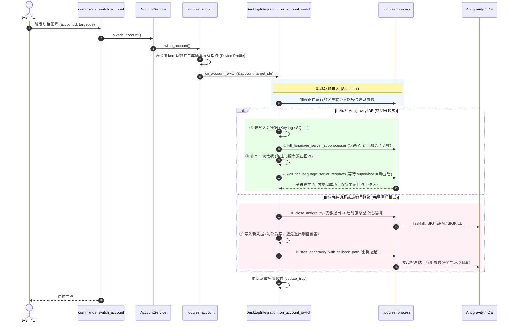

# Antigravity-Manager 账号切换与客户端重启机制详解

本文档深度剖析 **Antigravity-Manager** 在账号登录与切换过程中，如何协同操作系统进程、系统安全凭据库（Keyring）、本地数据库（SQLite）以及目标软件（Antigravity 经典版 / Antigravity IDE / agy CLI），实现精准、无感、高可靠的软件重载与重启。

---

## 一、 核心背景与架构设计

### 1. 为什么需要“重启软件”？
Antigravity 客户端（无论是定制的 VS Code 版 IDE 还是原生客户端）在设计上并未提供在内存中无感知热切换 Google 授权账户的接口。其凭据通常以持久化状态保存在：
1. **原生系统凭据库**（Windows Credential Manager / macOS Keychain / Linux Secret Service）；
2. **本地配置与状态数据库**（`state.vscdb` / `storage.json`）。

当 Antigravity-Manager 完成 OAuth 登录或账号切换后，必须让正在运行的 Antigravity 实例重新加载最新的 Token 与设备指纹（Device Profile）。因此，**进程控制（Process Management）与凭据注入（Credential Injection）的时序协同**成为整个项目的核心关键。

---

## 二、 整体调用链路与时序流程

无论是在前端界面（Web / Desktop UI）点击切换账号，还是 OAuth 授权完成触发激活，请求链路均统一经由系统集成层调度：



---

## 三、 两大核心重启策略

项目根据目标环境自动探测（`resolve_effective_target`），采取两套不同的处理方案：

### 策略 1：热切号（Hot Switch，面向 Antigravity IDE）

#### 痛点与机理
Antigravity IDE 基于 VS Code / Electron 架构。若直接杀死主进程，会导致用户**未保存的代码、打开的终端会话、调试断点及文件树状态全部丢失**。
为了实现无感切号，项目利用了 VS Code 内核内置的 **Supervisor** 机制：
* 主窗口本身只是宿主外壳；
* 实际负责 AI 补全和对话的核心逻辑运行在独立的后代子进程 `language_server`（或 `language_server.exe`）中；
* 当 `language_server` 意外挂掉时，宿主主进程的 Supervisor 会在约 **2 秒内原地重新拉起** 该子进程并重新加载 Webview。

#### 时序设计细节（先写 $\rightarrow$ 再杀 $\rightarrow$ 补写）
1. **预先写入凭据**：在杀进程前，将新账号凭据写到位。Supervisor 自动拉起新进程时，新进程启动即可直接读到新凭据。
2. **广度优先精确定位后代进程**：
   ```rust
   // 代码定位：src-tauri/src/modules/process.rs
   pub fn kill_language_server_subprocesses(target_ide: Option<&str>) -> Result<usize, String>
   ```
   遍历进程树，从 IDE 主进程根节点广度优先搜索所有子节点，仅强杀带有 `language_server` 特征的子进程，主窗口完全不受影响。
3. **补写凭据防竞争（Best-effort Re-assert）**：
   在旧的语言服务从收到终止信号到完全退出的数十毫秒窗口内，它可能会把内存中的旧 Token 刷回 `state.vscdb`。因此，杀完进程后立即再次执行一次写入，确保数据库和安全存储中的凭据为最终权威值。
4. **有界轮询探测与自动降级**：
   调用 `wait_for_language_server_respawn` 进行 15 秒的有界轮询检查。如果子进程顺利复活，则切号成功；如果未找到子进程或超时未复活，**立刻降级为“策略 2：完整重启”**，避免主窗口存活但 AI 处于瘫痪状态。

---

### 策略 2：完整重启（Full Restart，面向经典版客户端及降级情况）

#### 步骤 1：关进程前的“现场快照”
为了防止进程杀死后由于非标准安装路径（如便携版、自定义盘符）导致无法再次找到可执行文件，系统在杀死前预先读取当前存活实例的信息：
* `get_antigravity_executable_path`：提取可执行文件的规范化路径；
* `get_args_from_running_process`：提取当前运行实例的启动命令行参数。

#### 步骤 2：跨平台安全关闭（`close_antigravity`）
* **Windows**：
  * 精准收集 Antigravity 的 PID 集合；
  * 执行 `taskkill /F /T /PID <pid>`，并传入 `CREATE_NO_WINDOW`（`0x08000000`）标志位，静默杀死进程树，不闪烁黑窗口；
  * 执行 `sweep_orphan_language_servers()`，清理残留的孤儿语言服务，防止端口和文件互斥锁被死锁。
* **macOS**：
  * 深度过滤进程列表，排除 Helper、Crashpad、GPU、Renderer、Plugin 等子进程，精准锁定主进程 PID；
  * **第一阶段（平滑退出）**：仅向主进程发送 `kill -15` (SIGTERM)，等待主进程自我调度并退出所有子进程（避免 macOS 弹出系统级“应用程序意外退出”的崩溃告警）；
  * **第二阶段（超时强杀）**：若在超时前仍未退出，执行 `kill -9` (SIGKILL) 兜底清理剩余进程。
* **Linux**：
  * 同样采用 `SIGTERM` 平滑关闭 + `SIGKILL` 兜底；
  * 关闭后加入最长 3 秒的有界重试窗口，等待操作系统完全释放文件句柄。

#### 步骤 3：落盘写入新凭据
> **关键时序**：在完整重启流程中，**必须先杀进程、后写凭据**。
> 原因：原生客户端在正常退出时会将内存状态写回磁盘。如果先写凭据再关进程，客户端退出时的刷盘行为会直接将刚写入的新凭据覆盖为旧凭据。

* **版本 $\ge 2.0.0$**：构造带微秒级 RFC3339 时间戳的 Bearer Token Payload，调用各操作系统 Keyring API 写入系统凭据存储区。针对 Linux 特别处理 Secret Service 的 `login` 集合与 `default` 集合同步问题；
* **版本 $< 2.0.0$ 或 IDE**：自动对 `state.vscdb` 创建 `.backup` 备份，通过 SQLite 事务将 Token 和 Service Machine ID 安全更新进 `ItemTable`。

#### 步骤 4：参数净化与安全拉起（`start_antigravity_with_fallback_path`）
1. **参数净化（`sanitize_restart_args`）**：
   过滤掉启动参数中可能被污染的内部引擎或调试参数（例如 `--standalone`、`--subclient_type`、`--override_ide_name`、`language_server` 等），防止 IDE 再次启动时变成语言服务子进程模式。
2. **环境隔离（`clean_appimage_env`）**：
   在 Linux 环境下，若 Antigravity-Manager 自身以 AppImage 运行，会向子进程注入 `APPIMAGE`、`LD_LIBRARY_PATH`、`LD_PRELOAD` 等环境变量。拉起外部 Antigravity 之前必须将这些变量剥离，避免动态链接器版本冲突导致崩溃。
3. **多级路径回退执行**：
   * **优先级 1**：用户在配置界面中手动指定的可执行文件绝对路径；
   * **优先级 2**：步骤 1 快照中捕获到的有效运行时路径；
   * **优先级 3**：系统默认标准安装路径（macOS `/Applications/...`、Windows `AppData` 注册表路径、Linux `/usr/bin` 等）。
4. **进程分离启动**：
   * macOS：调用 `open -a <app_path> --args <clean_args>`；
   * Windows / Linux：使用 `std::process::Command::spawn` 创建独立于 Manager 的分离进程。

---

## 四、 核心代码文件分布一览

| 模块 / 路径 | 核心函数 / 职责 | 说明 |
| :--- | :--- | :--- |
| `src-tauri/src/commands/mod.rs` | `switch_account`<br>`start_oauth_login` | Tauri 命令入口，接收前端请求并重载代理 Token 池 |
| `src-tauri/src/modules/account.rs` | `switch_account` | 账号切换领域层，刷新 Token，绑定隔离指纹，触发系统集成接口 |
| `src-tauri/src/modules/integration.rs` | `DesktopIntegration::on_account_switch`<br>`apply_account_credentials` | **决策调度中枢**：判断 IDE 还是经典版，执行热切号或完整重启 |
| `src-tauri/src/modules/process.rs` | `kill_language_server_subprocesses`<br>`wait_for_language_server_respawn`<br>`close_antigravity`<br>`start_antigravity_with_fallback_path`<br>`sanitize_restart_args` | **底层进程控制库**：跨平台进程树遍历、精准击杀、环境净化、平滑拉起 |
| `src-tauri/src/modules/device.rs` | `write_profile` | 写入设备机器指纹，防止多账号指纹串联污染 |
| `src-tauri/src/modules/db.rs` | `inject_token` | SQLite 数据库注入，支持经典架构下的 Token 热注入 |

---

## 五、 设计要点总结

1. **动静分治**：IDE 走语言服务热击杀，保留主窗口和开发现场；原生端走安全关闭与拉起。
2. **时序反向**：
   * 热切号：**先写凭据 $\rightarrow$ 杀语言服务 $\rightarrow$ 补写凭据**（利用 ~2s 重建退避窗口，确保新服务必读新凭据）；
   * 完整重启：**先关进程 $\rightarrow$ 确保退出 $\rightarrow$ 写凭据 $\rightarrow$ 拉起**（防止退出时刷盘覆盖）。
3. **防丢失与强健韧性**：预先快照捕获非标路径，参数白名单净化，孤儿进程扫网，超时自动降级。
