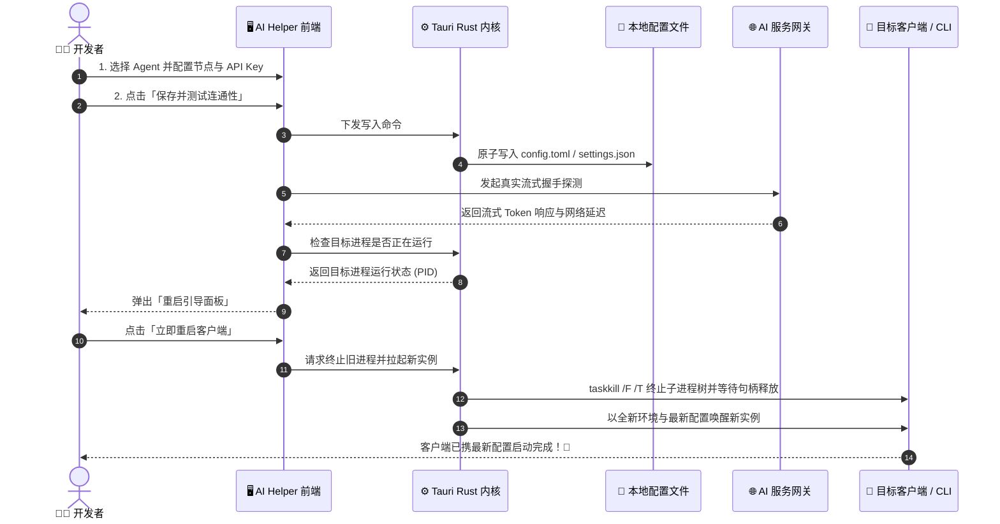

<p align="center">
  
</p>

<h1 align="center">⚡ AI Helper 🚀</h1>

<p align="center">
  <strong>专为 AI 开发者打造的极速 Agent 配置管理中枢 & 进程生命周期调度平台</strong><br>
  <em>The Ultimate Desktop Hub & Lifecycle Orchestrator for Claude Code, Codex CLI & ChatGPT</em>
</p>

<p align="center">
  <a href="https://github.com/TF49/AI-Helper/releases/latest"></a>
  <a href="https://tauri.app/"></a>
  <a href="https://www.rust-lang.org/"></a>
  <a href="https://react.dev/"></a>
  <a href="https://tailwindcss.com/"></a>
  <a href="LICENSE"></a>
  <a href="https://github.com/TF49/AI-Helper/stargazers"></a>
</p>

---

## 💡 为什么需要 AI Helper？

在以 **Claude Code CLI**、**OpenAI Codex CLI** 和 **ChatGPT 桌面端** 为代表的下一代 AI 编程时代，开发者经常面临以下痛点：

- 🤯 **配置极度碎片化**：不同 CLI 与客户端的配置文件散落各处（`config.toml`、`settings.json`、系统环境变量），格式各异且极易配错。
- ⏳ **修改后生效繁琐**：每次下发新 API Key 或切换模型节点后，需要手动在终端中反复查找 PID、强杀进程并手动唤醒新实例。
- 🧭 **安装路径难以寻迹**：Node 全局全局命令、WindowsApps Store 隔离包与 Win32 原生路径各不相同，跨机器配置耗时费力。
- 🔍 **连通性与协议排错艰难**：无法直观判断本地网络、代理通道及 OpenAI / Anthropic 双协议网关的真实连通延迟与流式状态。

**AI Helper** 破局而生！🎉 基于 **Tauri v2 (Rust)** 打造，兼具原生级别的极致性能与轻量体积，提供从 **「一键环境感知 ➔ 凭据与网关下发 ➔ 真实流式测试 ➔ 进程树安全热重启」** 的全链路闭环体验！⚡

---

## 🌟 核心功能全景 (Key Features)

```
┌────────────────────────────────────────────────────────────────────────────────┐
│                           AI Helper 现代化架构与能力全景                       │
├─────────────────────┬──────────────────────┬───────────────────────────────────┤
│  🤖 双核 Agent 调度 │  🔍 深度路径探测     │  🔄 智能无缝热重启                │
│  • OpenAI / Codex   │  • 多级回退探测算法  │  • 进程树安全递归查杀 (/F /T)     │
│  • Claude Code CLI  │  • Store 应用包解包  │  • 文件句柄释放安全等待轮询       │
│  • 热门模型快捷芯片 │  • 路径持久化与自愈  │  • 连通性测试通过后一键唤醒       │
├─────────────────────┼──────────────────────┼───────────────────────────────────┤
│  ⚡ 流式终端诊断    │  🧰 快速诊断工具箱   │  🎨 极光磨砂玻璃美学              │
│  • Token 逐字流回显 │  • 双协议 cURL 药丸  │  • 随 Agent 动态渐变的流光背景    │
│  • 毫秒级网络时延   │  • 环境变量快捷调试  │  • 字符解密动效与深浅双主题切换   │
│  • 状态码/错误解析  │  • 一键剪贴板导出    │  • 纯原生体验，超低内存常驻       │
└─────────────────────┴──────────────────────┴───────────────────────────────────┘
```

### 1. 🤖 双核主流 Agent 统一管理 (Dual-Core Orchestration)
- 🟢 **ChatGPT (Codex CLI / Desktop)**：
  - 自动管理与实时写入 `~/.codex/config.toml`；
  - 内置 `gpt-4o`、`gpt-4o-mini`、`o1`、`o3-mini`、`chatgpt-4o-latest` 热门模型快捷填充芯片；
  - 统一配置官方或第三方 API 服务网关、自定义 Headers 与 API Key。
- 🟣 **Claude Code CLI**：
  - 深度托管与更新 `~/.claude.json` / `settings.json`；
  - 内置 `claude-3-7-sonnet`、`claude-3-5-sonnet`、`claude-3-5-haiku`、`claude-3-opus` 智能芯片；
  - 自动注入 Anthropic 认证凭证与反代中转节点。

### 2. 🔍 应用与 CLI 路径深度探测引擎 (Path & Process Discovery)
- 🧭 **三大运行环境全量覆盖**：
  - 🟣 **Claude Code CLI**：支持全局 npm 脚本 (`%APPDATA%\npm\claude.cmd`) 及系统 PATH 探测；
  - 🔵 **Codex CLI**：支持全局 npm 命令 (`codex.cmd`) 及原生二进制；
  - 🟢 **ChatGPT 桌面客户端**：深度支持 **Microsoft Store 应用包** (`WindowsApps\OpenAI.Codex_*`) 与 **Win32 独立安装版** (`%LOCALAPPDATA%\Programs\ChatGPT`)。
- ⚡ **智能多级优先级回退算法**：
  `实时活跃进程探测` ➔ `NPM 全局路径` ➔ `PATH 环境变量` ➔ `标准程序目录` ➔ `Store 应用包降序版本比对`。
- 🛡️ **自愈与安全保障**：
  - 路径配置自动持久化存储于 `~/.ai-helper/app_paths.json`；
  - 软件启动时自动触发失效路径自愈纠偏；
  - 支持 Windows 原生文件对话框点选，实施严格的外部参数注入防御。

### 3. 🔄 智能进程热重启与安全熔断 (Smart Process Lifecycle)
- 🛡️ **底层安全进程树熔断 (Process Tree Clean-up)**：
  - Windows 环境下执行 `taskkill /F /T /PID` 强力清理进程树，避免 Electron/Node 孤儿进程僵尸残留；
  - 独创 **有界轮询句柄等待机制**（最长 2.5 秒，每 150ms 轮询），确保旧进程完全释放端口与文件读写锁后再启动新实例，杜绝多实例竞争崩溃。
- 🚀 **测试部署后一键拉起**：
  - 配置写入且测试通过后，自动感知目标客户端运行状态；
  - 弹出智能引导面板，支持一键独立重启或启动目标终端/桌面客户端。

### 4. ⚡ 实时交互式流式控制台 (Streaming Terminal Modal)
- ⏱️ **真实网络与协议连通性测试**：
  - 模拟真实请求向网关节点发送流式测试调用；
  - 毫秒级计算首字时延（TTFT）与传输速率；
  - 终端风格流式打字机动画，直观显示 API 返回状态码与报错堆栈信息。

### 5. 🧰 开发者极速诊断工具箱 (Diagnostic Toolbox)
- 🔀 **内置 [OpenAI / Claude] 双协议切换药丸**：
  - 一键生成并切换标准 cURL 测试命令（`/v1/chat/completions` 与 `/v1/messages`）；
  - 自动脱敏并带入当前填写的 API Key、模型与网关地址，快速在系统命令行排查网络代理问题。
- 🌐 **实时网络心跳探针**：
  - 侧边栏常驻网络探针，动态呼吸光晕反馈当前网关可达性。

### 6. 🎨 沉浸式极光磨砂玻璃美学 (Aurora Glassmorphism)
- ✨ **动态流动极光背景**：根据当前选中的 Agent 模式，在电光青蓝与琥珀金紫之间柔和流转过渡；
- 🔐 **字符解密与金属光泽**：集成了 `DecryptedText` 与 `ShinyText` 字符动效；
- 🌗 **全场景深浅色主题**：完美支持系统主题跟随与手动一键自由切换；
- 📐 **现代双栏桌面工作台**：固定导航侧边栏 + 自适应大屏宽阔展台，视野清晰不压抑。

---

## 🔄 核心工作流程 (Workflow)



---

## 📦 下载与安装 (Downloads)

前往 [GitHub Releases](https://github.com/TF49/AI-Helper/releases/latest) 下载最新发布的安装包：

| 版本类型 | 安装文件 | 说明 |
| :--- | :--- | :--- |
| **🚀 Windows 安装版 (推荐)** | `AI-Helper-vX.X.X-Windows-x64-Setup.exe` | 包含桌面快捷方式、开始菜单引导、静默自动更新与运行库检测 |
| **💼 Windows 绿色便携版** | `AI-Helper-vX.X.X-Windows-x64-Standalone.zip` | 解压即用，无须安装，不污染注册表，适合 U 盘与企业内网环境 |

> 📌 **系统要求**: Windows 10 / 11 64位系统，预装 [Microsoft Edge WebView2 Runtime](https://developer.microsoft.com/microsoft-edge/webview2/)（Win11 自带）。

---

## 🛠️ 本地开发与构建 (Development)

如果你希望在本地编译调试或为 AI Helper 贡献代码，请参考以下指南：

### 1. 环境准备
- [Node.js](https://nodejs.org/) (>= 18.0.0) & [pnpm](https://pnpm.io/) (>= 9.0)
- [Rust](https://www.rust-lang.org/) (推荐安装最新 stable 工具链与 `cargo`)
- [Visual Studio C++ Build Tools](https://visualstudio.microsoft.com/visual-cpp-build-tools/) (包含 Windows 10/11 SDK)

### 2. 克隆项目与安装依赖
```bash
# 克隆代码仓库
git clone https://github.com/TF49/AI-Helper.git
cd AI-Helper

# 使用 pnpm 安装前端依赖
pnpm install
```

### 3. 启动本地桌面调试
```bash
# 启动 Tauri 桌面端热重载开发环境
pnpm dev
```

### 4. 生产环境打包构建
```bash
# 自动编译 Rust 后端与 Vite 前端并打包为生产安装包
pnpm build
```
打包生成的可执行程序与安装包将位于：`src-tauri/target/release/bundle/`。

---

## 📁 核心项目结构 (Project Structure)

```
AI-Helper/
├── 📁 .github/              # GitHub Actions CI/CD 自动发布与打包工作流
├── 📁 docs/                 # 项目文档与历代详细 Release Notes
├── 📁 public/               # 静态资源、品牌 Logo 图形与 Favicon
│   ├── 🖼️ brand-logo.png           # 完整品牌 Logo（浅色底适用）
│   ├── 🖼️ brand-logo-darkmode.png  # 完整品牌 Logo（深色底适用）
│   ├── 🖼️ logo.png                 # 莫比乌斯环纯徽标 (512x512)
│   └── 🌐 favicon.ico              # 网页与托盘图标
├── 📁 scripts/              # 自动化发版脚本 (bump-version, release 等)
├── 📁 src/                  # React + TypeScript 前端工作区
│   ├── 📁 components/       # 核心 UI 面板 (ChatGPTPanel, ClaudePanel, AppPathsPanel 等)
│   ├── 📁 lib/              # API 请求、Tauri IPC 封装与工具函数
│   ├── 📄 App.tsx           # 桌面主窗口、双栏布局与标题栏
│   └── 📄 main.tsx          # 前端主入口
├── 📁 src-tauri/            # Tauri + Rust 桌面后端
│   ├── 📁 icons/            # 编译生成的全平台全尺寸专属 App 图标库
│   ├── 📁 src/              # Rust 核心逻辑 (进程扫描、网络探针、配置写入、更新器)
│   ├── 📄 Cargo.toml        # Rust 依赖声明
│   └── 📄 tauri.conf.json   # Tauri 应用主配置
├── 📄 app-icon-transparent.png # 1024x1024 透明莫比乌斯应用图标源图
└── 📄 package.json          # Node 依赖与脚本配置
```

---

## 🗺️ 演进路线 (Roadmap)

- [x] **v1.0.14**: 品牌焕新重塑为 AI Helper，推出现代桌面双栏工作台与热门模型芯片。
- [x] **v1.0.18**: 接入全新的安全更新通道与断点下载机制。
- [x] **v1.0.20**: 推出全新应用/CLI 路径管理面板、单快照高并发进程扫描与智能平滑热重启闭环。
- [x] **v1.0.21**: 全面升级专属双核无限莫比乌斯品牌 Logo 与全平台高质量抗锯齿图标库。
- [ ] **v1.1.0** *(Planned)*: 支持更多新兴 AI 编程工具与 Agent 扩展（如 Roo Code、Cursor、Windsurf 配置文件管理）。
- [ ] **v1.2.0** *(Planned)*: 支持多套环境配置档案（Profiles）一键快照保存与秒级切换。
- [ ] **v1.3.0** *(Planned)*: 探索 macOS / Linux 桌面版本的原生多平台适配构建。

---

## 🤝 贡献代码 (Contributing)

我们非常欢迎社区开发者提交 Issue 或 Pull Request！

1. Fork 本项目到你的 GitHub 仓库；
2. 新建你的特性分支：`git checkout -b feat/my-amazing-feature`；
3. 提交你的修改并保持良好的 Commit 规范：`git commit -m 'feat: add amazing new feature'`；
4. 推送分支到你的远程仓库：`git push origin feat/my-amazing-feature`；
5. 在 GitHub 提出一个清晰详尽的 Pull Request！🎉

---

## 📄 开源许可证 (License)

本项目遵循 [MIT License](LICENSE) 开源协议。无论是个人学习、自由开发还是商业使用均完全自由开源。

---

<p align="center">
  Made with ❤️ by <strong>TF49 & Open Source Community</strong><br>
  <em>Empowering Every AI Developer with Seamless Flow & Speed 🚀</em>
</p>
