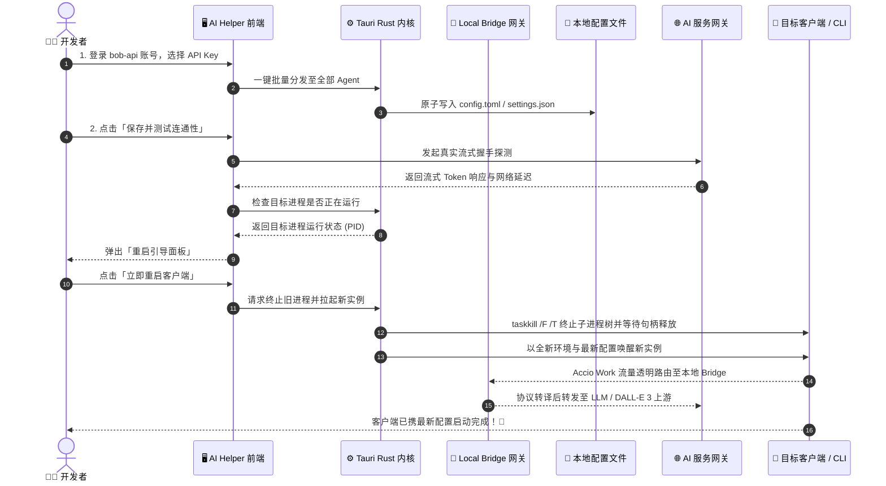

<p align="center">
  
</p>

<h1 align="center">⚡ AI Helper 🚀</h1>

<p align="center">
  <strong>专为 AI 开发者打造的极速 Agent 配置管理中枢 &amp; 进程生命周期调度平台</strong><br>
  <em>The Ultimate Desktop Hub &amp; Protocol Bridge for Claude Code · Codex CLI · ChatGPT · WorkBuddy · Accio Work · MCP</em>
</p>

<p align="center">
  <a href="https://github.com/TF49/AI-Helper/releases/latest"></a>
  <a href="https://tauri.app/"></a>
  <a href="https://www.rust-lang.org/"></a>
  <a href="https://react.dev/"></a>
  <a href="https://tailwindcss.com/"></a>
  <a href="LICENSE"></a>
  <a href="https://github.com/TF49/AI-Helper/stargazers"></a>
</p>

---

## 💡 为什么需要 AI Helper？

在以 **Claude Code CLI**、**OpenAI Codex CLI**、**ChatGPT 桌面端**、**WorkBuddy AI** 和 **Accio Work** 为代表的下一代 AI 编程时代，开发者经常面临以下痛点：

- 🤯 **配置极度碎片化**：不同 CLI 与客户端的配置文件散落各处（`config.toml`、`settings.json`、系统环境变量），格式各异且极易配错。
- ⏳ **修改后生效繁琐**：每次下发新 API Key 或切换模型节点后，需要手动在终端中反复查找 PID、强杀进程并手动唤醒新实例。
- 🧭 **安装路径难以寻迹**：Node 全局命令、WindowsApps Store 隔离包与 Win32 原生路径各不相同，跨机器配置耗时费力。
- 🔍 **连通性与协议排错艰难**：无法直观判断本地网络、代理通道及 OpenAI / Anthropic 双协议网关的真实连通延迟与流式状态。
- 🔑 **API Key 多工具重复配置**：随着 Agent 阵容扩充，每次更换密钥需在多个面板重复粘贴，极易遗漏或出错。

**AI Helper** 破局而生！🎉 基于 **Tauri v2 (Rust)** 打造，兼具原生级别的极致性能与轻量体积，提供从 **「账号一键登录 ➔ 凭据与网关下发 ➔ 本地 Bridge 协议转译 ➔ 真实流式测试 ➔ 进程树安全热重启」** 的全链路闭环体验！⚡

---

## 🌟 核心功能全景 (Key Features)

```
┌────────────────────────────────────────────────────────────────────────────────────────┐
│                         AI Helper v1.0.43 现代化架构与能力全景                          │
├──────────────────────┬──────────────────────┬──────────────────────┬───────────────────┤
│  🤖 五核 Agent 矩阵  │  🔐 bob-api 账号生态 │  🌉 本地 Bridge 网关 │  🔄 智能热重启    │
│  • OpenAI / Codex    │  • 账号原生直连登录  │  • Axum + Tokio 驱动 │  • 进程树安全清理 │
│  • Claude Code CLI   │  • 云端 Key 全景管理 │  • LLM 协议透明转译  │  • 句柄轮询等待   │
│  • WorkBuddy AI      │  • 一键批量四端分发  │  • MCP 代理路由      │  • 一键拉起新实例 │
│  • Accio Work        │  • 2FA + RSA-OAEP   │  • DALL-E 3 生图转译 │                   │
├──────────────────────┼──────────────────────┼──────────────────────┼───────────────────┤
│  ⚡ 流式终端诊断     │  🧰 快速诊断工具箱   │  🔍 深度路径探测     │  🎨 极光玻璃美学  │
│  • Token 逐字流回显  │  • 双协议 cURL 药丸  │  • 多级回退探测算法  │  • GSAP 物理动效  │
│  • 毫秒级 TTFT 时延  │  • 实时网络心跳探针  │  • Store 应用包解包  │  • 深浅双主题切换 │
│  • 状态码/错误解析   │  • 一键剪贴板导出    │  • 路径持久化与自愈  │  • 超低内存常驻   │
└──────────────────────┴──────────────────────┴──────────────────────┴───────────────────┘
```

### 1. 🤖 五核主流 Agent 统一管理 (Five-Core Orchestration)
- 🟢 **ChatGPT (Codex CLI / Desktop)**：自动管理 `~/.codex/config.toml`；内置热门模型快捷填充芯片；统一配置官方或第三方 API 网关与 API Key。
- 🟣 **Claude Code CLI**：深度托管 `~/.claude.json` / `settings.json`；内置 `claude-3-7-sonnet`、`claude-3-5-sonnet`、`claude-3-5-haiku`、`claude-3-opus` 智能芯片；自动注入认证凭证与中转节点。
- 🟩 **WorkBuddy AI**：全新接入的第三大 AI 编程助手；Emerald 翠绿专属主题面板；完整配置读写、安装路径探测与自定义模型维护。
- 🟠 **Accio Work**：专属橙色主题面板；无缝对接本地 Bridge 网关；支持顶级模型锁定与动态模型列表注入。
- 🧩 **MCP (Model Context Protocol)**：通过本地 Bridge 提供 `/api/mcp/proxy` 显式代理入口，支持标准 JSON-RPC 错误规范，赋能多 Agent MCP 工具生态。

### 2. 🔐 bob-api 原生账号生态 (Native Auth Integration)
- 🌟 **账号原生直连登录**：客户端内一键登录 bob-api.com，无需打开浏览器；支持交互式 GO 滑块验证码挑战与 TOTP 2FA 双因素认证。
- 🛡️ **军工级端到端安全**：全链路采用 **RSA-OAEP WebCrypto 非对称加密**传输，严格 `HttpOnly CookieJar` 存储，拒绝明文凭证传输。
- 🔄 **长效无感会话续期**：基于本地 `~/.ai-helper/auth_session.json` 持久化，Access Token 过期前 30 秒自动静默续期，实现「一次登录，长效安心使用」。
- 🔑 **全局令牌资产管理**：云端 API Key 全景列表呈现，含额度/有效期/状态透视；支持明暗文查看、一键复制。
- 🚀 **一键批量四端分发**：「全套同步」一键将所选 Key 并行配置至全部四大 Agent，0.1 秒完成全矩阵就绪，彻底告别重复粘贴！

### 3. 🌉 Accio Local Bridge 协议网关 (Local Protocol Bridge)
- 🦀 **原生 Axum + Tokio 高性能网关**：基于 Rust 生态顶级异步框架，低内存常驻，轻量极速。
- 🎯 **模型路由动态拦截**：精准拦截 Accio 内部模型决策请求，强制锁定至用户自定义的顶级模型（Claude 3.7、GPT-4o、DeepSeek R1 等）。
- 📋 **原生模型列表伪造注入**：向 Accio 客户端注入自定义模型完整元数据，使原生下拉框能完美识别与切换。
- 🌐 **透明官方网关反向代理**：登录鉴权、店铺数据、插件调用等非 LLM 请求原汁原味透传官方网关，商业功能 100% 畅通。
- 🎨 **DALL-E 3 生图协议转译**：自动拦截 Accio 生图请求并重定向至 OpenAI `/v1/images/generations`，按比例自适应映射尺寸（1792×1024 / 1024×1792 / 1024×1024），Base64/URL 双路兼容回传。
- 🔄 **OpenAI Responses API 对齐**：完整支持 `/v1/responses` 协议，`messages → input`、`max_tokens → max_output_tokens`，Tool Call 全链路解析与 Function Calling 容错（`arguments` / `args` / `input` 多格式自愈）。
- 🧩 **MCP 显式代理路由**：`/api/mcp/proxy` 入口，标准 JSON-RPC 2.0 错误规范，支持多 MCP 客户端接入。
- 🗜️ **请求压缩解码**：支持 gzip / Brotli / deflate 请求体安全解码，内置 64 MB 解压上限与 128 MB 响应上限双重资源保护。
- 🧾 **端到端头部白名单治理**：精确过滤 hop-by-hop 头部，防止代理层状态污染与敏感头部泄露。
- 💓 **SSE 心跳与错误归一化**：长耗时 LLM 调用保持 SSE 心跳防断连；官方网关非 SSE 错误统一转换为 Accio SSE 错误帧，客户端始终获得可消费的事件流。
- 🔌 **端口自适应探针**：默认监听 `127.0.0.1:8787`，遇占用自动平移至 `8787..=8807` 范围并持久化记录。

### 4. 🔍 应用与 CLI 路径深度探测引擎 (Path & Process Discovery)
- 🧭 **五大 Agent 运行环境全量覆盖**：Claude Code CLI（npm 全局）、Codex CLI（npm / 原生二进制）、ChatGPT（Microsoft Store 应用包 + Win32 独立安装版）、WorkBuddy AI、Accio Work 全部支持。
- ⚡ **智能多级优先级回退算法**：`实时活跃进程探测` ➔ `NPM 全局路径` ➔ `PATH 环境变量` ➔ `标准程序目录` ➔ `Store 应用包降序版本比对`。
- 🛡️ **自愈与安全保障**：路径配置持久化于 `~/.ai-helper/app_paths.json`；启动自动触发失效路径自愈；严格外部参数注入防御（拦截 `&`、`;` 及换行符等控制字符）。

### 5. 🔄 智能进程热重启与安全熔断 (Smart Process Lifecycle)
- 🛡️ **底层安全进程树熔断**：Windows 环境下执行 `taskkill /F /T /PID` 强力清理进程树，避免 Electron/Node 孤儿进程僵尸残留。
- ⏱️ **有界轮询句柄等待**：独创最长 2.5 秒、每 150ms 轮询机制，确保旧进程完全释放端口与文件锁后再启动新实例，杜绝多实例竞争崩溃。
- 🚀 **测试通过后一键拉起**：弹出智能引导面板，支持一键独立重启或启动目标终端/桌面客户端；终端测试通过后自动开启 8 秒智能退出倒计时。

### 6. ⚡ 实时交互式流式控制台 (Streaming Terminal Modal)
- ⏱️ **真实网络与协议连通性测试**：模拟真实请求向网关节点发送流式测试调用；毫秒级计算首字时延（TTFT）与传输速率；终端风格流式打字机动画，直观显示 API 返回状态码与报错堆栈。

### 7. 🧰 开发者极速诊断工具箱 (Diagnostic Toolbox)
- 🔀 **内置 [OpenAI / Claude] 双协议切换药丸**：一键生成并切换标准 cURL 测试命令（`/v1/chat/completions` 与 `/v1/messages`）；自动脱敏并带入当前 API Key、模型与网关地址。
- 🌐 **实时网络心跳探针**：侧边栏常驻网络探针，动态呼吸光晕反馈当前网关可达性（HTTP 状态码 < 500 均认定为可达，消除 302/403 假离线误报）。

### 8. 🎨 沉浸式极光磨砂玻璃美学 (Aurora Glassmorphism)
- ✨ **GSAP 物理弹性动效**：令牌调度中枢弹窗平滑弹性入场、列表级联瀑布流、刷新按钮旋转等全站 GSAP 驱动动效。
- 🔐 **字符解密与金属光泽**：集成 `DecryptedText`、`ShinyText`、`SpotlightCard`、`StarBorder` 等 React-Bits 组件，科技感十足。
- 🌗 **全场景深浅色主题**：完美支持系统主题跟随与手动一键自由切换。
- 📐 **现代双栏桌面工作台**：固定导航侧边栏 + 自适应大屏宽阔展台，视野清晰不压抑。

---

## 🔄 核心工作流程 (Workflow)


```mermaid
sequenceDiagram
    autonumber
    actor Developer as 🧑‍💻 开发者
    participant UI as 🖥️ AI Helper 前端
    participant Core as ⚙️ Tauri Rust 内核
    participant Bridge as 🌉 Local Bridge 网关
    participant Disk as 💾 本地配置文件
    participant Cloud as 🌐 AI 服务网关
    participant Target as 🚀 目标客户端 / CLI

    Developer->>UI: 1. 登录 bob-api 账号，选择 API Key
    UI->>Core: 一键批量分发至全部 Agent
    Core->>Disk: 原子写入 config.toml / settings.json
    Developer->>UI: 2. 点击「保存并测试连通性」
    UI->>Cloud: 发起真实流式握手探测
    Cloud-->>UI: 返回流式 Token 响应与网络延迟
    UI->>Core: 检查目标进程是否正在运行
    Core-->>UI: 返回目标进程运行状态 (PID)
    UI-->>Developer: 弹出「重启引导面板」
    Developer->>UI: 点击「立即重启客户端」
    UI->>Core: 请求终止旧进程并拉起新实例
    Core->>Target: taskkill /F /T 终止子进程树并等待句柄释放
    Core->>Target: 以全新环境与最新配置唤醒新实例
    Target-->>Bridge: Accio Work 流量透明路由至本地 Bridge
    Bridge-->>Cloud: 协议转译后转发至 LLM / DALL-E 3 上游
    Target-->>Developer: 客户端已携最新配置启动完成！🎉
```

---

## 📦 下载与安装 (Downloads)

前往 [GitHub Releases](https://github.com/TF49/AI-Helper/releases/latest) 下载最新发布的安装包：

| 版本类型 | 安装文件 | 说明 |
| :--- | :--- | :--- |
| **🚀 Windows 安装版 (推荐)** | `AI-Helper-vX.X.X-Windows-x64-Setup.exe` | 包含桌面快捷方式、开始菜单引导、静默自动更新与运行库检测 |
| **💼 Windows 绿色便携版** | `AI-Helper-vX.X.X-Windows-x64-Standalone.zip` | 解压即用，无须安装，不污染注册表，适合 U 盘与企业内网环境 |

> 📌 **系统要求**: Windows 10 / 11 64位系统，预装 [Microsoft Edge WebView2 Runtime](https://developer.microsoft.com/microsoft-edge/webview2/)（Win11 自带）。

---

## 🛠️ 本地开发与构建 (Development)

如果你希望在本地编译调试或为 AI Helper 贡献代码，请参考以下指南：

### 1. 环境准备
- [Node.js](https://nodejs.org/) (>= 18.0.0) & [pnpm](https://pnpm.io/) (>= 9.0)
- [Rust](https://www.rust-lang.org/) (推荐安装最新 stable 工具链与 `cargo`)
- [Visual Studio C++ Build Tools](https://visualstudio.microsoft.com/visual-cpp-build-tools/) (包含 Windows 10/11 SDK)

### 2. 克隆项目与安装依赖
```bash
# 克隆代码仓库
git clone https://github.com/TF49/AI-Helper.git
cd AI-Helper

# 使用 pnpm 安装前端依赖
pnpm install
```

### 3. 启动本地桌面调试
```bash
# 启动 Tauri 桌面端热重载开发环境
pnpm dev
```

### 4. 生产环境打包构建
```bash
# 自动编译 Rust 后端与 Vite 前端并打包为生产安装包
pnpm build
```
打包生成的可执行程序与安装包将位于：`src-tauri/target/release/bundle/`。

---

## 📁 核心项目结构 (Project Structure)

```
AI-Helper/
├── 📁 .github/              # GitHub Actions CI/CD 自动发布与打包工作流
├── 📁 docs/                 # 项目文档与历代详细 Release Notes
├── 📁 public/               # 静态资源、品牌 Logo 图形与 Favicon
│   ├── 🖼️ brand-logo.png           # 完整品牌 Logo（浅色底适用）
│   ├── 🖼️ brand-logo-darkmode.png  # 完整品牌 Logo（深色底适用）
│   ├── 🖼️ logo.png                 # 莫比乌斯环纯徽标 (512x512)
│   └── 🌐 favicon.ico              # 网页与托盘图标
├── 📁 scripts/              # 自动化发版脚本 (bump-version, release 等)
├── 📁 src/                  # React + TypeScript 前端工作区
│   ├── 📁 components/       # 核心 UI 面板 (ChatGPTPanel, ClaudePanel, WorkbuddyPanel, AccioWorkPanel 等)
│   ├── 📁 lib/              # API 请求、Tauri IPC 封装与工具函数
│   ├── 📄 App.tsx           # 桌面主窗口、双栏布局与 4 阶段启动时序
│   └── 📄 main.tsx          # 前端主入口
├── 📁 src-tauri/            # Tauri + Rust 桌面后端
│   ├── 📁 icons/            # 编译生成的全平台全尺寸专属 App 图标库
│   ├── 📁 src/
│   │   ├── 📁 accio/        # Accio Local Bridge 网关（bridge.rs, config.rs, protocol.rs）
│   │   ├── 📄 auth.rs       # bob-api 账号认证、会话续期与令牌分发
│   │   ├── 📄 app_paths.rs  # 五大 Agent 路径探测引擎
│   │   ├── 📄 process_manager.rs # 进程树安全熔断与热重启
│   │   ├── 📄 updater.rs    # 自动更新与断点下载
│   │   └── 📄 network.rs    # 网络心跳探针
│   ├── 📄 Cargo.toml        # Rust 依赖声明
│   └── 📄 tauri.conf.json   # Tauri 应用主配置
├── 📁 website/              # 官网落地页（纯静态，GitHub Pages 托管）
├── 📄 app-icon-transparent.png # 1024x1024 透明莫比乌斯应用图标源图
└── 📄 package.json          # Node 依赖与脚本配置
```

---

## 🗺️ 演进路线 (Roadmap)

- [x] **v1.0.14**: 品牌焕新重塑为 AI Helper，推出现代桌面双栏工作台与热门模型芯片。
- [x] **v1.0.18**: 接入全新的安全更新通道与断点下载机制。
- [x] **v1.0.20**: 推出全新应用/CLI 路径管理面板、单快照高并发进程扫描与智能平滑热重启闭环。
- [x] **v1.0.21**: 全面升级专属双核无限莫比乌斯品牌 Logo 与全平台高质量抗锯齿图标库。
- [x] **v1.0.25**: 正式接入 WorkBuddy AI 成为第三大 Agent，深度安全加固与全栈工程规范升级。
- [x] **v1.0.30**: 推出 Accio Work 支持，内置 Rust Axum + Tokio 本地 Bridge 协议网关，实现模型路由拦截与自定义模型列表注入。
- [x] **v1.0.36**: 原生接入 bob-api.com 账号体系，RSA-OAEP 加密、2FA 双因素认证、一键批量分发 API Key 至四大 Agent，GSAP 动效驱动令牌调度中枢。
- [x] **v1.0.37**: Accio Bridge 支持 DALL-E 3 生图协议转译，MCP 显式代理路由，Function Calling 多格式容错自愈。
- [x] **v1.0.41**: Bridge 接入 gzip/Brotli 请求解码、端到端头部白名单治理、SSE 错误归一化、双重资源保护上限。
- [x] **v1.0.43**: 完整切换至 OpenAI Responses API (`/v1/responses`) 协议，修复 Tool 参数类型安全问题，测试端点与运行链路完全对齐。
- [ ] **v1.1.0** *(Planned)*: 支持更多新兴 AI 编程工具与 Agent 扩展（如 Roo Code、Cursor、Windsurf 配置文件管理）。
- [ ] **v1.2.0** *(Planned)*: 支持多套环境配置档案（Profiles）一键快照保存与秒级切换。
- [ ] **v1.3.0** *(Planned)*: 探索 macOS / Linux 桌面版本的原生多平台适配构建。

---

## 🤝 贡献代码 (Contributing)

我们非常欢迎社区开发者提交 Issue 或 Pull Request！

1. Fork 本项目到你的 GitHub 仓库；
2. 新建你的特性分支：`git checkout -b feat/my-amazing-feature`；
3. 提交你的修改并保持良好的 Commit 规范：`git commit -m 'feat: add amazing new feature'`；
4. 推送分支到你的远程仓库：`git push origin feat/my-amazing-feature`；
5. 在 GitHub 提出一个清晰详尽的 Pull Request！🎉

---

## 📄 开源许可证 (License)

本项目遵循 [MIT License](LICENSE) 开源协议。无论是个人学习、自由开发还是商业使用均完全自由开源。

---

<p align="center">
  Made with ❤️ by <strong>TF49 &amp; Open Source Community</strong><br>
  <em>One Helper to Bridge Them All: ChatGPT 🤖 · Claude Code 🧠 · WorkBuddy ⚙️ · Accio Work 🚀 · MCP 🧩</em>
</p>
