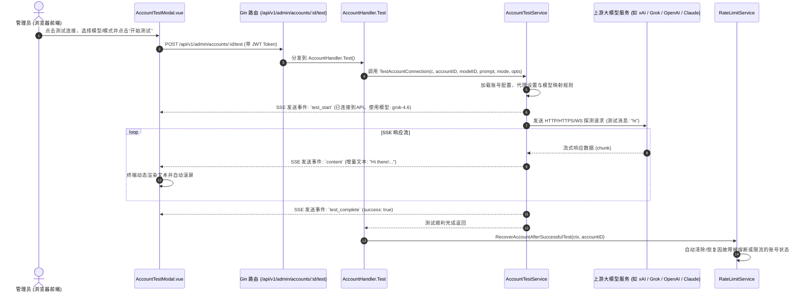

# Sub2API 账号模型连接测试功能架构与实现详解

## 1. 功能概述与背景

该功能为 **Sub2API** 系统管理后台（Admin Dashboard）中的 **账号连通性测试（Account Connectivity Test）** 模块。

截图中展示的界面是管理员针对特定上游账号（如截图中的 `apikey` 类型账号、模型 `grok-4.6`、测试模式 `文本 (Responses)`）发起的实时交互测试弹窗。系统模拟终端（Terminal）体验，以 Server-Sent Events (SSE) 流式传输的形式向上游接口发送探测消息（默认发送 `"hi"`），并实时输出各阶段连接状态与上游模型返回的流式 Token，测试成功后自动更新并尝试恢复账号的限流/可用状态。

---

## 2. 完整调用链路架构



---

## 3. 前端实现细节

### 3.1 核心组件位置
* **弹窗组件**：[`frontend/src/components/admin/account/AccountTestModal.vue`](file:///e:/Developer%20Tool/Sub2api/frontend/src/components/admin/account/AccountTestModal.vue)
* **调用入口**：
  * [`frontend/src/views/admin/AccountsView.vue`](file:///e:/Developer%20Tool/Sub2api/frontend/src/views/admin/AccountsView.vue)（账号列表页）
  * [`frontend/src/components/admin/account/AccountActionMenu.vue`](file:///e:/Developer%20Tool/Sub2api/frontend/src/components/admin/account/AccountActionMenu.vue)（操作菜单中的“测试连接”）

### 3.2 前端主要特性
1. **多模态与多模式支持**：
   * **OpenAI 模式**：`default`（标准）与 `compact`（上下文压缩测试）。
   * **Grok (xAI) 模式**：支持 `text` (Responses)、`image`、`video`、`search`、`tts`、`stt`、`realtime` 七种模式。
   * **多模态文件上传**：支持上传图片（图生图/视频首帧）或音频（语音识别 STT 测试）。
2. **动态模型拉取**：
   * 打开弹窗时调用 `adminAPI.accounts.getAvailableModels(props.account.id)` 动态加载该账号可用模型列表，并根据平台设定智能默认选项（如 Gemini 优先排布 `flash-image`/`pro`，Grok 优先选择 `grok-4.5`/`grok-4.6`）。
3. **类终端（Terminal）交互**：
   * 采用黑色/深色代码块样式，展示 ANSI 风格日志输出：
     * `账号类型: apikey`
     * `测试模式: 文本 (Responses)`
     * `已连接到 API`
     * `使用模型: grok-4.6`
     * `发送测试消息: "hi"`
     * `响应: ...`
     * `✓ 测试完成!`
   * 支持一键复制终端完整输出日志。
4. **流式数据接收**：
   * 因标准浏览器 `EventSource` 不支持 `POST` 请求，前端使用标准 `fetch` + `ReadableStream` (`getReader()`) + `TextDecoder` 手动切片解析 SSE 协议（按行切分 `data: `）。
5. **多媒体结果预览**：
   * 包含图片 Lightbox 模态框、音频播放器（`<audio controls>`）、视频播放器（`<video controls>`）。

---

## 4. 后端接口与路由定义

### 4.1 路由注册
* **文件路径**：[`backend/internal/server/routes/admin.go`](file:///e:/Developer%20Tool/Sub2api/backend/internal/server/routes/admin.go#L390)
```go
accounts := admin.Group("/accounts")
{
    // ...
    accounts.POST("/:id/test", h.Admin.Account.Test)
    // ...
}
```

### 4.2 控制器 Handler 实现
* **文件路径**：[`backend/internal/handler/admin/account_handler.go`](file:///e:/Developer%20Tool/Sub2api/backend/internal/handler/admin/account_handler.go#L1287-L1316)

```go
// TestAccountRequest represents the request body for testing an account
type TestAccountRequest struct {
    ModelID      string `json:"model_id"`
    Prompt       string `json:"prompt"`
    Mode         string `json:"mode"`
    ImageDataURL string `json:"image_data_url"`
    AudioDataURL string `json:"audio_data_url"`
}

// Test handles testing account connectivity with SSE streaming
// POST /api/v1/admin/accounts/:id/test
func (h *AccountHandler) Test(c *gin.Context) {
    accountID, err := strconv.ParseInt(c.Param("id"), 10, 64)
    if err != nil {
        response.BadRequest(c, "Invalid account ID")
        return
    }

    var req TestAccountRequest
    _ = c.ShouldBindJSON(&req)

    opts := service.AccountTestOptions{
        ImageDataURL: req.ImageDataURL,
        AudioDataURL: req.AudioDataURL,
    }

    // 核心调用：使用 AccountTestService 以 SSE 流式传输进行连通性测试
    if err := h.accountTestService.TestAccountConnection(c, accountID, req.ModelID, req.Prompt, req.Mode, opts); err != nil {
        return
    }

    // 测试成功后自动恢复账号限流/故障标记
    if h.rateLimitService != nil {
        if _, err := h.rateLimitService.RecoverAccountAfterSuccessfulTest(c.Request.Context(), accountID); err != nil {
            _ = c.Error(err)
        }
    }
}
```

---

## 5. 核心业务逻辑 Service

* **核心文件**：[`backend/internal/service/account_test_service.go`](file:///e:/Developer%20Tool/Sub2api/backend/internal/service/account_test_service.go)

### 5.1 平台适配与分发逻辑
在 `TestAccountConnection` 中，系统会根据 `Account.Platform` 和 `Account.APIProtocol` 自动分流：

| 平台类型 | 对应调用方法 | 说明 |
| :--- | :--- | :--- |
| **Grok (xAI)** | `testGrokAccountConnection` | **截图中使用的逻辑**，支持 Responses 协议、Grok 图片/视频/实时语音 |
| **OpenAI** | `testOpenAIAccountConnection` | 支持标准 /responses 端点与 compact 压缩探针 |
| **Claude / Anthropic** | `testClaudeAccountConnection` | 构造符合 Claude Code 规范的 session 头，模拟真实请求 |
| **Gemini** | `testGeminiAccountConnection` | 支持 Google AI Studio API 与 Vertex 适配 |
| **国内厂商 (CN)** | `testCNProviderAdaptiveConnection` | 自适应 ChatCompletions/Responses/Anthropic 协议转换 |
| **AWS Bedrock** | `testBedrockAccountConnection` | 支持 SigV4 认证签名与模型映射探活 |
| **OpenCodeGo** | `testOpenCodeGoAccountConnection` | 依据模型种类自动派发至不同底层协议 |

### 5.2 截图中 Grok (xAI) 测试细节
截图中使用的具体参数：
1. **账号类型**：`apikey`。
2. **测试模式**：`文本 (Responses)`（对应 `AccountTestModeGrokText = "text"`）。
3. **探测内容**：若未填写自定义 Prompt，默认发送 `"hi"`。
4. **模型**：`grok-4.6`（经过模型映射转换后发送至 xAI 上游）。
5. **事件流**：
   * 写入 SSE 响应头：`Content-Type: text/event-stream`、`Cache-Control: no-cache`。
   * 推送 `test_start` 事件：通知前端已连通上游并确定模型。
   * 向上游建立带 TLS 指纹、反向代理适配（如有）的请求。
   * 解析 SSE 数据块并推送 `content` 事件给前端。
   * 结束后推送 `test_complete` 事件，标明测试成功。

---

## 6. 延伸扩展功能：计划任务测试（Scheduled Tests）

除了管理员在界面上针对单账号手动触发的测试弹窗外，系统还内置了自动化监控测试方案：

* **代码文件**：
  * 服务层：[`backend/internal/service/scheduled_test_service.go`](file:///e:/Developer%20Tool/Sub2api/backend/internal/service/scheduled_test_service.go)
  * 执行器：[`backend/internal/service/scheduled_test_runner_service.go`](file:///e:/Developer%20Tool/Sub2api/backend/internal/service/scheduled_test_runner_service.go)
  * 控制器：[`backend/internal/handler/admin/scheduled_test_handler.go`](file:///e:/Developer%20Tool/Sub2api/backend/internal/handler/admin/scheduled_test_handler.go)
  * 前端面板：[`frontend/src/components/admin/account/ScheduledTestsPanel.vue`](file:///e:/Developer%20Tool/Sub2api/frontend/src/components/admin/account/ScheduledTestsPanel.vue)
* **业务功能**：
  * 支持为各账号配置 Cron 定时探测计划（如每 10 分钟自动测试一次）。
  * 自动记录每次测试延迟、状态、错误信息及历史结果，配合熔断机制在账号异常时及时剔除故障节点。
