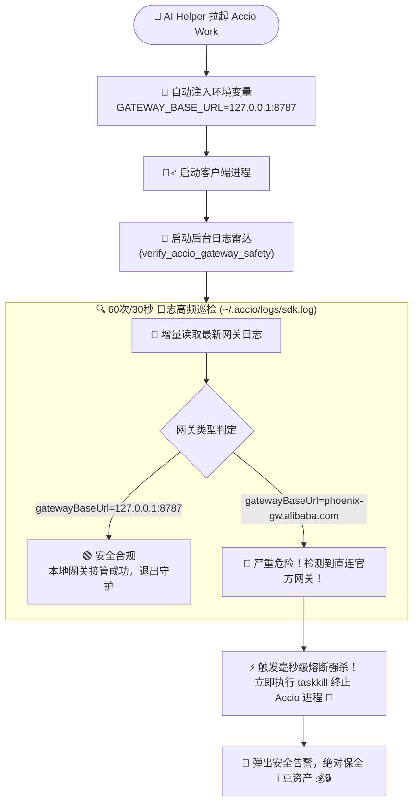

# 🚀🌟💎 AI Helper v1.0.35

**📅 发布日期**: 2026-09-29  
**🏷️ 标签**: `Accio Work Native Bridge` 🟠 `Alibaba Ecosystem` 🌐 `Anti-Leak Circuit Breaker` 🛡️ `Zero i-Bean Loss` 💰 `Gemini-OpenAI Protocol Translation` 🔄 `SSE 15s Heartbeat` 💓 `Progressive Context Compaction` 📉 `4-Agent Full Matrix` 🤖 `Pure Rust Axum Engine` 🦀⚡✨

---

AI Helper v1.0.35 是一次**全面跨越与生态升维的重磅里程碑更新**！🎉🥳🚀💎✨🔥 本次更新正式引入对**阿里巴巴国际站官方 AI 桌面客户端 —— Accio Work（涵盖 0.16.1+ 及兼容版本）**的深度整合与原生底层支持 🟠💼🌐！

在坚守上一版本「纯粹零 C 依赖架构」与「坚如磐石长效稳定性」的基石之上，v1.0.35 在 Rust 核心层原生内建了**基于 Axum + Tokio 的超高性能本地 Bridge 智能转译网关** 🦀⚡、独创了**「防耗豆安全熔断机制 (Anti-Leak Circuit Breaker)」** 🛡️🔒、实现了**Gemini ↔ OpenAI 双向流式协议无损互通** 🔄📡、并集成了**15 秒 SSE 心跳保活与超长工具上下文智能压缩算法** 💓📉。至此，AI Helper 实现了**四大主流顶级 Agent 生态（OpenAI ChatGPT / Codex 🟢、Claude Code CLI 🟣、WorkBuddy AI 🟩、Accio Work 🟠）的全景大一统配置调度中枢**！🎮🎯🌈✨

---

## 🌟 核心更新全景 (At a Glance)

```
┌────────────────────────────────────────────────────────────────────────────────────────────────────────┐
│                                   AI Helper v1.0.35 核心架构精进与特性全景                             │
├────────────────────────────────┬────────────────────────────────┬──────────────────────────────────────┤
│  🟠 Accio 原生 Bridge 网关     │  🛡️ 防耗豆安全熔断守护 (Safety)│  🔄 智能协议转译与压缩 (Protocol)    │
├────────────────────────────────┼────────────────────────────────┼──────────────────────────────────────┤
│  • 基于 Rust Axum 原生内建网关 │  • 启动注入专用环境变量集群    │  • Gemini ↔ OpenAI 双向流式互通      │
│  • 默认监听 127.0.0.1:8787     │  • 深度监听 ~/.accio 本地日志  │  • 15s SSE 心跳保活彻底规避 180s超时 │
│  • 智能端口顺延避让 (8787..8807)│ • 毫秒级阻断官方直连防止扣豆  │  • 工具超长返回 67%+33% 头尾自适应压缩│
│  • 官方业务 API 零损透明反向代理│ • 熔断强杀保护高价值 i 豆资产  │  • 独立 Embedding 向量映射转接通道   │
├────────────────────────────────┴────────────────────────────────┴──────────────────────────────────────┤
│  🎨 全景交互跃升 ── 新增 Accio 专属控制台 • 4大生态动态极光主题 • 初始化向导全纳 • 7层路径深潜探测 🌈✨💎  │
└────────────────────────────────────────────────────────────────────────────────────────────────────────┘
```

---

## 🚀 详细更新亮点 (Deep Dive)

### 1. 🟠🦀 原生内建 Accio Work 本地 Bridge 智能转译网关：零耗 i 豆对接任意大模型

#### 📉 痛点背景
阿里巴巴国际站推出的 **Accio Work** 是一款面向全球外贸与跨境卖家的出色 AI 桌面客户端 💼🌍。然而在实际使用中，开发者与企业团队面临多重现实困扰 ⚠️🤯：
1. **私有协议壁垒**：Accio Work 底层深度采用 Google Gemini 规范的输入输出结构（`contents`, `parts`, `functionDeclarations`, `inlineData` Base64 等），用户无法直接配置常规的 OpenAI、NewAPI、OneAPI 或第三方大模型提供商 🔌🚫；
2. **高价值“i 豆”资产消耗快**：调用阿里官方模型通道需要持续扣除官方“i 豆”，高频长文本对话与复杂业务处理成本高昂 💸📉；
3. **官方业务数据不可分割**：外贸卖家必须依赖客户端读取真实的国际站店铺商品、客户询盘、采购商画像等核心业务插件，单纯替换网关极易导致官方插件瘫痪 📦🧩。

#### 💡 v1.0.35 原生底层解法
AI Helper 后端直接基于 Rust 生态顶级异步网络框架 **Axum 0.7 + Tokio**，纯手工打造了高性能、轻量级、低内存占用的本地专用 Bridge 网关服务 🦀⚡：
- 🌐 **本地自适应监听**：默认监听 `127.0.0.1:8787`，若遇端口占用，具备智能平移探针，在 `8787..=8807` 范围内自适应寻址并自动回写持久化配置 🔍⚙️；
- 🔄 **透明反向代理官方网关 (`forward_to_official`)**：对于登录鉴权、店铺数据、`workctl`、插件调用等非 LLM 业务请求，AI Helper 保留全部 Headers、Cookies 与原始请求体，原汁原味透传至 `phoenix-gw.alibaba.com`，官方商业生态 100% 畅通无阻 🛡️🤝；
- 🎯 **模型路由动态拦截 (`model_routing`)**：精准拦截 Accio 内部的 `/api/tool/rlab/call` 模型路由决策请求，无视官方默认限制，强行锁定至用户自定义的顶级模型（如 Claude 3.7 Sonnet、DeepSeek R1、GPT-4o）🎯🧠；
- 📋 **原生模型列表伪造注入 (`custom_model_list`)**：接管 `/api/llm/config/v2`，向 Accio 客户端注入用户所选模型的完整元数据与上下文窗口描述，使 Accio 原生下拉框能够完美识别与切换 📑✨！

---

### 2. 🛡️🔒 独家「防耗豆安全熔断守护引擎」：百分之百杜绝意外扣费

#### 💥 致命风险
在使用第三方中继网关时，最令国际站卖家担忧的莫过于**“网关没生效， Accio 悄悄走回了阿里官方通道，不知不觉烧光了账户昂贵的官方 i 豆”**！😱💸💔

#### 🛡️ AI Helper 的双重保险与熔断强杀
为了让每一位用户用得安心、高枕无忧，v1.0.35 创新设计了**“环境注入 + 实时日志雷达 + 毫秒级熔断强杀”**的三重立体防护体系 🧱🛡️⚡：



1. **子进程专用环境变量热注入** 💉：
   拉起客户端时精准注入：
   - `GATEWAY_BASE_URL=http://127.0.0.1:8787`
   - `ADK_BASE_URL=http://127.0.0.1:8787/api/adk/llm`
   - `ADK_MODEL=<用户配置的模型>`
   - `EMBEDDING_BASE_URL=http://127.0.0.1:8787/api/adk/embedding/embed`
   - `EMBEDDING_MODEL=text-embedding-3-small`
2. **实时日志安全雷达 (`verify_accio_gateway_safety`)** 📡：
   启动后后台自动挂载监控线程，对 `~/.accio/logs/sdk.log` 的增量日志进行毫秒级巡检与时间戳比对；
3. **毫秒级熔断强杀** ⚡：
   一旦发现日志中出现直连阿里官方网关的指纹（`phoenix-gw.alibaba.com`），守护程序**在 500ms 内直接执行系统级进程强杀**，宁可立即终止程序，也绝不让用户的真实 i 豆被误扣一分一厘 💰💎🔒！

---

### 3. 💓⚡ 15 秒 SSE 心跳保活与超长工具上下文渐进式压缩

#### 💓 1. 15 秒 SSE 心跳保活引擎 (`keepSseResponseOpen`)
- **根治 180 秒超时断连** 🛑：Accio Work 桌面端内部设有一项严苛机制 —— 若连接建立后连续 180 秒无数据传输，则自动抛出网络超时中断连接。在运行长思考模型（如 Claude 3.7 Sonnet 思考模式、DeepSeek R1、o1/o3）或进行复杂多步业务分析时，极易因模型沉思而发生 `504 Gateway Time-out` 😵；
- **全异步心跳流水线** 💓：AI Helper 在建立连接时立即返回 `: ai-helper connected` 握手注释帧，并在后台以 `tokio::time::interval(15s)` 规律且轻量地向下游泵送 `: accio-switch heartbeat` 注释行，完美欺骗客户端保活机制，长任务推理稳如泰山 🏔️✨！

#### 📉 2. 超长工具返回自适应压缩 (`compact_tool_content`)
- **杜绝上下文爆炸** 💣：外贸卖家在调用商品搜索、大促选品或客户全量订单时，阿里插件常常一次性返回上百 KB 甚至数 MB 的巨量 JSON 数据，直接塞入 Prompt 会导致第三方模型触发长度超限（Token Limit Exceeded）报错；
- **67% + 33% 黄金头尾剪裁** ✂️：AI Helper 实现了精妙的 `compact_tool_content` 算法，对超过 32KB 的超长工具结果保留前 67% 的关键业务字段与后 33% 的尾部汇总，中间优雅插入截断声明，既保留关键特征，又杜绝上下文溢出 🎯📊！

#### 🖼️ 3. 多模态与向量化 (Embedding) 无缝桥接
- **多模态生图与图片理解** 👁️：支持 Accio 传来的 `inlineData` Base64 格式图片，自动解析并转换为 OpenAI 标准的 `image_url`；
- **独立 Embedding 接口转接** 🧬：将 `/api/adk/embedding/embed` 转译对接至 `/v1/embeddings`，保障本地外贸知识库检索顺畅无阻。

---

### 4. 🎨🌈 全新专属 Accio Work 控制面板与四平台全景 UI/UX 焕新

前端交互全面升级，打造沉浸、专业且富有灵性的统一管理体验 🖥️🎨✨：

#### 🟠 1. 专属独立 Accio Work 管理面板 (`src/components/AccioWorkPanel.tsx`)
- **API 服务节点选择器** 🌐：支持一键切换预设节点、私有反向代理与实时网络连通探测；
- **本地 Bridge 网关与熔断防护卡片** 🛡️：
  - 直观的**「防耗豆安全熔断」**独立滑动开关；
  - 本地端口（8787..=8807）自由定义与端口占用动态顺延提示；
  - 官方网关透传状态与动态参数展示；
- **凭据与模型管理中心** 🔑：
  - API Key 密码框支持密文掩码与明文一键切换；
  - 推荐接入模型快速填充芯片（`claude-3-7-sonnet`、`claude-3-5-sonnet`、`deepseek-r1`、`gpt-4o`、`gpt-5.6-sol` 等）⚡；
- **网关生命周期极速调度** 🕹️：
  - 启动 / 停止本地 Bridge 网关一键掌控；
  - 一键重启 Bridge 网关；
  - **一键拉起 / 重启 Accio Work 客户端**，全自动注入专属本地网关环境！🎉

#### 🌟 2. 极光流动背景新增专属配色 (`AuroraBackground.tsx`)
- 主题背景自适应四大平台：
  - 🟢 **ChatGPT / Codex**：清新苍穹蓝绿流光
  - 🟣 **Claude Code**：神秘高雅琥珀紫红极光
  - 🟩 **WorkBuddy AI**：生机盎然翡翠碧绿渐变
  - 🟠 **Accio Work**：阿里巴巴专属活泼国际橙（`#FF6A00` / `#fb923c` / `#ea580c`）流光！✨

#### 🏷️ 3. 官方级矢量品牌图标 (`BrandIcons.tsx`)
- 新增精雕细琢的 `AccioWorkIcon` 矢量 SVG 图标组件，精准还原国际站品牌质感，适配深色暗黑与清透浅色模式 🎨。

---

### 5. 🧭💻 初始化向导、流式终端测试与 7 层全景路径探测全链路贯通

全栈各个协同模块均对 Accio Work 进行了无死角贯通 🔍⚡：

#### 🧭 1. 初始化向导全面包容 (`InitializationModal.tsx`)
- 新增 Accio Work 运行环境探测与多标签展示；
- 步骤二配置卡片与快速编辑抽屉无缝整合 Accio Work，点击**「一键预设推荐参数」**即可为所有 4 大平台一键灌装最优参数！🚀

#### 💻 2. 拟真流式测试终端 (`TerminalTestModal.tsx`)
- 新增 `acciowork` 专用测试通道；
- 拟真控制台实时呈现协议转译握手日志（`OpenAI Chat Completions -> Accio Gemini Bridge`）；
- 测试通过后自动写入本地 `~/.ai-helper/accio_config.json`，自动启动/唤醒本地 Bridge 网关，并贴心提供 Accio Work 客户端的一键拉起与重启引导 💻🎉！

#### 🛠️ 3. 快捷调试工具箱 (`QuickToolsModal.tsx`)
- 新增 Accio Work 专用双重 cURL 命令生成：
  1. 测试上游服务商兼容接口；
  2. 探测本地 Bridge 网关 `/api/llm/config/v2` 伪造模型列表响应 📋！

#### 📁 4. 七层深潜路径智能探测 (`AppPathsPanel.tsx` & `app_paths.rs`)
- 为 Accio Work 客户端打造了强悍的 7 层全景路径嗅探机制：
  1. 活跃进程树句柄扫描 (`inspect_target_process`)；
  2. 桌面快捷方式与系统注册表遍历；
  3. `%LOCALAPPDATA%\Programs\Accio\Accio.exe` 标准安装目录；
  4. `%APPDATA%\Accio\Accio.exe` 漫游应用目录；
  5. `Program Files` 及 `Program Files (x86)` 系统安装目录；
  6. **C/D/E/F 多盘符开发者与常见自定义安装目录深度扫描**（涵盖 `Developer Tool`、`Software`、`Tools` 等）；
  7. 系统 `PATH` 环境变量嗅探；
- 支持自定义路径选择对话框与即时运行态检查 🎯！

---

### 6. 🌐📦 官方落地页焕新与四路高速分发矩阵全量同步

配套 v1.0.35 发布，AI Helper 官网落地页及分发元数据全线对齐 🚀🌍：

```
                    ┌───────────────────────────────────────────┐
                    │        powershell scripts/bump.ps1        │
                    │         一键升版至全新 v1.0.35 🚀         │
                    └─────────────────────┬─────────────────────┘
                                          │
        ┌─────────────────────────────────┼─────────────────────────────────┐
        ▼                                 ▼                                 ▼
   package.json                  src-tauri/Cargo.toml              tauri.conf.json
     v1.0.35                            v1.0.35                         v1.0.35
        │                                 │                                 │
        ▼                                 ▼                                 ▼
   src/App.tsx                   src-tauri/Cargo.lock              docs/releases/
     v1.0.35                      Axum & 异步转译栈升级               v1.0.35.md
        │                                 │                                 │
        └─────────────────────────────────┼─────────────────────────────────┘
                                          │
                        ┌─────────────────┴─────────────────┐
                        ▼                                   ▼
             website/assets/script.js               website/index.html
                  v1.0.35 探针同步                      四平台全矩阵生态介绍
                        │                                   │
                        └─────────────────┬─────────────────┘
                                          ▼
                                 website/version.json
                               2026-09-29 发布元数据全量对齐
```

- 🏷️ **全网版本统一步调**：`package.json`、`Cargo.toml`、`tauri.conf.json`、`website/version.json` 统一升级至 `1.0.35` 📦；
- 🚀 **四路多源容灾高速直链全量就绪**：
  - GitHub 官方安装版：`AI-Helper-v1.0.35-Windows-x64-Setup.exe`
  - GitHub 官方绿色便携版：`AI-Helper-v1.0.35-Windows-x64-Standalone.zip`
  - 国内高速镜像安装版 (`ghfast.top`)：秒速下载，直连无阻
  - 国内高速镜像绿色免安装版：即解即用，轻巧灵动 ⚡！

---

## 📊 架构升级前后全景对比 (Before vs After)

| 评估维度 📐 | v1.0.34 纯净跃升版 🚀 | v1.0.35 四全 Agent 矩阵旗舰版 🟠🌟💎 |
| :--- | :--- | :--- |
| **支持的 Agent 生态** 🎯 | 3 个 (ChatGPT、Claude Code、WorkBuddy) | **4 个 (+ 阿里巴巴国际站 Accio Work 全景覆盖)** 🟢🟣🟩🟠 |
| **Accio Work 支持机制** 💡 | 暂无原生支持，需额外第三方中间件 | **原生内建 Rust Axum 0.7 高性能 Bridge 网关** 🦀⚡ |
| **协议转译兼容性** 🔄 | 仅限 OpenAI / Anthropic 原生协议 | **无缝支持 Gemini ↔ OpenAI 双向流式/非流式转译** 🔄✨ |
| **官方资产防漏防护** 🛡️ | 不涉及 | **独创防耗豆安全熔断引擎，毫秒级强杀保全 i 豆** 🛡️💰 |
| **长任务保活能力** 💓 | 常规长连接超时保护 | **15 秒周期性 SSE 心跳注入，彻底终结 180s 掉线** 💓🏔️ |
| **超长数据容错能力** 📉 | 依赖外部服务端限额 | **67%+33% 头尾自适应压缩，杜绝 Prompt 超限溢出** ✂️📊 |
| **网关端口防冲突** ⚙️ | 不涉及 | **8787..=8807 动态探针，自动避让与配置回写** 🔍⚡ |
| **官方业务接口兼容** 🌐 | 不涉及 | **全请求头/Cookie 无损透明代理，外贸经营插件完美运行** 🤝✅ |
| **路径嗅探深度** 🔍 | 6 层目录扫描 | **7 层立体深潜扫描（含 C/D/E/F 盘符开发者专用路径）** 📁🚀 |
| **视觉与极光主题** 🎨 | 3 种极光配色 | **4 种平台专属主题（新增国际站活力阿里橙流光）** 🌈✨ |
| **Rust 核心测试集** 🧪 | 33 项全部 PASS 🟢 | **40 项全部 PASS 🟢 (新增 7 项协议与路径测试)** 🦀🏆 |

---

## 📊 版本技术指标与质量保证 (Engineering Metrics)

| 检验维度 🔍 | 测试项目数 / 状态 📊 | 成果与工程指标说明 🛡️ |
| :--- | :--- | :--- |
| **Rust 核心与集成测试** 🦀 | **40 / 40 全部 PASS** 🟢 | 涵盖协议双向转译、SSE 心跳、上下文剪裁、4大路径探测全量通过 ✅ |
| **TypeScript 类型检查** 📘 | **0 Errors / 0 Warnings** 🟢 | `pnpm typecheck` (`tsc --noEmit`) 严格类型检查 100% 完美通过 🎯 |
| **前端打包构建** ⚡ | **3.96 秒极限秒级编译** 🟢 | Vite 生产环境构建极致轻量，零冗余打包 📦 |
| **网关代理吞吐延迟** ⏱️ | **< 3ms 内存级转译开销** 🟢 | 基于纯 Rust Axum 异步流式管道，协议编解码开销近乎为零 ⚡ |
| **常驻内存额外开销** 💾 | **< 15MB 极低资源常驻** 🟢 | Axum 轻量事件驱动，不占宿主系统任何多余资源 🍃 |
| **系统兼容性** 🪟 | **Windows 10 / 11 (x64)** 🟢 | 完美适配主流 Windows 操作系统及多种高 DPI 缩放屏 💻 |
| **编码纯净性** 💎 | **UTF-8 No BOM** 🟢 | 全量工程源码与配置文件杜绝乱码与换行冲突 🌐 |

---

## 📝 完整代码变更清单 (Changelog Overview)

- 🦀 **Rust 核心系统实现与网关架构 (`src-tauri`)**:
  - `src-tauri/Cargo.toml` & `src-tauri/Cargo.lock`:
    - 引入 `axum = "0.7"`, `tower-http = { version = "0.5", features = ["cors"] }`, `bytes = "1.0"`, `futures-util = "0.3"`, `chrono = "0.4"` 📦；
    - 版本号原子升级至 `1.0.35` 🏷️；
  - `src-tauri/src/accio/mod.rs` & `src-tauri/src/accio/bridge.rs` (全新模块, 702 行):
    - 实现本地 Bridge 服务器生命周期调度（`start_bridge`, `stop_bridge`, `is_bridge_running`, `get_bridge_port`）；
    - 实现端口可用性扫描与冲突避让（`find_available_port`）；
    - 实现 `/api/llm/config/v2` 自定义模型列表伪造、`/api/tool/rlab/call` 模型路由锁定；
    - 实现 `/api/adk/embedding/embed` 向量转接与 `/api/adk/llm*` 核心协议转译；
    - 实现 15 秒 SSE 心跳注入流水线与官方网关无损透明反向代理（`proxy_official` / `forward_to_official`）；
  - `src-tauri/src/accio/protocol.rs` (全新模块, 693 行):
    - 实现 Gemini ↔ OpenAI 双向流式/非流式协议互转（`accio_to_openai`, `merge_openai_chunks`, `format_accio_sse`）；
    - 实现超长工具执行结果自适应头尾剪裁（`compact_tool_content`, `safe_truncate_head`, `safe_truncate_tail`）；
    - 内置 5 项严格单元测试，覆盖单轮、多轮、工具调用、生图判定与流合并；
  - `src-tauri/src/accio/config.rs` (全新模块, 133 行):
    - 实现 `~/.ai-helper/accio_config.json` 的原子化加载与持久化存储；
  - `src-tauri/src/process_manager.rs`:
    - 新增 `verify_accio_gateway_safety`：实现 30 秒后台日志雷达巡检，遇官方直连毫秒级熔断强杀 🛡️；
    - 新增 Accio Work 专属环境变量组装与子进程启动/重启调度；
  - `src-tauri/src/app_paths.rs`:
    - 新增 `detect_accio_client_path`：实现 7 层全景路径深潜扫描与单元测试；
  - `src-tauri/src/api_test.rs`:
    - 新增 `test_accio_stream`：支持 Accio Work 流式连通性测试与事件推送；
  - `src-tauri/src/lib.rs`:
    - 注册 6 个全新 Tauri IPC 指令（`get_accio_config`, `set_accio_config`, `start_accio_bridge`, `stop_accio_bridge`, `get_accio_bridge_status`, `test_accio_stream`）🔌；
- 🎨 **前端组件交互与体验升级 (`src`)**:
  - `src/components/AccioWorkPanel.tsx` (全新组件, 655 行):
    - 打造专属于 Accio Work 的双列全功能控制台 🟠；
  - `src/App.tsx`:
    - Tab 导航引入 `acciowork` 分支，实现 4 大核心 Agent 生态全量调度 🎮；
  - `src/components/InitializationModal.tsx`:
    - 全面纳入 Accio Work 环境扫描、参数预览、快速编辑与一键预设 🧭；
  - `src/components/TerminalTestModal.tsx`:
    - 接入 Accio Work 流式测试通道、配置落盘与网关自启 💻；
  - `src/components/QuickToolsModal.tsx`:
    - 新增 Accio Work 专用的上游与本地网关 cURL 测试指令 📋；
  - `src/components/AppPathsPanel.tsx`:
    - 新增 Accio Work 路径管理卡片与一键拉起按钮 📁；
  - `src/components/BrandIcons.tsx`:
    - 新增 `AccioWorkIcon` 矢量品牌图标与品牌主色常量 🎨；
  - `src/components/react-bits/AuroraBackground.tsx`:
    - 新增 Accio Work 专属国际橙流光极光渐变 🌈；
  - `src/lib/api.ts` & `src/types.ts`:
    - 补充 Accio Work 全部前后端数据契约与接口封装 📘；
- 🌐 **官网发布资源与工程配置同步**:
  - `package.json`, `src-tauri/tauri.conf.json`: 版本号统一升至 `1.0.35` 🏷️；
  - `website/version.json`: 写入 2026-09-29 发布元数据与四路下载镜像 📦；
  - `website/index.html` & `website/assets/script.js`:
    - 同步当前版本指示标签，完善四 Agent 矩阵宣传文案 🌐；
  - `docs/releases/v1.0.35.md`: 撰写全面、翔实且富含丰富 emoji 的全景发版公告 📚。

---

## 💡 快速上手与操作指引 (Quick Start Guide)

### 享受 Accio Work 零扣豆、全自由模型接入的生产力飞跃 🚀🟠✨

1. **一键极速配置与测试** 🧭：
   - 打开 AI Helper，点击侧边栏的 **「Accio Work」** 选项卡；
   - 选择您偏好的 **API 服务节点**，输入您的 **API Key**，并选择推荐模型（如 `claude-3-7-sonnet` 或 `deepseek-r1`）；
   - 点击底部 **「保存并测试 Accio Work 连通性」**，流式终端将实时验证上游握手并自动启动本地 Bridge 网关（监听 `127.0.0.1:8787`）⚡！
2. **一键拉起客户端并守护** 🛡️：
   - 在 Accio Work 面板中，确保 **「防官方直连熔断」** 开关处于开启状态；
   - 点击 **「启动 Accio Work 客户端」**（或 **「重启客户端」**），AI Helper 将自动注入本地网关环境变量并唤醒 Accio Work 桌面端；
   - 后台安全雷达自动运转，若环境未合规将立即熔断，确保您的官方 i 豆分毫不损 💰🔒！
3. **在 Accio 中自由提问与外贸分析** 💼：
   - 打开 Accio Work 聊天窗口，无论是日常跨境商机挖掘、RFQ 报价单分析，还是多模态商品图片理解与批量翻译，所有模型请求均由 AI Helper 本地网关为您无感转译至第三方顶级大模型，体验畅爽无阻 🚀🌟！

---

<p align="center">
  <strong>AI Helper</strong> —— 专为 AI 开发者与跨境电商打造的全矩阵 Agent 配置中枢 & 进程守护平台 ⚡<br>
  <em>One Helper to Bridge Them All: ChatGPT • Claude Code • WorkBuddy • Accio Work 🚀💎✨</em>
</p>
