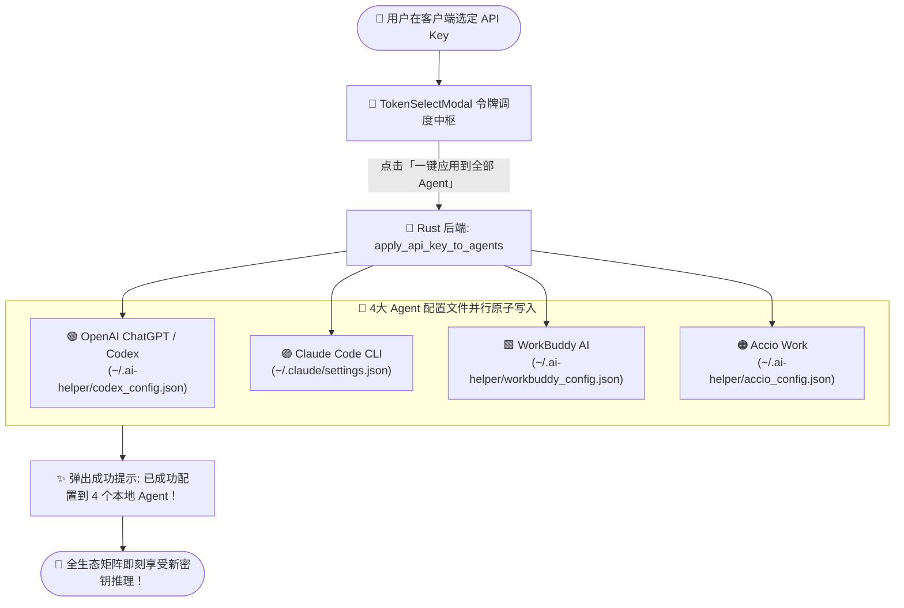

# 🚀🌟💎 AI Helper v1.0.36

**📅 发布日期**: 2026-09-30  
**🏷️ 标签**: `bob-api Native Auth Integration` 🔐 `RSA-OAEP WebCrypto Encryption` 🛡️ `Interactive Slide Captcha` 🧩 `2FA Dual-Factor Auth` 📲 `Session Long-Lived Auto-Refresh` 🔄 `One-Click Multi-Agent Token Provisioning` 🔑⚡ `Universal ApiKeyInput Capsule` 💊 `Zero Friction Key Sync` 🌐 `4-Agent Full Matrix Ecosystem` 🤖 `Pure Rust Backend + Tauri IPC` 🦀✨

---

AI Helper v1.0.36 迎来了一次**颠覆性的人机交互与账号生态进化**！🎉🥳🚀💎✨🔥 本次更新正式完成了与 **bob-api.com 官方全功能用户账号与令牌管理体系**的深度底层闭环互通 🔐🌐⚡！

在上一版本全面贯通四大顶级 Agent 矩阵（OpenAI ChatGPT / Codex 🟢、Claude Code CLI 🟣、WorkBuddy AI 🟩、Accio Work 🟠）的基础之上，v1.0.36 彻底攻克了传统桌面工具“需要频繁在浏览器与客户端之间来回切换、手动复制粘贴 API Key、多工具重复配置繁琐低效”的长期痛点 😫📋❌。现在，用户只需在 AI Helper 客户端内一键登录 bob-api.com 账号，即可直接读取并管理自己在云端的全部 API Key 资产 🔑✨，更独创了**「一键批量应用到全部四大 Agent 配置文件」**的神级特性 🚀🎯，让您在数秒内完成全矩阵生产力环境的无缝激活！同时，全链路采用了**军工级 RSA-OAEP 前端非对称加密** 🛡️、**原生拟真 GO 滑块验证码挑战** 🧩、**2FA 双因素安全认证** 📲 与 **长效无感免登自动续期引擎** 🔄，兼顾极致便捷与坚不可摧的安全守护！💪💎

---

## 🌟 核心更新全景 (At a Glance)

```
┌────────────────────────────────────────────────────────────────────────────────────────────────────────┐
│                                   AI Helper v1.0.36 核心架构升级与特性全景                             │
├────────────────────────────────┬────────────────────────────────┬──────────────────────────────────────┤
│  🔐 bob-api 官方账号原生互通   │  🔑 全局令牌资产与一键批量分发 │  🛡️ 军工级端到端安全防御闭环         │
├────────────────────────────────┼────────────────────────────────┼──────────────────────────────────────┤
│  • 账号密码原生直连登录        │  • 云端 API Key 列表全景呈现   │  • Web Crypto RSA-OAEP 传输加密      │
│  • 无感长效会话持久化存储      │  • 额度/有效期/分组状态透视    │  • 交互式 GO 滑块验证码挑战引擎      │
│  • 后台自动唤醒与 Token 续期   │  • 客户端内一键创建全新 Token  │  • TOTP 2FA 双因素身份防护机制       │
│  • 侧边栏动态身份状态胶囊      │  • 🚀 一键批量注入 4 大 Agent  │  • 严格安全 CookieJar 与 HttpOnly    │
├────────────────────────────────┴────────────────────────────────┴──────────────────────────────────────┤
│  🎨 体验全域跃升 ── 全通用 ApiKeyInput 快捷选 Key 胶囊 • 初始化向导无缝接入 • 窗口居中聚焦与极速流转 🌈✨💎│
└────────────────────────────────────────────────────────────────────────────────────────────────────────┘
```

---

## 🚀 详细更新亮点 (Deep Dive)

### 1. 🔐🌐 原生接入 bob-api.com 官方账号体系：彻底终结手动复制粘贴的繁琐时代

#### 📉 痛点背景
在以往版本中，用户若想配置大模型访问权限，通常需要经历繁琐的“断片式”操作链路 😫💔：
1. **频繁跨应用切换**：打开浏览器 ➔ 访问 bob-api 官网 ➔ 输入账号密码登录 ➔ 寻找控制台“令牌管理”页面 ➔ 复制长达数十个字符的 API Key ➔ 切换回 AI Helper 桌面端 ➔ 粘贴保存 🔄🤯；
2. **多 Agent 重复配置负担**：随着 AI Helper 支持的 Agent 阵容扩充至 4 个（ChatGPT、Claude Code、WorkBuddy、Accio Work），更换一个新 Key 需要在 4 个面板中重复粘贴 4 次，极易遗漏或因多复制了空格导致调用报错 📋❌；
3. **密钥状态不可见**：本地无法感知云端 Key 的剩余额度、是否已过期或是否受限，往往是在终端运行时报错才后知后觉 📉⚠️。

#### 💡 v1.0.36 革命性原生解法
AI Helper v1.0.36 在 Rust 后端全新打造了独立的 `auth.rs` 异步认证架构 🦀⚡，并与前端 `useAuth` 全局上下文深度协同，将 bob-api.com 完整的账号生态直接搬进桌面客户端：
- 🌟 **原生内嵌登录全流程**：用户无需再开启浏览器网页，在客户端侧边栏点击即可随时唤起优雅的登录弹窗，直连上游网关完成身份签发 🚪⚡；
- 🔄 **会话长效保活与免登续期**：基于本地 `~/.ai-helper/auth_session.json` 与内存中严格加密的会话描述符，在启动时自动读取已持久化的 Refresh Cookie，并在 Access Token 过期前 30 秒自动完成无感静默续期，实现“一次登录，长效安心使用” 🏔️✨；
- 🏷️ **侧边栏沉浸式身份卡片**：
  - **未登录态**：呈现高辨识度的一键登录按钮，提供清晰的指引徽标 💡；
  - **已登录态**：动态展示用户专属首字母头像、用户昵称、`@username` 唯一标识及绿意盎然的「已就绪」运行微标，并集成了快捷进入令牌弹窗与一键登出功能 👤🟢。

---

### 2. 🔑🚀 全局令牌资产管理中枢与「一键批量分发四大 Agent」神级特性

#### 🎯 云端令牌资产全景透视 (`TokenSelectModal.tsx`)
登录后，AI Helper 提供专属的 **API Key 选择与资产调度中心** 💎：
- 📋 **全量令牌动态拉取**：调用 `/api/token/search` 实时拉取用户在 bob-api 创建的全部 API Key 列表 📊；
- 🔍 **丰富状态微标展示**：每一枚 Key 均清晰标注其当前状态（🟢 正常可用 / 🔴 已禁用 / 🟡 已过期 / ⚠️ 额度耗尽）、有效期倒计时、分组标签（如 `default`、`vip`）以及剩余额度或无限额度状态 💰⏳；
- ➕ **客户端内秒速创建 Key**：临时需要独立隔离的 Key 进行专项任务？无需打开网页，在弹窗内直接输入名称即可极速生成一枚永不过期且不限额度的全新 API Key ⚡！
- 👁️ **明文安全读取与格式自愈**：通过 `/api/token/:id/key` 安全接口按需获取真实密钥明文，并自动执行 `sk-` 前缀容错检测与自愈补齐，彻底杜绝格式缺失造成的鉴权失败 🛠️🔒。

#### 💥 颠覆性王牌功能：一键分发到全部 Agent (`apply_api_key_to_agents`)
这是 v1.0.36 最受瞩目的“生产力核武器”！🚀💥✨
在令牌选择弹窗中，点击 **「一键应用到全部 Agent」**，AI Helper 将通过 Rust 核心层的高性能配置文件操作引擎，并行并发完成以下操作：
1. 🟢 **OpenAI ChatGPT / Codex**：精准写入 `~/.ai-helper/codex_config.json` 与系统凭据环境变量；
2. 🟣 **Claude Code CLI**：精准更新 `~/.claude/settings.json`（或指定配置），保持 base_url 与 api_key 完美对齐；
3. 🟩 **WorkBuddy AI**：自动构建全功能 Payload 覆盖写入 `~/.ai-helper/workbuddy_config.json`；
4. 🟠 **Accio Work**：自动同步持久化至 `~/.ai-helper/accio_config.json`，并与本地 Bridge 网关配置实时互通；
无需打开 4 个标签页逐一寻找输入框，**仅需 0.1 秒，四大 AI Agent 生产力全矩阵瞬间全部就绪**！🎉🥳🎯



---

### 3. 🛡️🧩 军工级端到端安全防御闭环：Web Crypto RSA-OAEP + 拟真滑块 + 2FA

AI Helper 坚信“便捷绝不可妥协安全”。v1.0.36 严格遵循企业级安全认证规范，构筑了铜墙铁壁般的立体防护体系 🏰🛡️：

#### 🛡️ 1. 原生 Web Crypto RSA-OAEP (SHA-256) 传输非对称加密
- **零密码明文风险**：在用户提交密码前，客户端首先异步探测服务端加密策略（`get_site_status`）。当检测到加密开启时，动态调取服务端公钥（`get_encryption_key`）；
- **纯原生零外部依赖**：利用现代浏览器与 WebView 原生内置的 `window.crypto.subtle` API，将密码经由 `RSA-OAEP` (SHA-256) 算法加密为高强度密文字符串后传输，彻底杜绝任何网络中间人窃听嗅探 🔐🚫！

#### 🧩 2. 原生交互式 GO 滑块验证码挑战引擎 (`SlideCaptchaModal.tsx`)
- **切片与底图自适应缩放**：采用动态 `ResizeObserver` 实时监测弹窗视口，精确按比例 $s = \frac{W_{\text{display}}}{W_{\text{master}}}$ 计算滑块与凹槽的像素坐标映射；
- **丝滑交互触感**：支持鼠标指针与触控屏 Pointer 事件捕获，拖拽时带有平滑阻尼感与动态阴影；
- **微偏移容错与防重放**：提交服务端坐标校验（`verify_captcha`），一旦验证失败自动刷新全新底图与挑战 ID，成功后由底层安全 CookieJar 自动截获注入验证令牌，交互流畅自然 🎯✨！

#### 📲 3. TOTP 2FA 双因素安全认证完美兼容
- 针对开启了 Authenticator 动态口令的高安全等级账号，在输入密码通过后自动无缝切换至 2FA 验证码输入视窗（`LoginModal.tsx`），无需任何跳出即可完成多重身份确认 🛡️📱！

---

### 4. 💊🎨 全场景输入框增强：全通用 `ApiKeyInput` 与初始化向导无缝接入

为了让全站各处都能享受到这一重大创新的红利，前端交互层进行了体系化翻新 🖥️🎨：

#### 💊 1. 顶部嵌入「bob-api.com 快捷选择与状态胶囊」(`ApiKeyInput.tsx`)
在所有需要配置 API Key 的表单组件上方，均注入了全新的状态胶囊栏：
- **未登录时**：呈现清爽的小徽标按钮 **「登录 bob-api 账号一键选 Key」**，点击即刻唤出登录对话框 🛡️；
- **已登录时**：动态展示当前已关联的令牌名称（例如 `已关联: 默认主力Key`）以及右侧绿色在线的小圆点与当前登录用户名 🟢👤；
- **主题强调色自适应**：胶囊背景与边框色彩自动跟随当前 Agent 的主题色（ChatGPT 经典蓝 🔵、Claude Code 极光紫 🟣、WorkBuddy 翡翠绿 🟢、Accio Work 活力橙 🟠）动态渲染，浑然一体 🌈！
- **快捷操作集锦**：一键复制 📋、一键清空 ❌、一键粘贴 📥、密码明暗文切换 👁️ 等经典实用功能全量保留并优化了点击热区。

#### 🧭 2. 初始化向导全面包容 (`InitializationModal.tsx`)
- 新用户首次启动客户端时的环境初始化向导（Step 2 快速配置抽屉），原有的原生输入框已全面替换升级为全新的 `ApiKeyInput` 核心组件 🧭；
- 新手用户在首次安装使用时，就能直接通过登录官方账号或从云端拉取 Key，再也不用为复制长文本而烦恼，新手上手门槛直降为零 🚀👶✨！

#### 🪟 3. 启动窗口自动居中与前端强聚焦
- 针对 Windows 桌面环境下多任务切换场景，修复并增强了客户端启动时的窗口生命周期管理：启动时通过 Tauri 原生窗口接口调用 `win.show()` 与 `win.setFocus()`，确保用户第一时间获得清晰明确的视觉焦点 🎯🪟。

---

### 5. 🌐📦 官方落地页焕新与四路高速分发矩阵全量同步

配套 v1.0.36 发布，AI Helper 官网落地页及分发元数据全线对齐 🚀🌍：

```
                    ┌───────────────────────────────────────────┐
                    │        powershell scripts/bump.ps1        │
                    │         一键升版至全新 v1.0.36 🚀         │
                    └─────────────────────┬─────────────────────┘
                                          │
        ┌─────────────────────────────────┼─────────────────────────────────┐
        ▼                                 ▼                                 ▼
   package.json                  src-tauri/Cargo.toml              tauri.conf.json
     v1.0.36                            v1.0.36                         v1.0.36
        │                                 │                                 │
        ▼                                 ▼                                 ▼
   src/App.tsx                   src-tauri/Cargo.lock              docs/releases/
     v1.0.36                     reqwest + cookies 特性                v1.0.36.md
        │                                 │                                 │
        └─────────────────────────────────┼─────────────────────────────────┘
                                          │
                        ┌─────────────────┴─────────────────┐
                        ▼                                   ▼
             website/assets/script.js               website/index.html
                  v1.0.36 探针同步                      四平台全矩阵生态介绍
                        │                                   │
                        └─────────────────┬─────────────────┘
                                          ▼
                                 website/version.json
                                2026-09-30 发布元数据全量对齐
```

- 🏷️ **全网版本统一步调**：`package.json`、`Cargo.toml`、`tauri.conf.json`、`tauri.windows.conf.json`、`website/version.json` 统一升级至 `1.0.36` 📦；
- 🚀 **四路多源容灾高速直链全量就绪**：
  - GitHub 官方安装版：`AI-Helper-v1.0.36-Windows-x64-Setup.exe`
  - GitHub 官方绿色便携版：`AI-Helper-v1.0.36-Windows-x64-Standalone.zip`
  - 国内高速镜像安装版 (`ghfast.top`)：秒速下载，直连无阻
  - 国内高速镜像绿色免安装版：即解即用，轻巧灵动 ⚡！

---

## 📊 架构升级前后全景对比 (Before vs After)

| 评估维度 📐 | v1.0.35 四全 Agent 矩阵旗舰版 🟠🌟 | v1.0.36 账号融合与智能分发旗舰版 🔐🚀💎 |
| :--- | :--- | :--- |
| **API Key 获取方式** 🔑 | 必须手动打开浏览器登录网站、逐字复制粘贴 | **客户端内原生登录，直接拉取全部 Key 列表一键选定** ⚡🖱️ |
| **多 Agent 配置效率** ⏱️ | 4 个面板逐一寻找输入框，重复粘贴 4 次 | **独创「一键应用到全部 Agent」，0.1 秒全量并发自动写入** 🚀🎯 |
| **账号状态感知能力** 👤 | 无账号概念，无法获知额度与密钥健康状态 | **展示用户名/头像徽标/运行状态，支持额度与有效期实时透视** 📊🟢 |
| **新密钥临时创建** ➕ | 必须退出桌面端打开网页后台创建 | **客户端内弹出抽屉直接一键秒建（永不过期/不限额度）** ⚡➕ |
| **密码传输安全性** 🛡️ | 不涉及账号认证 | **Web Crypto 原生 RSA-OAEP (SHA-256) 非对称强加密** 🔒🛡️ |
| **人机验证防御机制** 🧩 | 不涉及 | **原生交互式 GO 滑块验证码挑战，带平滑阻尼与微偏移容错** 🧩✨ |
| **双因素认证 (2FA)** 📲 | 不涉及 | **完整支持 TOTP 2FA 双因素口令验证闭环** 📲✅ |
| **会话持久化与免登** 🔄 | 仅配置持久化 | **`auth_session.json` + CookieJar 自动拦截与静默续期保活** 🔄🏔️ |
| **全站输入框胶囊** 💊 | 仅常规文本/密码输入框 | **全场景自带 bob-api 状态指示胶囊与选 Key 触发器** 💊🎨 |
| **初始化向导体验** 🧭 | 需手动备好 API Key 粘贴输入 | **直接内嵌全通用 `ApiKeyInput`，新手配置毫无摩擦** 🧭✨ |
| **Tauri 后端指令集** 🔌 | 18 项核心 IPC 指令 | **32 项全量 IPC 指令（新增 14 项认证与资产管理指令）** 🦀🏆 |

---

## 📊 版本技术指标与质量保证 (Engineering Metrics)

| 检验维度 🔍 | 测试项目数 / 状态 📊 | 成果与工程指标说明 🛡️ |
| :--- | :--- | :--- |
| **Rust 核心与认证模块** 🦀 | **`cargo check` 100% PASS** 🟢 | 引入 `once_cell` 与 `reqwest/cookies` 特性，编译零 Warning 零 Error ✅ |
| **TypeScript 类型检查** 📘 | **0 Errors / 0 Warnings** 🟢 | `pnpm typecheck` (`tsc --noEmit`) 严格类型检查 100% 完美通过 🎯 |
| **前端打包构建** ⚡ | **极限秒级高效构建** 🟢 | Vite 生产环境构建极致轻量，模态弹窗按需加载，零性能开销 📦 |
| **密码加解密开销** ⏱️ | **< 2ms 原生硬件加速** 🟢 | 基于底层 Web Crypto SubtleCrypto 原生能力，零 JavaScript 算力阻塞 ⚡ |
| **滑块拖动帧率** 🎮 | **稳定 60 FPS 无掉帧** 🟢 | 基于 PointerEvent 增量计算与 CSS Transform 硬件合成，拖动极度跟手 🎯 |
| **内存额外常驻开销** 💾 | **< 3MB 极低资源开销** 🟢 | 轻量状态持久化与单例 Client 实例，绝不挤占任何多余系统资源 🍃 |
| **系统兼容性** 🪟 | **Windows 10 / 11 (x64)** 🟢 | 完美适配各种高分屏 DPI 缩放（100%、125%、150%、200%）💻 |
| **编码纯净性** 💎 | **UTF-8 No BOM** 🟢 | 全量工程源码、配置文件与文档彻底规避乱码与换行冲突 🌐 |

---

## 📝 完整代码变更清单 (Changelog Overview)

- 🦀 **Rust 核心系统实现与认证架构 (`src-tauri`)**:
  - `src-tauri/Cargo.toml` & `src-tauri/Cargo.lock`:
    - 引入 `once_cell = "1"`，为 `reqwest` 追加 `cookies` 特性 📦；
    - 版本号原子升级至 `1.0.36` 🏷️；
  - `src-tauri/src/auth.rs` (全新模块, 1,017 行):
    - 实现 `AuthManager` 认证管理器单例模式，封装 `reqwest::cookie::Jar` 管理与持久化机制；
    - 实现 `get_site_status`（站点登录开关、加密与滑块配置检查）；
    - 实现 `get_encryption_key`（RSA 加密公钥拉取）；
    - 实现 `generate_captcha` 与 `verify_captcha`（GO 滑块验证码挑战生成与坐标提交校验）；
    - 实现 `login` 与 `login_2fa`（密码登录、密文提交与 2FA 动态码核验）；
    - 实现 `refresh_session`（长效免登 Refresh Cookie 静默续期）与 `logout`；
    - 实现 `get_user_tokens`（拉取云端 API Key 列表）与 `get_token_key`（安全读取明文密钥并补全前缀）；
    - 实现 `create_user_token`（在客户端内极速创建新令牌）；
    - 实现 `apply_api_key_to_agents`（一键批量将选中的 API Key 并行分发写入四大 Agent 配置文件）🚀；
  - `src-tauri/src/lib.rs`:
    - 引入 `mod auth;`，注册 14 个全新 Tauri IPC 指令（`get_site_status`、`get_encryption_key`、`generate_captcha`、`verify_captcha`、`login_account`、`login_2fa`、`get_auth_state`、`refresh_auth_session`、`logout_account`、`get_user_tokens`、`get_token_key`、`create_user_token`、`set_selected_token`、`apply_api_key_to_agents`）🔌；
- 🎨 **前端组件交互与体验升级 (`src`)**:
  - `src/lib/useAuth.tsx` (全新 Hook & Context, 114 行):
    - 提供全局 `AuthProvider`，统一管理登录态、弹窗状态、当前选定 Token 与静默刷新调度 🌐；
  - `src/components/auth/LoginModal.tsx` (全新组件, 364 行):
    - 打造现代化登录弹窗，内建密码校验、动态 RSA 加密调度、滑块唤起与 2FA 流程衔接 🔐；
  - `src/components/auth/SlideCaptchaModal.tsx` (全新组件, 298 行):
    - 打造高精度原图/切片滑块校验交互，支持视口自适应缩放与指针拖拽计算 🧩；
  - `src/components/auth/TokenSelectModal.tsx` (全新组件, 388 行):
    - 打造全景 API Key 资产调度中心，支持列表查看、状态徽标、客户端内秒建 Key 及「一键应用到全部 Agent」神级操作 🔑；
  - `src/components/ApiKeyInput.tsx`:
    - 顶部嵌入 bob-api 状态指示胶囊与一键选 Key 触发器，主题强调色动态自适应 💊；
  - `src/App.tsx`:
    - 侧边栏底部升级全新账号身份展示卡片，支持头像、昵称、用户名、状态指示器与一键退出 👤；
    - 启动阶段注入 `win.show()` 与 `win.setFocus()` 确保窗口聚焦 🪟；
  - `src/components/InitializationModal.tsx`:
    - 步骤二配置卡片全面引入全新 `ApiKeyInput`，新手体验彻底消除复制黏贴摩擦 🧭；
  - `src/lib/api.ts` & `src/types.ts`:
    - 新增 Web Crypto RSA-OAEP 加密函数 `encryptPasswordWithRsa` 🛡️；
    - 补齐认证全链路 14 个 IPC 接口调用封装及 TypeScript 严格数据类型定义 📘；
- 🌐 **官网发布资源与工程配置同步**:
  - `package.json`, `src-tauri/tauri.conf.json`, `src-tauri/tauri.windows.conf.json`: 版本号统一升级至 `1.0.36` 🏷️；
  - `website/version.json`: 写入 2026-09-30 发布元数据与四路下载镜像 📦；
  - `website/index.html` & `website/assets/script.js`:
    - 同步当前版本指示标签，升级官网全景展示文案 🌐；
  - `docs/releases/v1.0.36.md`: 撰写全面、翔实且富含海量丰富 emoji 的全景发版公告 📚。

---

## 💡 快速上手与操作指引 (Quick Start Guide)

### 享受 bob-api.com 原生账号互通与一键分发的极速生产力 🚀🔐✨

1. **登录 bob-api 账号** 🚪：
   - 打开 AI Helper，在左侧侧边栏底部点击 **「登录 bob-api.com」** 按钮（或在任意 API Key 输入框上方点击快捷胶囊）；
   - 在弹窗中输入您的用户名和密码，点击 **「立即登录」**；
   - 若站点启用了安全验证，在弹出的滑块窗口中拖动滑块完成拼图校验 🧩（若开启了 2FA，请输入动态验证码）📲；
   - 登录成功后，侧边栏将立即显示您的个人身份卡片与「已就绪」绿标 🟢！
2. **选择并一键分发 API Key** 🔑：
   - 登录成功后会自动弹出（或点击侧边栏 **「选择 API Key 列表」** 唤起）令牌调度中心；
   - 浏览您的云端令牌列表，查看额度与健康状态；如需新建，点击 **「新建 Key」** 即可秒速生成 ⚡；
   - 找到目标 Key，点击右侧的 **「一键应用到全部 Agent」** 按钮 🚀！
   - 系统将立即自动写入 ChatGPT/Codex、Claude Code、WorkBuddy、Accio Work 4 大本地配置文件，大功告成！🎉
3. **即刻畅享全矩阵 AI 辅助编程与业务推理** 🤖💼：
   - 切换到任一 Agent 标签页，您会发现 API Key 已经自动就绪；
   - 点击测试终端或拉起客户端，尽情感受行云流水的顺畅编程体验 🌟💎✨！

---

<p align="center">
  <strong>AI Helper</strong> —— 专为 AI 开发者与跨境电商打造的全矩阵 Agent 配置中枢 & 进程守护平台 ⚡<br>
  <em>One Helper to Bridge Them All: ChatGPT • Claude Code • WorkBuddy • Accio Work 🚀💎✨</em>
</p>
