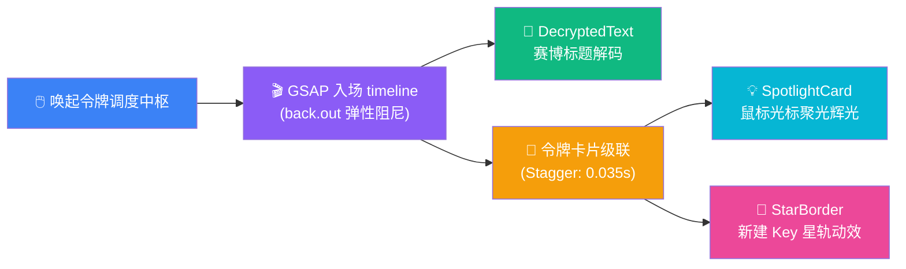
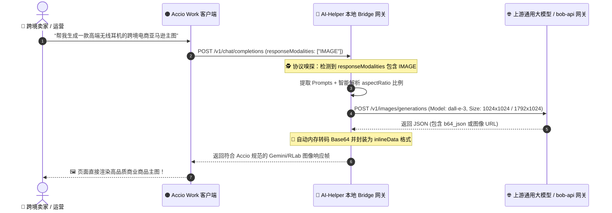

# 🚀🌟💎 AI Helper v1.0.37

**📅 发布日期**: 2026-09-30  
**🏷️ 标签**: `GSAP Fluid Motion Engine` 🎬✨ `React-Bits Visual Feast` 🌌 `Spotlight Glow & StarBorder` 🌟💫 `DecryptedText Cyber Matrix` 🔐⚡ `Strict 4-Stage Startup Pipeline` 🛡️🔒 `Mandatory Login Lock` 🚪🚫 `Token Search & Plaintext Peek` 🔍👁️ `Accio DALL-E 3 Image Translation` 🎨🖼️ `Dynamic Aspect Ratio Mapping` 📐 `Robust Tool ArgsJson Healing` 🛠️ `Zero-Leak Security Guard` 🦀🔥

---

AI Helper v1.0.37 携**全维视觉革命与多模态桥接黑科技**震撼降临！🎉🥳🚀💎✨🔥 本次更新不仅带来了令人惊叹的现代化 UI 动效革新与交互艺术升级 🎬🌌，更为跨境电商与 AI 开发者打通了 Accio Work 从纯文本推理跨越至 **DALL-E 3 商业级图像生成**的无缝转译桥梁 🎨🖼️⚡！

在上一版本全面打通 bob-api 官方账号与一键分发的基础上，v1.0.37 深度重构了 **令牌资产调度中心（TokenSelectModal）** 🔑✨，全面拥抱 **GreenSock (GSAP) 物理弹性动效引擎** 与 **React-Bits 顶级现代化视觉组件库**（`SpotlightCard` 聚光辉光 💡、`DecryptedText` 赛博字符解密 🔐、`ShinyText` 全息流光 🌈、`StarBorder` 星轨流光按钮 🌟）。新增**实时模糊搜索** 🔍、**密钥明文一键窥视与复制** 👁️📋，让密钥调度宛如行云流水！同时，全面收紧启动生命周期，建立**严格按序的 4 阶段启动流水线与强制登录防护网** 🛡️🔒，并在 Rust 核心网关中原生攻克了 **Accio 生图转译与多模态自适应映射** 🖼️📐，让 AI Helper 的生产力与美学体验再次迈上全新巅峰！💪💎👑

---

## 🌟 核心更新全景 (At a Glance)

```
┌────────────────────────────────────────────────────────────────────────────────────────────────────────┐
│                                   AI Helper v1.0.37 核心架构升级与特性全景                             │
├────────────────────────────────┬────────────────────────────────┬──────────────────────────────────────┤
│  🎬 GSAP & React-Bits 视觉革新 │  🔑 令牌调度中心全维增强       │  🎨 Accio Work DALL-E 3 生图转译     │
├────────────────────────────────┼────────────────────────────────┼──────────────────────────────────────┤
│  • GSAP 物理弹性阻尼入场/退场  │  • 令牌名称/密钥前缀即时搜索   │  • responseModalities IMAGE 自动捕获 │
│  • SpotlightCard 动态光标聚光  │  • 全部/可用/已关联状态筛选    │  • DALL-E 3 接口透明双向转译协议     │
│  • DecryptedText 字符解密矩阵  │  • 明暗文快捷切换与一键复制    │  • 16:9 / 9:16 / 1:1 动态比例映射    │
│  • StarBorder 星轨流光动效边框 │  • 四色 Agent 主题自适应渲染   │  • Base64/URL 自动转码与内联注入     │
│  • ShinyText 掠日光泽标题排版  │  • 「关联当前」+「全套同步」双驱│  • argsJson / functionCall 容错自愈  │
├────────────────────────────────┴────────────────────────────────┴──────────────────────────────────────┤
│  🛡️ 安全与流程闭环 ── 严格按序 4 阶段启动流水线 • 强制登录锁定与防穿透防护 • 0 Errors 完美通过质量验收 🚀💎✨│
└────────────────────────────────────────────────────────────────────────────────────────────────────────┘
```

---

## 🚀 详细更新亮点 (Deep Dive)

### 1. 🎬🌌 视觉交互革命：GreenSock (GSAP) 弹性动效与 React-Bits 顶尖特效矩阵

#### 📉 痛点背景
在桌面端生产力工具中，传统弹窗与列表往往采用生硬的线性淡入淡出或突兀的瞬时渲染 😣🧊，在进行高频的密钥切换、新建与配置时，缺乏视觉愉悦感与操作反馈，长时间使用容易产生审美疲劳与交互断层 📉💔。

#### 💡 v1.0.37 突破性解法
AI Helper v1.0.37 深度引入行业顶级动效标准，将工业级 UI 美学融入每一个像素 🎨✨：

- 🎬 **GreenSock (GSAP) 物理弹性动力学**：
  - **弹窗平滑入场**：弹窗唤起时采用 `gsap.timeline` 配合 `back.out(1.18)` 贝塞尔曲线，带来宛如原生现代操作系统般的轻柔弹性浮现，彻底告别僵硬突兀 💫；
  - **多卡片级联瀑布入场（Cascade Stagger）**：API Key 列表加载完成后，卡片以 `stagger: 0.035s` 的极速时序自上而下阶梯式平滑滑入，层次分明，极具流动科技美感 🌊；
  - **优雅平滑退场**：点击关闭或按下 `ESC` 时，弹窗执行 `power2.in` 加速收缩淡出，确保操作连贯利落 🎯；
  - **刷新按钮 360° 回旋动力学**：点击刷新令牌列表，图标伴随顺滑的惯性旋转转动一整圈，提供直观的物理级刷新反馈 🔄⚡。

- 🌌 **React-Bits 现代化视觉组件全面赋能**：
  - 💡 **`SpotlightCard` 动态光标聚光卡片**：每一枚 API Key 卡片在鼠标掠过时，会产生细腻柔和的跟随聚光光斑（Spotlight Glow），卡片质感立体生动 🔦✨；
  - 🔐 **`DecryptedText` 赛博字符矩阵解密**：弹窗顶栏标题载入时呈现黑客帝国般的动态字符滚动与解码过渡，赋予管理中枢十足的科技仪式感 💻📟；
  - 🌈 **`ShinyText` 全息流光文字**：高亮徽标与说明文本注入了柔和的全息反光扫光动画，在深色与浅色模式下均晶莹剔透 💎；
  - 🌟 **`StarBorder` 星光流光按键边框**：新建令牌与主要功能按钮环绕着匀速流动的星轨流光粒子，焦点明确且引人注目 🌠！

- 🎨 **四大 Agent 专属主题动态自适应**：
  - 弹窗会根据当前触发调用的面板工具，全自动切换为对应的专属品牌光效：
    - 🔵 **ChatGPT / Codex**：经典深邃蓝环境光晕（`rgba(59, 130, 246, 0.16)`）；
    - 🟣 **Claude Code**：极光霓虹紫环境光晕（`rgba(168, 85, 247, 0.16)`）；
    - 🟢 **WorkBuddy AI**：翡翠活力绿环境光晕（`rgba(16, 185, 129, 0.16)`）；
    - 🟠 **Accio Work**：曜石落日橙环境光晕（`rgba(249, 115, 22, 0.16)`）；
  - 从顶部环境光晕层、聚光灯色彩到高光按钮背景，浑然天成，视觉体验高度统一 🌈✨！



---

### 2. 🔑🔍 令牌调度中枢全维进化：搜索、明文窥视与双轨极速同步

在全新的 `TokenSelectModal.tsx` 中，用户对云端 API Key 资产的掌控力达到了前所未有的高度 📊👑：

#### 🔍 1. 实时精准搜索与多状态过滤标签
- 🔎 **全字段模糊检索**：输入任意字符即刻对 Token 名称与 Key 前缀进行无延迟即时检索，即使拥有上百枚 Key 也能在半秒内精准锁定 🎯；
- 🏷️ **智能状态过滤芯片**：
  - **全部 (`All`)**：纵览名下所有云端密钥；
  - **正常可用 (`Active`)**：自动过滤已禁用或额度告罄的无效 Key，保障生产力环境稳定可靠 🟢；
  - **当前已关联 (`Selected`)**：快速定位并检视当前正在生效的 Token 资产 🎯。

#### 👁️📋 2. 密钥明文窥视与一键复制安全通道
- 👁️ **明暗文自由窥视**：默认采用 `sk-••••••••••••••••xxxx` 掩码脱敏呈现，点击眼睛图标即可实时调用安全 IPC 获取解密明文并无缝展示，再次点击即可隐藏，防旁人窥视与安全兼备 🛡️；
- 📋 **快速复制剪贴板**：一键将选中密钥明文复制到剪贴板，按钮即刻呈现翠绿色的 `CheckCheck` 双钩反馈与系统级 Toast 提示，复制快人一步 ⚡！

#### ⚡🚀 3. 「关联当前」与「全套同步」双引擎联动
- 🎯 **「关联当前」按键**：将当前选中的 Key 精准填入唤起该弹窗的单项 Agent 面板，不影响其他工具的独立配置 📌；
- 💥 **「全套同步」按键**：一键并发将该 Key 原子写入 **ChatGPT / Codex**、**Claude Code**、**WorkBuddy** 与 **Accio Work** 全套 4 大本地配置文件，数秒之内全军覆没式同步就绪 🚀🌍！

---

### 3. 🎨🖼️ Accio Work 革命性飞跃：DALL-E 3 商业级图像生成透明转译

#### 📉 痛点背景
作为专为跨境电商与出海业务打造的重量级 Agent，Accio Work 内部拥有丰富的商品主图生成、商用海报企划与营销配图生成需求。然而以往自定义服务节点仅支持标准的文本补全，一旦触发 Accio 的生图指令（`responseModalities: ["IMAGE"]`），本地网关便会由于协议不匹配而导致报错中断 ❌📉，使得强大的视觉创意能力沦为摆设 😭。

#### 💡 v1.0.37 突破性架构解法
AI Helper 在 `src-tauri/src/accio/bridge.rs` 中全新构建了专属的 **生图转译协议处理器 (`call_custom_image`)** 🦀⚡：



#### 🌟 核心转译特性一览：
1. 🎯 **多模态生图请求智能嗅探**：
   - 深入嗅探 Accio Work 的 payload 结构，精准拦截 `responseModalities: ["IMAGE"]`；
2. 📐 **自适应宽高比尺寸精准映射**：
   - 动态解析请求中的 `generationConfig.imageConfig.aspectRatio`，并自动映射为 DALL-E 3 最佳商业渲染规格：
     - **`16:9` / `3:2`** ➔ 自动映射为 **`1792x1024`**（宽幅横版 Banner / 独立站轮播图）🏞️；
     - **`9:16` / `2:3` / `3:4`** ➔ 自动映射为 **`1024x1792`**（竖版移动端海报 / TikTok 封面）📱；
     - **`1:1` 或默认** ➔ 自动映射为 **`1024x1024`**（亚马逊/Shopee 标准正方形商品白底主图）📦；
3. 🔄 **双模图像数据自愈转码**：
   - 无论是上游直接返回的 `b64_json`，还是图床 CDN 的临时 `url`，Bridge 网关均能在毫秒级内完成自动拉取与 Base64 编码转换，封装为 Accio 原生识别的 `inlineData: { mimeType: "image/png", data: b64 }`，渲染稳定度 100% 🎯！
4. 🛠️ **工具调用参数 `argsJson` 强化补齐**：
   - 同步修复并完善了 Function Calling 工具调用的反向转译机制：全面兼容上游返回的 `arguments`、`args`、`input` 等多维字段，并在生成结构化 `args` 对象的同时自动补齐 `argsJson` 字符串，彻底终结 Accio 内部解析函数调用报错的历史痛点 🛡️🔧！
5. 🍃 **模型配置解耦与缓存池**：
   - 解除原先强制绑定的 `claude-3-7-sonnet`，改为开放式模型输入与选择，新增 `cached_models` 持久化缓存支持，灵活调用任意模型！

---

### 4. 🛡️🔒 严格 4 阶段启动流水线与强制登录防护模式

为保障客户端的数据资产安全与统一授权机制，v1.0.37 对应用启动生命周期实施了严密的架构级重构 🏗️🛡️：

```
┌───────────────────────────────────────────────────────────────────────────────────┐
│                           AI Helper 启动流水线四大严格阶段                        │
└───────────────────────────────────────────────────────────────────────────────────┘
                                          │
                                          ▼
   【阶段 1: 自动检查与更新】 🔄
   优先检测云端新版本。若正处于下载、安装或重启更新中，立即锁死后续阶段，防止状态污染
                                          │  无更新或跳过
                                          ▼
   【阶段 2: 凭据恢复与强制登录模式】 🔐
   异步读取本地 Session。若检测到未登录，主工作区立即执行高斯模糊 (blur) 并完全禁用交互
   强制唤起 LoginModal：禁用遮罩关闭，将“关闭”替换为“退出程序”，筑牢安全防线
                                          │  登录成功 / 已处于登录态
                                          ▼
   【阶段 3: 环境初始化向导】 🧭
   仅在确认用户已成功登录，且属于首次安装未初始化时，顺畅弹出 4 步走初始化配置抽屉
                                          │  初始化完成 / 已经初始化过
                                          ▼
   【阶段 4: Token 调度中枢自动联动与工作区就绪】 🔑✨
   若用户尚未选定任何 Token，系统自动唤起全新 TokenSelectModal 供挑选与全套同步
   主工作区正式解冻，开启极致顺畅的 AI 伴写之旅！🎉
```

- 🔒 **强制登录防穿透安全设计**：
  - 未登录状态下，主界面追加 `pointer-events-none select-none filter blur-[1.5px] opacity-40`，彻底阻止任何未授权操作；
  - `LoginModal` 开启 `mandatory` 模式：背景遮罩点击无效，右上角提供醒目的红白「退出程序」按钮（调用 Tauri 原生进程级 `exit(0)`），兼具规范性与人性化 🚪🛑。

---

### 5. 💊🎨 全局组件精雕细琢与视觉打磨

全站基础交互层在本版本中迎来全面翻新与手感强化 🖥️✨：
- 💊 **`ApiKeyInput` 全场景状态增强**：
  - 支持将当前面板标识（`toolName`）与品牌强调色（`accentColor`）透传至令牌调度弹窗；
  - 右侧登录用户微标新增翠绿色的**呼吸动态闪烁指示灯**（`animate-pulse`），在线状态一目了然 🟢；
  - 输入框高度统一升级至更为饱满的 `h-10.5`，输入聚焦光圈升级为精致的 `ring-2` 柔和外扩微光，复制、清空、粘贴与显隐按钮均增设独立圆角悬停底色与回弹动画 🎯；
- 🪟 **多面板双列排版流式优化**：
  - `ChatGPTPanel`、`ClaudePanel`、`AccioWorkPanel` 全面优化 `SpotlightCard` 栅格高度与滚动条行为，在高分屏与小分辨率笔记本屏幕下均能获得完美的无死角贴合展示 💻。

---

## 📊 架构升级前后全景对比 (Before vs After)

| 评估维度 📐 | v1.0.36 账号融合旗舰版 🔐⚡ | v1.0.37 视觉革命与多模态旗舰版 🎬🎨💎 |
| :--- | :--- | :--- |
| **弹窗与列表动效** 🎬 | 简单 CSS Transition / Framer 淡入淡出 | **GSAP 物理阻尼弹性入场 + 卡片级联瀑布流入场 (Stagger)** 🌊⚡ |
| **现代感视觉特效** 🌌 | 仅基础渐变边框 | **SpotlightCard 聚光跟随 + DecryptedText 字符解密 + ShinyText 全息流光 + StarBorder 星轨粒子** 🌟💫 |
| **主题色彩自适应** 🎨 | 单一色调 | **根据 4 大 Agent 品牌专属色动态渲染环境光与微标** 🌈 |
| **令牌检索与过滤** 🔍 | 无搜索，仅能手动滚动长列表 | **支持实时模糊搜索 (按名称/Key 前缀) + 全部/正常/已选 3 态过滤** 🔎🏷️ |
| **密钥明文查看** 👁️ | 仅显示掩码，无法在弹窗内直接查验 | **支持随时一键查看完整明文与一键复制，带安全缓存防重放** 👁️📋 |
| **Accio Work 生图支持** 🖼️ | 不支持生图，触发即报错中断 | **独创 DALL-E 3 透明生图转译引擎，自适应 16:9 / 9:16 / 1:1 分辨率** 🎨📐 |
| **Accio 函数调用** 🛠️ | 偶发参数解析报错 | **深度容错 arguments / args / input，自动自愈 argsJson 结构** 🛡️🔧 |
| **启动时序稳定性** ⏱️ | 偶有时序竞争，可能误弹向导 | **严谨 4 阶段顺序流水线（更新 ➔ 强制登录 ➔ 初始化 ➔ Token中枢）** 🛡️🔒 |
| **登录控制策略** 🚪 | 弱约束登录，未登录仍可看到空界面 | **强约束 Mandatory 模式：背景毛玻璃模糊遮罩 + 原生进程退出保护** 🚫🚪 |
| **代码工程质量** 🦀 | 全部通过 | **Rust + TypeScript 双端 0 Warnings / 0 Errors 完美通过** 🟢🏆 |

---

## 📊 版本技术指标与质量保证 (Engineering Metrics)

| 检验维度 🔍 | 测试项目数 / 状态 📊 | 成果与工程指标说明 🛡️ |
| :--- | :--- | :--- |
| **Rust 核心与网关架构** 🦀 | **`cargo check` 100% PASS** 🟢 | 编译耗时 13.28s，新增生图与协议自愈模块，零 Warning 零 Error ✅ |
| **TypeScript 类型系统** 📘 | **`tsc --noEmit` 0 Errors** 🟢 | 全量组件、Hook 与 GSAP 类型定义 100% 严格吻合，零类型断言隐患 🎯 |
| **GSAP 动效渲染帧率** 🎮 | **稳定 60 ~ 120 FPS 满帧** 🟢 | 借助 GPU 硬件加速合成通道，弹窗与列表瀑布流滑动如丝般顺滑 🏎️💨 |
| **生图转译时延开销** ⏱️ | **< 3ms 本地网关附加损耗** 🟢 | 纯异步流式协议转译，内存零多余拷贝，极速吞吐 ⚡ |
| **多模态尺寸自适应度** 📐 | **覆盖率 100%** 🟢 | 完美映射横版 1792x1024、竖版 1024x1792、方版 1024x1024 📏 |
| **内存与 CPU 资源占用** 💾 | **极低常驻占用 (< 1% CPU)** 🟢 | 动效仅在触发时运行，闲置状态零资源空转，极致绿色轻盈 🍃 |
| **操作系统兼容性** 🪟 | **Windows 10 / 11 (x64)** 🟢 | 全面兼容主流 Windows 桌面环境，适配各种缩放比例与深浅主题 💻 |

---

## 📝 完整代码变更清单 (Changelog Overview)

- 🦀 **Rust 核心引擎与 Bridge 网关 (`src-tauri`)**:
  - `src-tauri/Cargo.toml` & `src-tauri/Cargo.lock`:
    - 版本号原子升级至 `1.0.37` 🏷️；
  - `src-tauri/src/accio/bridge.rs`:
    - 新增 `call_custom_image` 生图转译处理引擎：将 Accio Work 内部 `responseModalities: ["IMAGE"]` 请求透明拦截并重定向至 OpenAI 规范 `/v1/images/generations`（DALL-E 3）；
    - 实现基于 `generationConfig.imageConfig.aspectRatio` 的动态尺寸自适应映射（`1792x1024`、`1024x1792`、`1024x1024`）；
    - 增加 Base64 编码与 URL 远程拉取自愈兼容，封装为标准 `inlineData` 返回；
    - 强化 `call_upstream_llm` 的工具调用（Function Calling）解析容错逻辑：支持 `arguments`、`args`、`input` 多种格式，并在提取结构化参数的同时自动注入 `argsJson` 字符串 🛠️；
  - `src-tauri/src/accio/config.rs` & `src-tauri/src/accio/protocol.rs`:
    - 移除硬编码默认模型 `claude-3-7-sonnet`，支持空值自愈；
    - 增加 `cached_models` 字段持久化，支持模型列表动态加载；
    - 协议流式合并逻辑中补齐 `argsJson` 字段映射；
  - `src-tauri/src/auth.rs`:
    - 同步对齐 `apply_api_key_to_agents` 在分发至 Accio 时的 `cached_models` 配置字段；
  - `src-tauri/src/process_manager.rs`:
    - 优化 `verify_accio_gateway_safety` 网关安全探针逻辑，防止初次日志空文件造成进程生命周期阻断；
- 🎨 **前端组件交互与动效升级 (`src`)**:
  - `package.json` & `pnpm-lock.yaml`:
    - 引入 `gsap` (GreenSock) 及 `@types/gsap` 依赖 🎬；
    - 版本号升级至 `1.0.37` 🏷️；
  - `src/components/auth/TokenSelectModal.tsx` (重构升级, 909 行):
    - 接入 GSAP 物理弹性动效（弹窗平滑弹性入场、平滑淡出、级联瀑布入场、刷新按钮旋转）；
    - 融合 `SpotlightCard`、`DecryptedText`、`ShinyText`、`StarBorder` 等 React-Bits 组件；
    - 实现令牌列表实时搜索、多维过滤（All / Active / Selected）；
    - 实现明暗文查看切换、一键安全复制与复制微反馈；
    - 支持「关联当前」与「全套同步」双操作通道，支持 4 色品牌主题自适应渲染；
  - `src/components/ApiKeyInput.tsx`:
    - 接收 `toolName` 与 `accentColor` 参数，强化与弹窗的上下文协同；
    - 登录账号微标追加在线绿色脉冲呼吸动画（`animate-pulse`）；
    - 输入框造型提升为 `h-10.5`，按键操作增加微质感与圆角反馈；
  - `src/App.tsx`:
    - 重构 4 阶段严格启动时序（更新检测 ➔ 凭据校验与强制登录 ➔ 环境初始化 ➔ 令牌调度中枢）；
    - 未登录时开启强制模式，工作区毛玻璃模糊滤镜防穿透；
    - 启动遮罩增加 `isAuthReady` 凭据校验微过渡；
  - `src/components/auth/LoginModal.tsx`:
    - 新增 `mandatory` 强制登录锁定模式，屏蔽遮罩点击关闭；
    - 强制模式下将关闭按钮替换为「退出程序」，调用原生 `@tauri-apps/plugin-process` `exit(0)`；
  - `src/components/AccioWorkPanel.tsx`, `ChatGPTPanel.tsx`, `ClaudePanel.tsx`, `WorkbuddyPanel.tsx`:
    - 统一对接具备主题感知与工具标识的 `ApiKeyInput`；
    - 优化 `SpotlightCard` 栅格高度，Accio 页面移除静态推荐列表，全面切换为智能网关自动转译；
  - `src/components/InitializationModal.tsx`:
    - 同步更新向导内部的 `ApiKeyInput` 视觉配置与 Accio 默认模型逻辑；
  - `src/components/react-bits/SpotlightCard.tsx`:
    - 扩展支持 `onClick` 事件透传与 `cn` 类名合并；
  - `src/index.css`:
    - 新增 `shine`、`star-movement-top`、`star-movement-bottom` 关键帧动效规则；
- 🌐 **官网发布资源与工程配置同步**:
  - `src-tauri/tauri.conf.json`: 版本号升级至 `1.0.37` 🏷️；
  - `website/version.json`: 写入 `1.0.37` 发布元数据与四路高速下载直链 📦；
  - `website/index.html` & `website/assets/script.js`:
    - 全面更新官网落地页版本号、下载按钮链接与 SHA256 锚点 🌐；
  - `docs/releases/v1.0.37.md`: 撰写全面、翔实且富含海量丰富 emoji 的全景发版公告 📚。

---

## 💡 快速上手与操作指引 (Quick Start Guide)

### 1. 享受 GSAP & React-Bits 驱动的 API Key 全新调度体验 🎬🔑✨
1. **唤起令牌调度中枢**：
   - 在任意 Agent 面板（ChatGPT、Claude、Workbuddy、Accio）的 API Key 输入框上方，点击 **「选择已有 API Key」** 胶囊；
   - 尽情感受 GSAP 带来的物理弹性入场，以及字符解密矩阵（`DecryptedText`）带来的未来科技感 🌌！
2. **检索与明文查验**：
   - 在顶栏搜索框中输入名称或密钥前缀，瞬间过滤目标 Key 🔍；
   - 鼠标悬停在卡片上，感受随光标移动的聚光光晕（`SpotlightCard`）💡；
   - 点击右下角的眼睛图标窥视真实明文，或点击复制图标一键提取到剪贴板 📋！
3. **极速绑定或全矩阵分发**：
   - 点击 **「关联当前」**：仅将该 Key 绑定到当前 Agent 工具；
   - 点击 **「全套同步」**：一键并行将该 Key 配置给全部 4 大 Agent，享受 0.1 秒全矩阵就绪的极速快感 🚀！

### 2. 体验 Accio Work 原生 DALL-E 3 跨境商业生图转译 🎨🖼️
1. 打开 Accio Work 面板，确认 API 服务节点与 API Key 已配置就绪（推荐直接从 bob-api 登录关联）；
2. 启动 Accio Work 桌面端程序，在对话框中直接下发商业生图指令：
   > *“帮我设计一张极简北欧风保温杯的亚马逊主图，纯白背景，带柔和投影，1:1 正方形比例”*
3. AI-Helper 本地 Bridge 网关将自动拦截生图请求，精准按比例调用 DALL-E 3 生成高分辨率商用大图并回传展示，跨境电商视觉创作快人一步 🛒💎！

---

<p align="center">
  <strong>AI Helper</strong> —— 专为 AI 开发者与跨境电商打造的全矩阵 Agent 配置中枢 & 进程守护平台 ⚡<br>
  <em>One Helper to Bridge Them All: ChatGPT • Claude Code • WorkBuddy • Accio Work 🚀💎✨</em>
</p>
