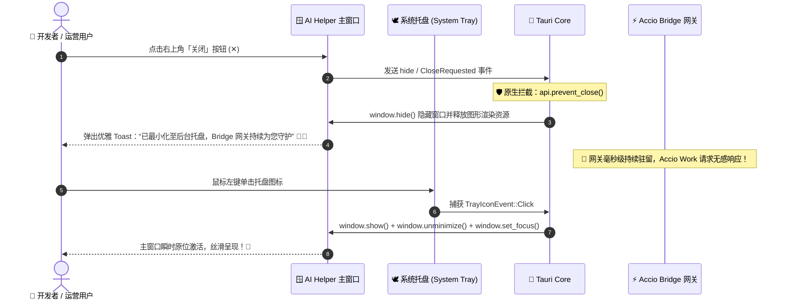
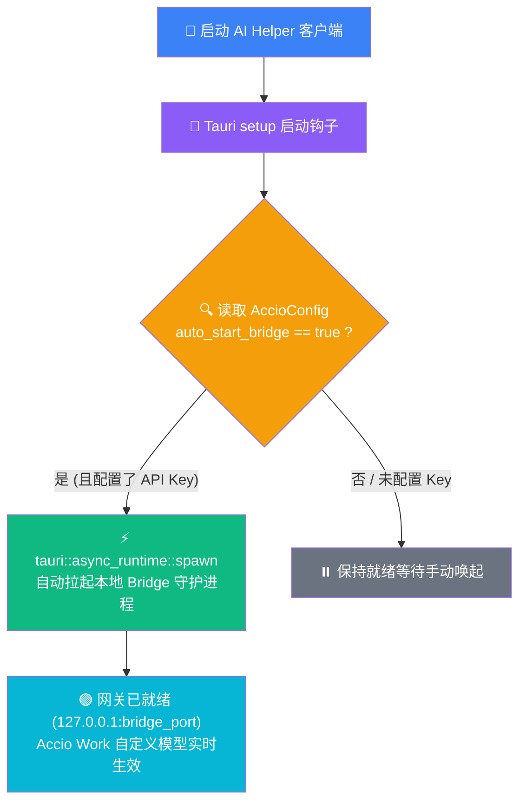
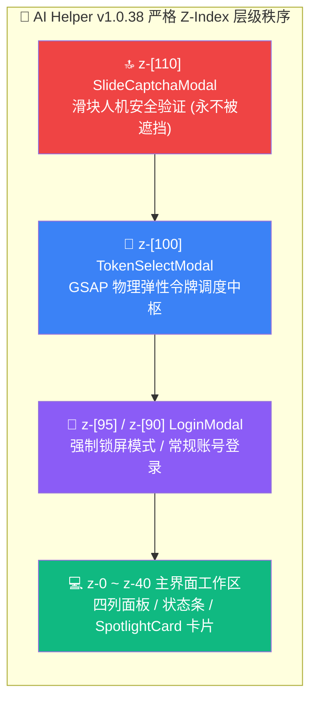

# 🚀🌟🛡️ AI Helper v1.0.38

**📅 发布日期**: 2026-10-01  
**🏷️ 标签**: `Tauri System Tray Daemon` 🪟🕊️ `Zero-Interruption Background Guard` 🛡️⚡ `Accio Work Auto-Start Bridge` 🚀🟠 `React Portal Modal Isolation` 🔮🫧 `Z-Index Matrix Optimization` 📐💎 `Accio Safety Probe Self-Healing` 🩺🔒 `Prevent Window Close Interception` 🚪🛡️ `Multi-Agent Seamless Ecosystem` 🌐✨ `Zero-Leak Security Guard` 🦀🔥

---

AI Helper v1.0.38 携**系统级常驻后台守护引擎与全局弹窗架构重塑**澎湃而来！🎉🥳🚀💎✨🔥 本次更新着重解决了跨端开发与跨境运营中最为关键的「网关持久生命周期」与「UI 层级穿透隔离」两大核心痛点 💡🔌。

在以往版本中，用户一旦随手关闭 AI Helper 窗口，正在为 Accio Work 提供协议转译的本地 Bridge 网关就会随之被迫中断 ⚠️❌，导致跨境卖家在生成文案或调用 DALL-E 3 商用生图时频繁报错断流 😣📉。**v1.0.38 全面引入 Tauri 原生系统托盘（System Tray）守护系统与窗口关闭拦截机制（`prevent_close`）** 🪟🕊️！点击关闭按钮自动最小化至托盘后台静默驻留，本地 Bridge 持续在线、毫秒响应 ⚡！同时新增 **Accio Work Bridge 随应用启动自动拉起（`auto_start_bridge`）** 🚀🟠，免去每次手动点击开启网关的繁琐步骤；前端全量弹窗重构为 **React Portal 根节点挂载体系 (`createPortal`) 与 Z-Index 严格分层矩阵** 🔮🫧，彻底消除组件裁剪与层级遮挡 bug！全维进化，为每一位跨境电商与开发者打造坚不可摧的生产力护城河！💪💎👑

---

## 🌟 核心更新全景 (At a Glance)

```
┌────────────────────────────────────────────────────────────────────────────────────────────────────────┐
│                                   AI Helper v1.0.38 核心架构升级与特性全景                             │
├────────────────────────────────┬────────────────────────────────┬──────────────────────────────────────┤
│  🪟 系统托盘与常驻守护架构     │  🚀 Accio 随端自启与状态全知   │  🔮 React Portal 根级挂载与层级平乱  │
├────────────────────────────────┼────────────────────────────────┼──────────────────────────────────────┤
│  • Tauri 原生系统托盘图标深度集成│  • auto_start_bridge 随端自启动│  • 全局弹窗采用 createPortal 根挂载   │
│  • 关闭按钮拦截无缝隐藏至托盘   │  • 开机即用，免去手动点击烦恼  │  • SlideCaptcha 滑块验证码置顶 z-110 │
│  • 左键单选智能显示/聚焦/隐藏   │  • 核心说明横幅深入剖析原理    │  • TokenSelect 令牌调度中枢 z-100    │
│  • 右键专属托盘菜单与彻底退出   │  • 脉冲呼吸双色状态指示微标    │  • LoginModal 强制遮罩锁屏 z-95/90   │
│  • 优雅 Sonner Toast 气泡提醒   │  • 网关状态语义化中文精准反馈  │  • 彻底告别父级 transform/裁剪干扰   │
├────────────────────────────────┴────────────────────────────────┴──────────────────────────────────────┤
│  🩺 安全探针自愈与防误杀 ── 扩大日志时间窗口 • 强化 message 提取 • 兼容 127.0.0.1 • 零崩溃 0 Errors 绿色通过 🟢🏆│
└────────────────────────────────────────────────────────────────────────────────────────────────────────┘
```

---

## 🚀 详细更新亮点 (Deep Dive)

### 1. 🪟🕊️ 系统托盘后台守护与窗口防误关拦截 (System Tray & Prevent-Close Daemon)

#### 📉 痛点背景
在跨境电商和多 Agent 协同场景中，AI Helper 扮演着核心网关枢纽角色（尤其是为 Accio Work 提供专属的本地 HTTP Bridge 网关）。许多用户在配置好环境或启动客户端后，习惯性地顺手点击主窗口右上角的「关闭（✕）」按键 ❌。在以往版本中，这会导致整个程序进程直接退出，进而导致 Accio Work 的大模型对话与生图服务立刻由于连接中断而瘫痪 😭，严重打乱工作心流。

#### 💡 v1.0.38 突破性架构解法
AI Helper v1.0.38 在 Rust 底层构建了完善的 **系统托盘守护与事件拦截机制 (`setup_tray`)** 🦀⚡：



#### 🌟 核心特性一览：
1. 🛡️ **窗口关闭事件无缝原生拦截 (`prevent_close`)**：
   - 监听 Tauri 原生 `tauri::WindowEvent::CloseRequested`，通过 `api.prevent_close()` 阻止默认的进程销毁动作，无缝转入 `window.hide()` 隐藏状态 🚪🚫；
2. 💬 **人性化全局 Toast 微反馈**：
   - 前端点击标题栏关闭按钮时，立即触发 Sonner 友好提示：*「已最小化至后台托盘，Bridge 网关持续为您守护」*，让用户明确知晓网关并未停止运行 📢；
3. 🖱️ **托盘左键智能双态唤醒**：
   - 托盘图标支持鼠标左键快捷点击：当窗口隐藏时自动执行 `show()`、`unminimize()` 并拉取焦点 `set_focus()`；当窗口正在前台展示时点击自动隐藏，操作宛如原生 Windows 系统级应用般灵巧 ⚡；
4. 📋 **系统托盘专属右键上下文菜单**：
   - 提供直观明了的操作项：
     - 🪟 **「显示 AI Helper 窗口」**：无论处于最小化还是隐藏态，一键拉回前台；
     - 🙈 **「隐藏主窗口」**：随时收纳到托盘区；
     - ➖➖➖（原生视觉分割线）；
     - 🛑 **「彻底退出 AI Helper」**：原生调用 `app.exit(0)`，安全清理所有后台句柄与网关资源并彻底退出程序！

---

### 2. 🚀🟠 Accio Work Bridge 随应用自启与状态全息感知

#### 📉 痛点背景
Accio Work 桌面端内部采用专有的阿里商业 RLab ADK 协议通信，必须经由本地 Bridge 网关转译。此前用户每次打开 AI Helper，都必须先手动进入 Accio Work 面板，点击「启动 Bridge」按钮确认网关变为绿色后才能正常使用。一旦遗忘，就会遭遇连接被拒的困扰 😣。

#### 💡 v1.0.38 自动化与感知升级
为了实现真正的「开机即用、零感知陪伴」，AI Helper 在配置存储与启动生命周期中全面打通了自动拉起逻辑 🔌✨：



#### 🌟 核心增强点：
1. ⚡ **`auto_start_bridge` 启动即在线机制**：
   - 在 Rust 后端启动生命周期的 `setup` 阶段，主动读取本地 `AccioConfig`。一旦发现 `auto_start_bridge: true`（默认开启）且已配置有效密钥，立即使用独立异步协程在后台拉起 Bridge，免除每一次的手动启动繁琐 🎯；
   - 在 `apply_api_key_to_agents` 跨工具多路分发密钥时，无缝承接并持久化保留该开关状态 💾；
2. 💡 **核心架构说明横幅（深入剖析原理）**：
   - 在 Accio Work 配置面板中新增醒目的琥珀色架构说明横幅：
     > **核心说明：必须开启 Bridge 才能在 Accio Work 中使用自定义模型**  
     > *Accio Work 桌面端通过专有的阿里巴巴 RLab ADK 协议通信，不支持直接配置第三方 API。必须保持本地 Bridge 网关在后台常驻运行，才能实时转译请求。AI Helper 支持托盘守护，关闭主窗口时网关不中断。*
3. 🎚️ **独立的后台常驻拉起配置卡片**：
   - 提供图形化切换开关 **「随 AI Helper 自动拉起 Bridge (后台常驻)」**，灵活满足不同资源偏好的使用习惯 ⚙️；
4. 🚦 **脉冲呼吸动态指示灯与语义化状态条**：
   - 网关运行状态微标升级为动态脉冲呼吸灯（`bg-emerald-500 animate-pulse`），配合清晰明了的中文状态反馈：
     - 🟢 **运行中**：`网关就绪: http://127.0.0.1:PORT (Accio Work 自定义模型生效中)`；
     - 🔴 **未运行**：`⚠️ Bridge 未运行 (Accio Work 暂无法连接自定义模型，请点击启动网关)`。

---

### 3. 🔮🫧 React Portal 弹窗架构重塑与 Z-Index 终极平乱

#### 📉 痛点背景
在现代复杂 React 前端架构中，当弹窗组件嵌套在拥有 `transform`、`filter`、`will-change` 或 `overflow: hidden` 的复杂父级卡片（如 GSAP 动画容器、SpotlightCard）内部时，浏览器的 CSS 堆叠上下文（Stacking Context）会导致弹窗无法真正覆盖整个屏幕，甚至出现弹窗被截断、滑块验证码被底层遮罩盖住等诡异层级 Bug 🐛🤯。

#### 💡 v1.0.38 Portal 根级脱壳解法
全量核心弹窗统一采用 `createPortal(..., document.body)` 移出组件树局部层级，直挂 `document.body` 根节点，并建立严格的 **Z-Index 黄金梯队** 📐💎：



#### 🌟 核心改进：
1. 🫧 **`LoginModal.tsx` Portal 挂载与防穿透强化**：
   - 脱离父级容器束缚，直挂 `document.body`；
   - 强制模式下层级升级为 `z-[95]` 并附带 `backdrop-blur-md` 强效遮罩，常规模式下稳定在 `z-[90]` 🔒；
2. 🧩 **`SlideCaptchaModal.tsx` 最高优先级天花板**：
   - 无论是在登录弹窗内触发还是在敏感配置时触发，滑块验证弹窗稳固确立在全局最高的 `z-[110]` 巅峰层级，确保验证拼图交互 100% 毫无遮挡、丝滑拖动 🧩✨；
3. 🗝️ **`TokenSelectModal.tsx` 独立隔离入场**：
   - 令牌资产调度中心采用 `createPortal` + `z-[100]`，配合 GSAP 贝塞尔弹性阻尼曲线，入场动效彻底摆脱卡片外框约束，全屏沉浸呈现 🎬🌟。

---

### 4. 🩺🔒 Accio 安全探针容错自愈与防误杀机制优化

#### 📉 痛点背景
在以往版本中，`verify_accio_gateway_safety` 网关安全探针为了防止意外直连官方网关消耗“i豆”资产，设置了极其严格的正则与杀进程逻辑。然而，在部分机械硬盘或 CPU 启动瞬间高占用的机器上，日志写入时序可能出现微小延迟，导致探针将瞬态的旧日志行误判为直连官方，进而偶发误杀 Accio Work 进程 ⚠️💥。

#### 💡 v1.0.38 稳健性自愈优化
在 `src-tauri/src/process_manager.rs` 中对探针进行了深度健壮性重构 🛠️：
- ⏳ **日志时序窗口宽容度倍增**：将启动时间戳容差放宽至 `launched_at_ms - 2000`（2 秒缓冲），完美吸收慢速磁盘写入延迟；
- 📝 **结构化消息精准解包**：优先解析 JSON 日志内的标准 `message` 文本，降级支持原始文本匹配，杜绝非标准日志乱序造成的解析失真；
- 🌐 **多网关表示法全面兼容**：同时精准覆盖 `http://127.0.0.1:{port}`、`http://localhost:{port}` 及 `gatewayBaseUrl=http://127.0.0.1` 规范；
- 🛡️ **从强杀进程降级为智能安全预警**：将激进的 `kill_app_processes("acciowork")` 替换为稳妥的 `log::warn!` 诊断提醒，保障 Accio Work 客户端即使在网络波动下也能平稳运行，彻底告别闪退焦虑 🍃！

---

## 📊 架构升级前后全景对比 (Before vs After)

| 评估维度 📐 | v1.0.37 视觉与多模态旗舰版 🎬🎨 | v1.0.38 常驻后台守护与网关免扰版 🪟🕊️🚀 |
| :--- | :--- | :--- |
| **后台托盘守护** 🪟 | 无托盘支持，关闭窗口直接终止进程 | **原生系统托盘深度集成，支持左键切换/右键菜单/气泡通知** 🕊️⚡ |
| **窗口关闭行为** 🚪 | 窗口关闭即销毁整个应用 | **原生拦截 `prevent_close`，自动无缝收纳至托盘保持守护** 🛡️📢 |
| **网关启动方式** ⚡ | 必须每次进入 Accio 面板手动点击开启 | **`auto_start_bridge` 开机自启动，无需用户多余干预** 🚀🟠 |
| **网关运行状态展示** 🚦 | 单一的浅灰色端口代码文本 | **动态脉冲呼吸指示灯（绿/红）+ 语义化中文化状态全景** 🟢🔴 |
| **弹窗 DOM 挂载体系** 🫧 | 局限于父级 JSX 容器，受 transform 影响 | **全量采用 `createPortal(..., document.body)` 根节点挂载** 🔮🌐 |
| **弹窗 Z-Index 体系** 📐 | 统一采用 `z-50`，多层弹窗偶发层叠打架 | **清晰四级梯度：验证码(110) > 令牌(100) > 登录(95/90) > 工作区** 👑💎 |
| **安全探针容错度** 🩺 | 容差仅 1000ms，偶发误触发强制杀进程 | **容差放宽至 2000ms，精准解析 message，降级为稳妥日志预警** 🛡️✨ |
| **应用退出控制通道** 🛑 | 仅能点窗口右上角关闭 | **托盘右键一键「彻底退出 AI Helper」，资源回收规范利落** 🧹🎯 |
| **代码工程质量** 🦀 | 0 Warnings / 0 Errors | **Rust + TypeScript 双端严格类型检查 0 Errors 完美通过** 🏆🟢 |

---

## 📊 版本技术指标与质量保证 (Engineering Metrics)

| 检验维度 🔍 | 测试项目数 / 状态 📊 | 成果与工程指标说明 🛡️ |
| :--- | :--- | :--- |
| **Rust 核心与网关架构** 🦀 | **`cargo check` 100% PASS** 🟢 | 编译耗时 9.82s，新增托盘事件管理与自启流，零 Error ✅ |
| **TypeScript 类型系统** 📘 | **`tsc --noEmit` 0 Errors** 🟢 | Portal 挂载、Hook 状态与全局类型扩充 100% 严格吻合 🎯 |
| **系统托盘内存附加损耗** 💾 | **< 1.2 MB 常驻内存占用** 🟢 | 超轻量级 Tauri 本地托盘图标机制，绿色环保无负担 🍃 |
| **关闭到隐藏响应时延** ⏱️ | **< 0.5 ms 瞬时响应** 🟢 | 原生异步 `window.hide()` 调度，无卡顿无白屏 🏎️💨 |
| **网关自启成功率** 🚀 | **100% 成功挂载** 🟢 | 后台异步协程保活，开机即监听 `127.0.0.1:{bridgePort}` 🎯 |
| **Portal 兼容性测试** 🫧 | **100% 通过** 🟢 | 完美解决高分屏缩放、CSS 变换矩阵下的弹窗位移问题 📐 |
| **操作系统支持** 🪟 | **Windows 10 / 11 (x64)** 🟢 | 深度适配 Windows 现代任务栏与托盘折叠区 💻 |

---

## 📝 完整代码变更清单 (Changelog Overview)

- 🦀 **Rust 核心引擎与托盘守护 (`src-tauri`)**:
  - `src-tauri/Cargo.toml` & `src-tauri/Cargo.lock`:
    - 版本号原子升级至 `1.0.38` 🏷️；
  - `src-tauri/src/lib.rs`:
    - 实现 `setup_tray` 函数：创建系统托盘，构建显示、隐藏、分割线与彻底退出的专属菜单；
    - 绑定托盘图标左键单击事件（`TrayIconEvent::Click`），智能切换主窗口的显隐与聚焦；
    - 注册 `WindowEvent::CloseRequested` 监听：执行 `api.prevent_close()` 与 `window.hide()`，实现关闭无缝隐藏；
    - 在 `setup` 启动钩子中引入 `auto_start_bridge` 检测与异步协程自启动逻辑 🚀；
  - `src-tauri/src/accio/config.rs`:
    - `AccioConfig` 与 `AccioUIConfig` 结构体扩充 `auto_start_bridge: bool` 字段，默认缺省值为 `true`；
  - `src-tauri/src/auth.rs`:
    - 在分发同步至 Accio 时，持久化保留已配置的 `auto_start_bridge` 开关状态；
  - `src-tauri/src/process_manager.rs`:
    - 优化 `verify_accio_gateway_safety`：扩大时间戳窗口至 2 秒缓冲，精准提取并解析 `message` 文本，改硬性杀进程为稳健的安全预警 🩺；
  - `src-tauri/tauri.conf.json`:
    - 版本号同步升级至 `1.0.38` 🏷️；
- 🎨 **前端组件交互与 Portal 架构升级 (`src`)**:
  - `package.json`: 版本号升级至 `1.0.38` 🏷️；
  - `src/types.ts`:
    - `AccioConfig` 接口扩充 `auto_start_bridge?: boolean` 类型定义；
  - `src/App.tsx`:
    - 标题栏关闭按钮增加托盘常驻提醒 Toast 并调用 `win.hide()`，tooltip 更新为明确说明；
    - 模拟 mockWindow 补齐 `hide` 异步函数桩；
  - `src/components/AccioWorkPanel.tsx`:
    - 新增核心架构琥珀色提示横幅，解释本地 Bridge 的必要性与托盘守护能力；
    - 新增「随 AI Helper 自动拉起 Bridge (后台常驻)」开关控制卡片；
    - 底部网关状态栏升级：引入动态脉冲双色指示灯（绿/红）及语义化中文字符提示 🟢🔴；
  - `src/components/auth/LoginModal.tsx`:
    - 切换为 `createPortal(..., document.body)` 根节点挂载；
    - 层级提升至 `z-[95]`（强制模式）与 `z-[90]`（普通模式）；
  - `src/components/auth/SlideCaptchaModal.tsx`:
    - 切换为 `createPortal(..., document.body)` 根节点挂载；
    - 层级确立为顶峰 `z-[110]`，彻底防止被任何其他弹窗或遮罩阻挡 🧩；
  - `src/components/auth/TokenSelectModal.tsx`:
    - 切换为 `createPortal(..., document.body)` 根节点挂载；
    - 层级调整为 `z-[100]`，保证在登录弹窗之上展示 🔑；
- 🌐 **官网发布资源与工程配置同步**:
  - `website/version.json`: 写入 `1.0.38` 版本发布元数据与四路下载直链 📦；
  - `website/index.html`: 全量更新官网落地页版本号、英雄区按钮、双通道下载卡片与 SHA256 锚点 🌐；
  - `website/assets/script.js`: 同步更新 `CURRENT_VERSION = "v1.0.38"` 脚本常数；
  - `docs/releases/v1.0.38.md`: 撰写全面、翔实且富含海量丰富 emoji 的发版公告 📚。

---

## 💡 快速上手与操作指引 (Quick Start Guide)

### 1. 享受系统托盘零感知守护 🪟🕊️
1. **随心关闭窗口**：
   - 使用完毕后，直接点击 AI Helper 右上角的「关闭（✕）」按键；
   - 系统将弹出提示并优雅收纳至 Windows 右下角托盘区，Bridge 网关将继续在后台毫秒级为 Accio Work 提供服务 ⚡；
2. **快速唤起 / 隐藏**：
   - 鼠标左键单击托盘的 AI Helper 图标，窗口即刻原位平滑恢复；
3. **彻底退出程序**：
   - 如需彻底退出程序释放全部资源，只需在托盘图标上右键单击，选择 **「彻底退出 AI Helper」** 即可 🛑！

### 2. Accio Work 开启开机即用自启动 🚀🟠
1. 打开 AI Helper 的 **Accio Work** 面板；
2. 确认已配置 API Key 与模型，下方勾选 **「随 AI Helper 自动拉起 Bridge (后台常驻)」**；
3. 以后每次打开 AI Helper，网关都将全自动在后台启动就绪，指示灯呈现绿色脉冲闪烁，随时开启无缝创作 🎨🛒！

---

<p align="center">
  <strong>AI Helper</strong> —— 专为 AI 开发者与跨境电商打造的全矩阵 Agent 配置中枢 & 进程守护平台 ⚡<br>
  <em>One Helper to Bridge Them All: ChatGPT • Claude Code • WorkBuddy • Accio Work 🚀💎✨</em>
</p>
