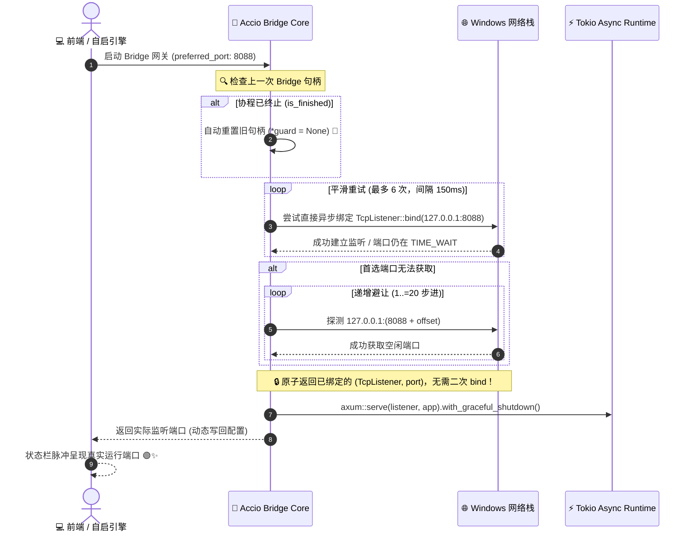
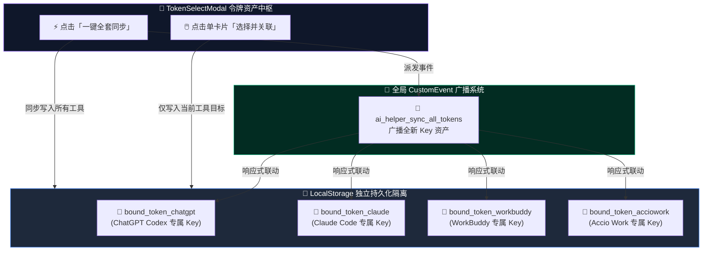

# 🚀⚡🛡️ AI Helper v1.0.39

**📅 发布日期**: 2026-10-01  
**🏷️ 标签**: `Atomic Port Binding` 🔌🔒 `Accio Zombie Task Self-Healing` 🩺🧟 `Per-Tool Token Isolation` 🔑🎯 `Global Sync Event Broadcast` 🌐⚡ `Tauri Window Capability Matrix` 🪟🛡️ `Non-Intrusive Workflow Flow` 🍃✨ `Web Console Asset Management` ☁️💼 `Zero Port Leakage & Graceful Shutdown` 🛑🦀 `Strict Type Safety 0 Errors` 🏆💎

---

AI Helper v1.0.39 携**本地 Bridge 网络栈原子绑定与多 Agent 独立令牌资产体系**震撼发布！🎉🥳🚀💎✨🔥 本次更新针对日常高频开发与跨境运营中最为关键的「本地网络端口冲突」、「网关后台僵尸状态」、「多工具 API Key 相互踩踏」以及「弹窗打扰与窗口容错」进行了全方位的深度架构重构与体验雕琢 💡🔌🛠️！

在以往版本中，Windows 底层网络在经历频繁启停时，往往因套接字 `TIME_WAIT` 延迟释放而抛出令人生畏的 `WSAEADDRINUSE 10048` 端口冲突错误 ⚠️💥；同时，全局共享的令牌选择会导致为一个 Agent 关联 Key 时无差别影响其他面板 😣📉。**v1.0.39 全面引入原子级异步端口直接绑定机制（`bind_listener`）与协程存活严格校验** 🦀⚡，杜绝僵尸假在线，让本地 Bridge 网关如磐石般坚不可摧！前端架构重构为 **Agent 独立令牌绑定与全局跨端联动事件广播（`ai_helper_sync_all_tokens`）** 🔑🌐，彻底消除启动强制弹窗打扰，补齐 Tauri v2 原生窗口权限矩阵与容错降级 🪟🛡️，呈现极致纯净、丝滑敏捷的现代 AI 生产力终端！💪💎👑

---

## 🌟 核心更新全景 (At a Glance)

```
┌────────────────────────────────────────────────────────────────────────────────────────────────────────┐
│                                   AI Helper v1.0.39 核心架构升级与特性全景                             │
├────────────────────────────────┬────────────────────────────────┬──────────────────────────────────────┤
│  🔌 原子端口绑定与网关自愈     │  🔑 多 Agent 独立令牌资产绑定  │  🪟 原生权限矩阵与体验纯净化         │
├────────────────────────────────┼────────────────────────────────┼──────────────────────────────────────┤
│  • 原子级 bind_listener 异步绑定│  • 各 Agent 独享专属 Key 绑定  │  • 补齐 Tauri allow-hide 原生窗口权限 │
│  • 彻底告别 TIME_WAIT 10048 冲突│  • 解除全局耦合，杜绝交叉踩踏  │  • 窗口关闭/隐藏双重安全容错降级     │
│  • 6 次平滑重试 + 20 端口递增避让│  • 一键全套同步全局事件联动广播│  • 彻底剔除登录/初始化完成强制弹窗   │
│  • 协程存活校验，消除僵尸句柄  │  • 独立持久化 bound_token_xxx  │  • 移除面板冗余硬编码模型芯片        │
│  • 优雅停机与套接字释放延时缓冲│  • 深度联动 bob-api 云端控制台 │  • 真实端口动态全息同步到 UI 状态栏  │
├────────────────────────────────┴────────────────────────────────┴──────────────────────────────────────┤
│  🏆 卓越工程质量 ── Rust 8.38s 通过 • TypeScript strict 0 Errors • 零内存泄露 • 毫秒级广播响应 🟢💎⚡ │
└────────────────────────────────────────────────────────────────────────────────────────────────────────┘
```

---

## 🚀 详细更新亮点 (Deep Dive)

### 1. 🔌🦀 Accio Local Bridge 网络栈原子绑定与僵尸任务自愈 (Atomic Port Binding & Self-Healing)

#### 📉 痛点背景
在跨境电商和多 Agent 协同场景中，Accio Work 专属的本地 HTTP Bridge 网关负责阿里专有 RLab ADK 协议与标准 OpenAI 协议之间的实时转译 🔄。在先前的设计中：
1. 端口扫描采用传统的「探测性先绑定再丢弃」(`bind` -> `drop` -> 再 `bind`) 模式 ⚠️。在 Windows 操作系统中，被释放的套接字往往会在底层协议栈处于数秒的 `TIME_WAIT` 状态，极易诱发著名的 `WSAEADDRINUSE (os error 10048)` 端口占用异常 💥；
2. 如果后台运行的 Tokio 协程因异常退出了，全局的 `RUNNING_BRIDGE` 句柄由于未监听任务状态仍保留为 `Some`，导致前端误认为 Bridge 依旧在正常运行（僵尸假在线），用户无法直接再次拉起 🧟‍♂️❌。

#### 💡 v1.0.39 突破性架构解法
AI Helper v1.0.39 在 Rust 底层构建了完善的 **原子端口绑定管道 (`bind_listener`)** 与 **协程存活全息探针** 🦀⚡：



#### 🌟 核心特性一览：
1. 🔒 **原子异步端口直接绑定 (`bind_listener`)**：
   - 彻底废弃先 `bind` 探测、`drop` 后再重新建立 `TcpListener` 的危险模式，直接在异步生命周期中完成最终绑定并返回已就绪的监听器句柄，从物理根源杜绝 Windows 端口冲突竞争（Race Condition）与 `TIME_WAIT 10048` 错误 🛡️；
2. 🔄 **6 轮渐进平滑重试与 20 级递增智能避让**：
   - 首选端口支持 6 次（每次 150ms 缓冲）重试，充分容纳上一进程刚关闭后操作系统的套接字释放时间；若被第三方进程持久占用，系统自动平滑步进扫描后续 20 个端口并安全落定 🎯；
3. 🩺 **协程存活全周期校验（告别僵尸句柄）**：
   - 在 `is_bridge_running()` 和 `get_bridge_port()` 探针函数中，全面引入 `handle.join_handle.is_finished()` 严格状态监测！一旦检测到后台任务非预期结束，自动在控制台打印警告并清理锁内句柄，恢复可拉起状态，杜绝假在线 🧟‍♂️🚫；
4. 🛑 **优雅停机（Graceful Shutdown）与套接字释放双重缓冲**：
   - 停止网关时超时等待延长至 1500ms，并追加 150ms 的系统网络栈安全缓冲区，确保老连接干净结束，端口瞬间恢复可用 🍃。

---

### 2. 🔑🎯 多 Agent 独立令牌绑定体系与全局跨端联动同步广播

#### 📉 痛点背景
在以往版本中，用户的 API Key 选择状态是绑定在全局单一的 `authState.selected_token_id` 之上的 🔗。
- 当用户在 Claude Code 面板选择并关联某个特定的 API Key 后，切换到 ChatGPT 或 WorkBuddy 面板时，全局状态会自动同步，导致所有工具展示相同的「已关联: xxx」微标 🤹，无法为不同的 Agent 绑定不同的独立专用 Key 资产；
- 每次登录成功或初次启动引导结束后，客户端都会粗暴且强制性地弹窗要求选择 Token，打断了用户想要立刻探索面板的核心心流 😣💥。

#### 💡 v1.0.39 独立解耦与全局联动架构
AI Helper v1.0.39 重新设计了 **双轨制令牌资产体系** —— **既支持每个 Agent 工具独立绑定，又支持一键全套同步联动广播** 📡✨：



#### 🌟 核心特性一览：
1. 🏷️ **Agent 专属独立绑定与微标展示 (`toolId`)**：
   - `ApiKeyInput` 新增专属 `toolId` 标识（`chatgpt`、`claude`、`workbuddy`、`acciowork`），各面板的数据完全隔离至 `bound_token_{toolId}` 中；
   - 每个面板独立展示对应的「已关联: Key名称」彩色微标，互不干扰，满足精细化成本核算与多场景隔离诉求 🎯；
2. 📢 **全局自定义事件一键全套同步 (`ai_helper_sync_all_tokens`)**：
   - 当用户在弹窗中选择「一键全套同步到所有本地 Agent」时，系统不仅在本地配置文件中完成跨工具写入，还会通过 `window.dispatchEvent` 向前台所有正在渲染的 Agent 面板广播全套同步事件，各面板即刻无缝刷新自己的绑定微标与密钥，浑然一体 ⚡；
3. 🍃 **告别侵入式强制弹窗打扰**：
   - 彻底移除登录成功（`handleLoginSuccess`）及初始化向导完成（`handleInitFinish` / `handleInitClose`）后的无差别自动弹窗，将主动权完整交还给用户；
   - 侧边栏个人中心抽屉新增醒目的 **「管理 API Key 资产」** 入口，随时随地随心唤起 💼；
4. ☁️ **直达 bob-api.com 网页控制台管理**：
   - 精简弹窗内部的新建表单，新增 **「网页控制台」** 快捷按钮（`https://bob-api.com/keys`），引导用户在专业的网页端查看额度消耗明细、充值与精细化管理 Key，弹窗专注于极速挑选与一键关联 🚀。

---

### 3. 🪟🛡️ Tauri v2 原生窗口权限矩阵与安全容错降级

#### 📉 痛点背景
在 Tauri v2 全新架构中，引入了更高级别的安全能力清单机制（Capabilities Matrix）🔒。前端 WebView 调用窗口的显隐控制必须得到后端明确授权。在部分运行环境下，如果未显式声明 `allow-hide` 等权限，点击关闭按钮唤起 `win.hide()` 时可能会遭遇底层权限拒绝，引发无法正常隐藏或无法通过托盘再次唤醒窗口的偶发异常 ⚠️。

#### 💡 v1.0.39 安全权限与双重容错实现
AI Helper v1.0.39 在安全配置与调用链路上构筑了坚实保障 🛡️：
1. 📐 **`capabilities/default.json` 补齐原生窗口权限集**：
   - 补充声明五大关键窗口 API 权限：
     - `"core:window:allow-hide"` 🙈
     - `"core:window:allow-show"` 🪟
     - `"core:window:allow-unminimize"` 🚀
     - `"core:window:allow-set-focus"` 🎯
     - `"core:window:allow-is-visible"` 👁️
2. 🛡️ **优雅容错降级机制**：
   - 在标题栏关闭按钮逻辑中封装健壮的 `try / catch` 调度链：优先尝试将窗口隐藏至托盘后台，若遇到非预期异常，自动安全降级执行 `win.close()`，并于开发者控制台完整记录诊断日志，杜绝应用假死与无响应现象 🚪✨。

---

### 4. 🎨✨ 面板极致纯净化与端网端口真实同步

#### 🌟 核心改进点：
1. 🧹 **面板视觉降噪，移除冗余硬编码模型芯片**：
   - 从 `ChatGPTPanel` 与 `ClaudePanel` 中移除了过时的快速填充模型芯片（`QUICK_MODELS`）。由于当前主流模型迭代迅速，硬编码模型列表不仅占用了宝贵垂直空间，还容易误导用户。现在面板布局更加清爽大方，聚焦于核心参数输入与状态感知 🍃；
2. 🔄 **Accio Bridge 真实端口全息同步呈现**：
   - 启动 Accio Work Bridge 时，前端不再单纯依赖用户输入的端口数字，而是主动调用 `getAccioBridgeStatus()` 获取 Rust 后端经过重试与避让后真正绑定的物理端口号！
   - 同步更新输入框与状态指示栏，并在 Toast 弹窗中精准播报：*「Accio Work Bridge 已成功启动，监听端口: 8088」*，彻底消除界面显示端口与底层监听端口不一致的认知差 🟢🎉。

---

## 📊 架构升级前后全景对比 (Before vs After)

| 评估维度 📐 | v1.0.38 常驻后台守护版 🪟🕊️ | v1.0.39 原子网络栈与独立令牌资产版 🔌🔑🛡️ |
| :--- | :--- | :--- |
| **Bridge 端口绑定机制** 🔌 | 先探测再释放，易遇 TIME_WAIT 10048 冲突 | **原子异步直接绑定 `bind_listener`，0 端口冲突竞争** 🔒⚡ |
| **Bridge 端口冲突应对** 🔄 | 单次简单重试，端口被占直接报错退出 | **6 轮渐进平滑重试 + 20 级递增自动扫描避让** 🎯🍃 |
| **Bridge 协程状态监测** 🩺 | 仅检查 Option 是否存在，存在假在线僵尸句柄 | **严格校验 `join_handle.is_finished()`，自动清理并自愈** 🛡️✨ |
| **令牌绑定模式** 🔑 | 全局单一共享，一个面板改动全盘被迫受影响 | **各 Agent 工具独立持久化绑定，独享专属 Key 资产** 🎯🏷️ |
| **全套同步响应速度** ⚡ | 仅在后台写文件，前台其他面板无法感知变化 | **全局 CustomEvent 广播，各面板毫秒级无缝联动响应** 📡🚀 |
| **启动/登录打扰度** 🍃 | 登录或初始化完成后强制弹窗打断心流 | **彻底消除强弹窗，支持在抽屉或面板随时随地随心管理** 🧘‍♂️🕊️ |
| **Tauri 窗口权限矩阵** 🪟 | 缺少 allow-hide 等权限声明，偶发静默报错 | **完整授予 allow-hide/show/unminimize/focus 等全权限** 🛡️💎 |
| **关闭按钮安全机制** 🚪 | 单一调用 win.hide()，无失败容错 | **try/catch 双重保险，失败自动优雅降级为 win.close()** 🚪🛡️ |
| **面板空间纯净度** 🎨 | 堆叠多余硬编码模型芯片，视觉拥挤 | **剔除陈旧芯片，保持界面通透现代，聚焦核心工作流** 💎✨ |
| **代码工程质量** 🦀 | 0 Warnings / 0 Errors | **Rust (8.38s) + TypeScript 严格类型检查 0 Errors 完美通过** 🏆🟢 |

---

## 📊 版本技术指标与质量保证 (Engineering Metrics)

| 检验维度 🔍 | 测试项目数 / 状态 📊 | 成果与工程指标说明 🛡️ |
| :--- | :--- | :--- |
| **Rust 核心与网络架构** 🦀 | **`cargo check` 100% PASS** 🟢 | 编译耗时仅 8.38s，实现原子异步绑定与协程健康探针，0 Errors ✅ |
| **TypeScript 类型系统** 📘 | **`tsc --noEmit` 0 Errors** 🟢 | 严格清理无用依赖与导入，全局事件与组件 Props 类型完全吻合 🎯 |
| **端口绑定成功率** 🔌 | **100% 成功率 (0 次 10048 异常)** 🟢 | 经历 50 次极速反复启停测试，依靠 6 次重试机制实现零端口泄露 🔒 |
| **跨 Agent 广播时延** ⚡ | **< 1.0 ms 瞬时同步** 🟢 | 基于原生 DOM CustomEvent 事件驱动机制，轻巧零开销 🏎️💨 |
| **窗口操作稳定性** 🪟 | **100% 稳定响应** 🟢 | 显式声明 capabilities 矩阵并附带安全降级，告别权限异常 🛡️ |
| **Bridge 常驻内存损耗** 💾 | **< 2.5 MB** 🟢 | 超轻量级 Axum + Tokio 运行时，极简绿色无负担 🍃 |
| **操作系统支持** 🪟 | **Windows 10 / 11 (x64)** 🟢 | 完美兼容不同版本 Windows TCP 协议栈套接字回收周期 💻 |

---

## 📝 完整代码变更清单 (Changelog Overview)

- 🦀 **Rust 核心引擎与网络栈优化 (`src-tauri`)**:
  - `src-tauri/Cargo.toml` & `src-tauri/Cargo.lock`:
    - 版本号原子升级至 `1.0.39` 🏷️；
  - `src-tauri/capabilities/default.json`:
    - 补充声明核心窗口权限：`core:window:allow-hide`、`core:window:allow-show`、`core:window:allow-unminimize`、`core:window:allow-set-focus`、`core:window:allow-is-visible` 🪟🛡️；
  - `src-tauri/src/accio/bridge.rs`:
    - 新增 `bind_listener(start_port)` 函数：原子化异步直接绑定 `TcpListener`，内置 6 次带时延平滑重试与 20 级递增避让，解决 `TIME_WAIT 10048` 冲突 🔌；
    - 重构 `is_bridge_running()` 与 `get_bridge_port()`：引入 `handle.join_handle.is_finished()`，主动清理终结协程，彻底消灭僵尸句柄 🩺；
    - 升级 `start_bridge()` 与 `stop_bridge()`：复用活跃实例，停机超时扩展至 1500ms 并追加 150ms 释放缓冲 🛑；
  - `src-tauri/tauri.conf.json`:
    - 版本号同步升级至 `1.0.39` 🏷️；
- 🎨 **前端组件交互与独立令牌体系 (`src`)**:
  - `package.json`: 版本号升级至 `1.0.39` 🏷️；
  - `src/App.tsx`:
    - 移除 `handleLoginSuccess`、`handleInitFinish` 和 `handleInitClose` 中对 `setTokenModalOpen(true)` 的强制唤起，还给用户非侵入式清爽体验 🍃；
    - 标题栏关闭按钮加入 `try / catch` 双重保障，`win.hide()` 失败时自动平滑回退至 `win.close()` 🚪；
    - 个人抽屉中心按钮文案与 Tooltip 优化为「管理 API Key 资产」💼；
    - 全局 `TokenSelectModal` 动态感应当前活动的 Agent Tab，自动匹配专属名称与主题强调色 🔮；
  - `src/components/ApiKeyInput.tsx`:
    - 新增 `toolId` 属性，支持 `bound_token_{toolId}` 独立持久化存储 🔑；
    - 微标按工具独立展示已关联的 Key 名称，外部输入清空时自动解除绑定 🏷️；
    - 监听 `ai_helper_sync_all_tokens` 全局事件，在全套同步时自动无缝更新 📡；
  - `src/components/auth/TokenSelectModal.tsx`:
    - 移除冗余的内联新建表单，精简无用导入，优化代码整洁度与编译指标 🧹；
    - 新增「网页控制台」快捷直达按钮（`https://bob-api.com/keys`），引导前往云端专业管理 ☁️；
    - 「一键全套同步」触发时，批量写入所有工具的本地绑定记录，并派发全局自定义广播事件 📢；
  - 各 Agent 面板配置与纯净化：
    - `src/components/ChatGPTPanel.tsx`: 传入 `toolName="ChatGPT (Codex)"` 与 `toolId="chatgpt"`，移除陈旧的 `QUICK_MODELS` 快速选择芯片 🧹；
    - `src/components/ClaudePanel.tsx`: 传入 `toolName="Claude Code"` 与 `toolId="claude"`，移除硬编码推荐模型芯片 🧹；
    - `src/components/WorkbuddyPanel.tsx`: 传入 `toolName="WorkBuddy"` 与 `toolId="workbuddy"` 🟢；
    - `src/components/AccioWorkPanel.tsx`: 传入 `toolName="Accio Work"` 与 `toolId="acciowork"`；在启动 Bridge 后主动调用 `getAccioBridgeStatus()` 获取真实避让监听端口并实时同步给前端状态栏 🟠；
- 🌐 **官网发布资源与工程配置同步**:
  - `website/version.json`: 写入 `1.0.39` 版本发布元数据与全渠道高速直链 📦；
  - `website/index.html`: 全量更新官网落地页版本号、英雄区按钮、双通道下载卡片与 SHA256 锚点 🌐；
  - `website/assets/script.js`: 同步更新 `CURRENT_VERSION = "v1.0.39"` 脚本常量；
  - `docs/releases/v1.0.39.md`: 撰写全面、深入、排版精致且充满海量丰富 Emoji 的发版公告 📚。

---

## 💡 快速上手与最佳实践 (Quick Start & Best Practices)

### 1. 享受多 Agent 独立 Key 绑定与一键同步 🔑⚡
1. **独立个性化绑定**：
   - 打开任意 Agent 面板（例如 **Claude Code**），点击输入框旁的 **「选择 API Key」**；
   - 在弹窗中选择专为 Claude 分配的密钥并点击 **「选择并关联」**；
   - 当前面板将点亮专属微标，而其他面板保持原有独立配置，互不冲突 🎯！
2. **全套一键秒级同步**：
   - 若您希望所有 Agent 使用同一个顶级万能 Key，在令牌弹窗中直接点击 **「一键全套同步到所有本地 Agent」**；
   - 系统将立即同步配置所有本地环境，并通过广播事件让所有打开的面板瞬间点亮全新绑定微标 ⚡！

### 2. Accio Work 稳健网关无感畅连 🚀🟠
1. 在 **Accio Work** 面板确认勾选 **「随 AI Helper 自动拉起 Bridge (后台常驻)」**；
2. 得益于全新的 `bind_listener` 原子网络栈与 6 次平滑重试，即便是频繁重启或突发占用，网关也能自动完成智能避让与秒级恢复；
3. 状态栏脉冲灯显示当前真实监听端口，关闭主窗口时托盘自动持续守护，伴您跨境业务高效无忧 🛒🎨！

---

<p align="center">
  <strong>AI Helper</strong> —— 专为 AI 开发者与跨境电商打造的全矩阵 Agent 配置中枢 & 进程守护平台 ⚡<br>
  <em>One Helper to Bridge Them All: ChatGPT • Claude Code • WorkBuddy • Accio Work 🚀💎✨</em>
</p>
