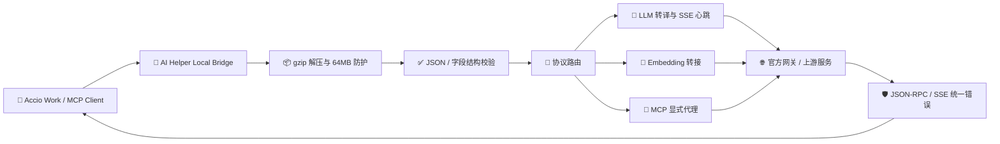

# 🚀🛡️ AI Helper v1.0.41 —— Accio Bridge 协议网关安全加固与 MCP 代理能力升级 🌐🦀✨

**📅 发布日期**：2026-10-01  
**🏷️ 版本标签**：`v1.0.41` 🎯  
**🧭 更新类型**：协议能力扩展 🔌 · 网络安全加固 🛡️ · 流式稳定性优化 ⚡ · 发布链路同步 📦

---

AI Helper v1.0.41 正式上线啦！🎉🥳🚀

本次更新聚焦于 **Accio Work Local Bridge** 的协议完整性、异常可观测性与网络边界安全：新增独立的 MCP 代理入口 🧩，支持 gzip 压缩请求解码 📦，为 LLM、Embedding 与 RLab 请求补齐严格的输入校验 ✅，同时建立请求/响应头白名单、响应体大小上限以及统一的 JSON-RPC / SSE 错误归一化机制 🛡️🌊。

此外，本版本同步修正 Windows 自动更新安装参数，让安装器可以在更新完成后更可靠地进入重启生效流程 🔄🪟；应用版本、Rust 依赖、官网展示与下载资源也完成了全链路升级，确保用户看到、下载到、运行到的都是同一个 `v1.0.41` 📥✅🌍。

## 🌟 本次更新速览

| 模块 🧩 | 更新内容 ✨ | 用户收益 🎁 |
| :--- | :--- | :--- |
| 🧩 MCP 代理 | 新增 `/api/mcp/proxy` 与通配路径代理入口 | MCP 请求拥有明确、稳定、可诊断的本地转发通道 🔌 |
| 📦 压缩请求 | 支持 `Content-Encoding: gzip`，统一解压后再解析 | 兼容压缩客户端，减少传输体积与网络压力 🚀 |
| 🛡️ 输入防御 | 严格校验 JSON、`contents` / `messages`、`texts` / `input` | 错误更早暴露，避免无效请求穿透上游 🧱 |
| 🧯 资源保护 | 解压后请求体上限 `64 MB`，上游响应体上限 `128 MB` | 防范 gzip 炸弹与超大响应拖垮 Bridge 💪 |
| 🧾 头部治理 | 端到端请求/响应头白名单，过滤 hop-by-hop 头 | 反向代理边界更干净、更符合协议规范 🔐 |
| 🌊 错误归一化 | MCP 输出 JSON-RPC 错误，Accio 回退输出 SSE 错误帧 | 客户端不再收到难以解析的 HTML / 文本错误 📡 |
| 🔄 自动更新 | Windows 安装器参数统一为 `/P /R /UPDATE /ARGS` | 下载完成后更可靠地安装并重启生效 🪟 |
| 🌐 发布同步 | 官网、下载地址、版本清单统一切换至 `v1.0.41` | 版本信息与实际安装包精准对应 📥✅ |

---

## 🗺️ 核心能力全景图



---

## 🧩 1. 新增 MCP 显式代理通道：让工具调用拥有稳定入口

### 🚪 新增路由

Accio Local Bridge 现在明确注册以下 MCP 代理路径：

- `ANY /api/mcp/proxy` 🧩
- `ANY /api/mcp/proxy/*path` 🧩

MCP 客户端可以将请求发送到本地 Bridge，由 Bridge 根据当前官方网关配置进行转发。路径、查询参数、授权信息与必要的端到端请求头都会被保留，方便覆盖不同 MCP 资源路径与调用方式 🔁🌐。

### 📡 成功响应保持原协议形态

- ✅ 上游成功响应保持原有 JSON 或 SSE 内容类型；
- ✅ 流式响应不会被强制拼接成普通文本；
- ✅ `Content-Type`、缓存控制、`ETag`、`Set-Cookie` 等允许透传的响应头得到保留；
- ✅ 不再把 MCP 的正常流式交互误判成普通 LLM 请求。

### 🧾 失败响应统一为 JSON-RPC

当本地读取失败、gzip 解码失败、上游连接失败或上游返回无法识别的错误页面时，Bridge 会生成结构稳定的 JSON-RPC 错误：

```json
{
  "jsonrpc": "2.0",
  "id": null,
  "error": {
    "code": -32002,
    "message": "MCP 上游代理失败: ..."
  }
}
```

这样 MCP 客户端可以按照协议解析失败原因，不必再猜测返回内容究竟是 JSON、HTML 还是纯文本 🧠✅。

---

## 📦 2. gzip 请求解码与安全边界：兼容压缩，也防止资源滥用

### 🗜️ 统一支持 `Content-Encoding: gzip`

本版本为以下入口接入统一的请求体解码流程：

- `/api/tool/rlab/call` 🧰
- `/api/adk/embedding/embed` 🧬
- `/api/adk/llm` 与 `/api/adk/llm/*` 🧠
- `/api/mcp/proxy` 与 `/api/mcp/proxy/*` 🧩

Bridge 会先读取原始请求体，再根据 `Content-Encoding` 进行解压，随后才执行 JSON 解析与业务转译。转发到上游时会移除 `Content-Encoding` 与 `Content-Length`，避免解压后的实体与旧头部不一致造成协议错误 📮🔧。

### 🧯 防 gzip 炸弹保护

- 支持的编码：`gzip` ✅；
- `identity` 或空编码：按原始请求处理 ✅；
- `br`、未知编码或多重压缩：返回 `415 Unsupported Media Type` 🚫；
- 解压后最大允许体积：`64 MB` 📏；
- 超过上限：返回 `413 Payload Too Large`，并停止继续解析 🛑。

这套限制可以兼顾大上下文请求与本地服务安全，避免极小压缩包在解压时膨胀为危险的大对象 💥🛡️。

---

## ✅ 3. LLM 与 Embedding 输入校验：让错误尽早、清晰、可修复

### 🧠 LLM 请求结构校验

`/api/adk/llm*` 不再把无法解析的内容静默透传给官方网关，而是先完成本地校验：

1. 请求体必须是有效 JSON 📄；
2. 顶层必须是 JSON 对象 `{}` 🧱；
3. 必须提供数组形式的 `contents` 或 `messages` 字段 🧾；
4. 校验失败时返回 `400` 与明确的 `error_code` / `error_message` 🔍。

这意味着调用方可以在本地立即定位“格式错误”“缺少字段”等问题，避免无效请求经过网络往返后才收到模糊的上游报错 ⚡🧭。

### 🧬 Embedding 请求校验

`/api/adk/embedding/embed` 现在要求请求中存在数组形式的 `texts` 或 `input` 字段：

- 缺少字段：返回 `400`，提示缺少 `texts` 或 `input`；
- 字段类型错误：返回 `400`，拒绝非数组输入；
- 数组为空：返回 `400`，提示输入文本数组不能为空；
- 上游响应读取失败：返回 `502 Bad Gateway`；
- 上游响应超过 `128 MB`：返回 `413 Payload Too Large`。

向量检索链路因此拥有更明确的输入契约与资源保护，不会再将空输入误当成一次有效嵌入请求 🧬📏。

---

## 🛡️ 4. 反向代理边界治理：只转发真正需要的头部

本版本将官方网关透明代理重构为可复用的 `forward_to_official_result` 结果链路，并建立端到端头部白名单 🧾🔐。

### 📤 请求头白名单

允许转发的请求头包括：

`accept`、`accept-encoding`、`accept-language`、`authorization`、`cache-control`、`content-type`、`cookie`、`origin`、`referer`、`user-agent`、`x-request-id`、`x-forwarded-for`、`x-real-ip`。

### 📥 响应头白名单

允许回传的响应头包括：

`cache-control`、`content-type`、`date`、`etag`、`expires`、`last-modified`、`set-cookie`、`vary`、`x-request-id`。

`host`、`content-length`、`connection`、`transfer-encoding`、`upgrade` 等不属于端到端业务语义的 hop-by-hop 头不会被盲目穿透 🚧。

这一调整可以减少代理层重复计算、连接状态污染与跨 hop 头部泄露，让本地 Bridge 更像一个边界清晰的协议网关，而不是简单的字节搬运器 🧱🌐。

---

## 🌊 5. SSE 与错误响应归一化：流式体验更稳定

### 💓 保留 Accio LLM 心跳

LLM 请求仍然会立即发送连接注释帧，并按既有节奏发送 SSE 心跳，让长耗时模型调用不会因为中间网络设备等待过久而被误判为断线 ⏱️💓。

### 🔁 官方回退更懂 SSE

当自定义模型调用失败且启用了官方网关回退时：

- ✅ 官方 SSE 响应保持原样流式转发；
- ✅ 官方非 SSE 错误响应会被读取并转换成 Accio SSE 错误帧；
- ✅ 错误帧带有 `errorCode`、`errorMessage`、`turnComplete` 与 `partial` 字段；
- ✅ Accio 客户端始终可以用统一的事件流方式收尾，不会突然收到一段无法消费的 HTML 或普通文本 🌊🧩。

示例错误帧结构：

```json
{
  "errorCode": "502",
  "errorMessage": "官方网关返回 HTTP 502: ...",
  "turnComplete": true,
  "partial": false
}
```

### 📏 上游响应体大小保护

统一设置上游响应体最大值为 `128 MB`。当 LLM 或 Embedding 上游返回异常大响应时，Bridge 会主动拒绝继续处理并给出可诊断的错误信息，保护桌面端内存与 Tokio 任务稳定性 🧠🛡️。

---

## 🪟 6. Windows 自动更新参数修正：安装完成后更可靠地重启

自动更新下载成功后，Windows 安装器现在统一接收以下参数：

```text
/P /R /UPDATE /ARGS
```

相比此前的 `/UPDATE /passive`，新参数组合与安装器的更新、重启流程契约保持一致 🔄。下载器依旧会：

- 🌐 按多镜像策略获取安装包；
- 🧪 校验安装包最小体积与 `Content-Length`；
- 🚀 以脱离当前进程的方式启动安装器；
- 🛑 安全退出旧版本进程；
- 🔁 交由安装器完成更新并重启生效。

同时新增单元测试锁定参数数组，避免后续发版时意外回退 🧪✅。

---

## 📦 7. Rust 依赖与版本元数据同步

### 🦀 网络压缩能力

`src-tauri/Cargo.toml` 中的 `reqwest` 增加了以下能力：

- `gzip` 🗜️
- `brotli` 🧱
- `deflate` 🔻

同时加入 `flate2 = "1"`，用于 Bridge 对请求体 gzip 内容进行显式安全解码。`Cargo.lock` 已同步更新，确保构建环境拿到一致的依赖解析结果 🔒📚。

### 🏷️ 版本号统一升级

以下元数据已统一升级至 `1.0.41`：

- `package.json` 📦
- `src-tauri/Cargo.toml` 🦀
- `src-tauri/tauri.conf.json` ⚙️
- `website/version.json` 🌐
- `website/assets/script.js` 🧾
- `website/index.html` 🖥️

官网安装包、绿色包、国内镜像地址、版本徽章、校验和文件名与 Release 标签均已切换为 `v1.0.41` 📥✅。

---

## 🧪 8. 测试覆盖与质量护栏

本次在 `src-tauri/src/accio/bridge.rs` 新增并补充了针对网络边界的单元测试：

- 🗜️ `decode_request_body_supports_gzip`：验证 gzip 请求可以正确解码；
- 🚫 `decode_request_body_rejects_unknown_encoding`：验证未知压缩编码被拒绝；
- 🧯 `decode_request_body_rejects_gzip_bomb`：验证解压后超过 `64 MB` 会被拦截；
- 🧾 `end_to_end_headers_filter_hop_by_hop`：验证代理头部白名单会过滤 hop-by-hop 头；
- 🌐 `clean_base_url_removes_trailing_slash_and_v1`：验证上游 Base URL 标准化行为；
- 🔄 `test_windows_update_installer_args_enable_restart`：锁定 Windows 更新安装参数。

这些测试覆盖了压缩解码、资源上限、头部治理、URL 清洗与更新重启参数等本次版本最关键的边界行为 🧪🛡️。

---

## 📝 完整代码变更清单

- 🦀 `src-tauri/src/accio/bridge.rs`
  - 新增 MCP 代理路由与 JSON-RPC 错误响应；
  - 新增 gzip 解码、安全上限与请求体错误处理；
  - 强化 LLM / Embedding 输入字段校验；
  - 新增 `64 MB` 解压上限与 `128 MB` 响应上限；
  - 重构官方网关转发，加入请求/响应头白名单；
  - 将官方网关非 SSE 错误转换为 Accio SSE 错误帧；
  - 增加压缩、头部、URL 与资源边界测试。
- 🧰 `src-tauri/src/updater.rs`
  - 抽取 Windows 更新安装参数常量；
  - 使用 `/P /R /UPDATE /ARGS` 启动安装器；
  - 新增安装参数回归测试。
- ⚙️ `src-tauri/Cargo.toml` / `src-tauri/Cargo.lock`
  - 同步 `v1.0.41`；
  - 启用 reqwest gzip / Brotli / deflate 支持；
  - 引入 `flate2` 依赖。
- 📦 `package.json` / `src-tauri/tauri.conf.json`
  - 应用版本统一升级至 `1.0.41`。
- 🌐 `website/index.html` / `website/assets/script.js` / `website/version.json`
  - 官网版本展示、下载地址、安装包文件名、镜像地址与 Release 页面全部切换至 `v1.0.41`。
- 📚 `docs/releases/v1.0.41.md`
  - 编写本次更新的完整发布说明与协议架构记录。

---

## 🔄 兼容性与升级建议

- ✅ 历史 Accio 配置格式保持兼容；
- ✅ 原有 `/api/adk/llm*`、`/api/adk/embedding/embed` 与 RLab 调用路径继续可用；
- ✅ 未使用 gzip 的客户端无需修改请求；
- ✅ MCP 客户端可改用新的 `/api/mcp/proxy` 显式入口；
- ⚠️ 使用 `br` 或其他非 gzip 请求压缩的客户端，需要在客户端侧切换为 gzip 或发送未压缩请求；
- ⚠️ LLM 请求需要提供 `contents` 或 `messages` 数组，Embedding 请求需要提供非空的 `texts` 或 `input` 数组。

### 🚀 推荐升级路径

1. 下载并安装 `AI-Helper-v1.0.41-Windows-x64-Setup.exe` 📥；
2. 启动 **Accio Work**，确认 Bridge 健康检查仍返回 `ok: true` 🟢；
3. 若接入 MCP，将客户端代理地址指向 `http://127.0.0.1:<端口>/api/mcp/proxy` 🧩；
4. 观察 LLM / Embedding 请求的错误响应，按 `error_code`、JSON-RPC `error.code` 或 SSE `errorCode` 定位问题 🔍；
5. 在官网或应用内检查更新，确认版本标签为 `v1.0.41` 🏷️。

---

## 🎉 总结

AI Helper v1.0.41 把 Accio Local Bridge 从“可以转发请求”进一步推进到“理解协议、保护资源、规范错误、稳定流式传输”的本地协议网关阶段 🦀🔌🛡️。

从 MCP 显式代理 🧩，到 gzip 请求兼容 📦；从字段级输入校验 ✅，到 `64 MB / 128 MB` 双重资源边界 🧯；从端到端头部治理 🧾，到 JSON-RPC / SSE 错误归一化 🌊，本次更新让多 Agent、多协议与复杂网络环境下的调用更加可靠、透明、易排查 🚀✨。

<p align="center">
  <strong>AI Helper</strong> —— 专为 AI 开发者与跨境电商打造的全矩阵 Agent 配置中枢 & 协议桥接平台 ⚡<br>
  <em>One Helper to Bridge Them All: ChatGPT • Claude Code • WorkBuddy • Accio Work • MCP 🚀💎✨</em>
</p>
