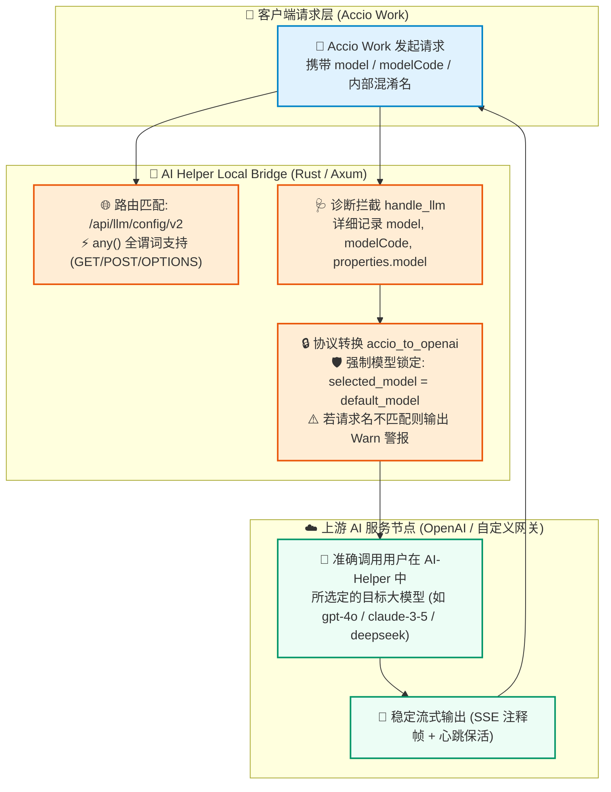

# 🚀🔒 AI Helper v1.0.42 —— Accio 模型透传锁定防护 · 网关路由全谓词支持 · 面板防挤压布局重构 🎨📐✨

**📅 发布日期**：2026-10-01 🗓️  
**🏷️ 版本标签**：`v1.0.42` 🎯  
**🧭 更新类型**：模型安全锁定 🔒 · 网关路由强化 🌐 · 诊断观测升级 🩺 · 界面防挤压重构 🎨 · 全端体验优化 📐 · 全链路版本同步 📦

---

AI Helper v1.0.42 正式发布啦！🎉🥳🚀✨

本次更新聚焦于 **Accio Work Local Bridge** 的请求安全防护 🔒 与诊断可观测性 🩺，以及全软件各控制面板在不同屏幕分辨率与缩放比例下的 **布局弹性与视觉体验重构** 🎨📐！

在后端协议层面 🦀，我们彻底重塑了 Accio 客户端与 OpenAI 兼容上游之间的模型映射逻辑 🧠：全面实施 **AI-Helper 配置模型强制锁定防护** 🔒，杜绝 Accio Work 客户端私带内部混淆模型名透传导致的上游 404/400 报错与调用紊乱 🚫；同时将 `/api/llm/config/v2` 路由升级为全 HTTP 谓词支持（`any`）🌐，并在请求入口引入毫秒级字段全景诊断日志 🩺。

在前端 UI 层面 🖥️，我们对 **AccioWorkPanel** 的卡片视觉层级与操作动线进行了逻辑重组 🔄，新增即时配置刷新机制 ⚡；并在 **ChatGPT** 🤖、**Claude Code** 🧠、**WorkBuddy** ⚙️、**Accio Work** 🚀 四大面板全面引入弹性防挤压（`shrink-0`）架构 📐，完美兼顾高 DPI 缩放、窄屏窗口与多任务分屏场景 🌟！

---

## 🌟 本次更新速览 📋✨

| 模块类别 🧩 | 核心更新内容 💡 | 用户与开发者收益 🎁 |
| :--- | :--- | :--- |
| 🔒 **模型锁定防护** | 强制使用 AI-Helper 配置模型，阻断客户端透传混淆模型 | 解决 Accio 客户端携带内部模型名导致的上游报错，调用 100% 准确命中 🎯 |
| 🩺 **诊断日志透视** | 在 `handle_llm` 打印 `model` / `modelCode` / `properties` 全量字段 | 彻底消除黑盒排查，模型请求来源与映射关系一目了然 👀 |
| 🌐 **网关路由升级** | `/api/llm/config/v2` 升级为 `any` 谓词路由支持 | 完美兼容客户端 GET、POST、OPTIONS 探测请求，配置拉取永不报错 🔌 |
| 🔄 **操作动线重构** | Accio 面板将「配置文件与客户端状态」上调为卡片 2 | 形成「API 节点 ➡️ 配置文件 ➡️ Bridge 网关」更加自然的配置流 🪄 |
| ⚡ **即时配置刷新** | `StatusBadge` 增加 `onReload` 刷新回调与 `FileCode` 图标 | 配置状态随时一键重检，无需重启应用即可感知本地文件变动 🔄 |
| 📐 **面板防挤压重构** | 四大主 Agent 面板全量接入 `shrink-0` 防坍缩布局 | 彻底根治小窗口、低分辨率与高 DPI 缩放下的卡片挤压与内容截断 🛡️ |
| 📦 **全链路版本同步** | 应用核心、Rust 后端、官网网站及下载直链统一切换至 `v1.0.42` | 所见即所得，国内高速镜像与 GitHub 官方源秒速直达 🚀 |

---

## 🗺️ 核心架构与防护流转示意图 🏗️✨



---

## 🔒 1. Accio 模型强制锁定保护：杜绝客户端混淆模型穿透 🛡️🧠

### 🧩 痛点背景剖析
在先前的实现中 📜，Bridge 的 `accio_to_openai` 函数会尝试从客户端发来的请求体中探测多个模型字段（包括 `model`、`modelCode`、`modelName`、`properties.model`）🔍。然而 Accio Work 客户端在特定任务或默认调用时，常常会在底层私自附加其内部混淆的模型代码或默认固定字符串 🤦‍♂️。

当这些未被用户显式指定的内部模型标识透传给第三方或官方 OpenAI 兼容网关时，上游服务常常直接返回：
- ❌ `404 Model Not Found`
- ❌ `400 Invalid Model Name`
- ❌ 或者意外命中非预期的昂贵模型，造成配额浪费 💸

### 🛡️ 架构方案修复
在 `src-tauri/src/accio/protocol.rs` 中，我们重构了模型选择策略 💎：

```rust
// 🔒 模型选择：始终使用 AI-Helper 配置的模型，防止 Accio Work 客户端携带的内部混淆模型名透传
let requested = extract_requested_model(input, default_model);
if requested != default_model {
    log::warn!(
        "⚠️ [Accio Shield] Accio 请求携带模型名 '{}' 与配置模型 '{}' 不同，已强制使用配置模型！",
        requested, default_model
    );
}
let selected_model = default_model;
```

### 🎁 核心收益
- 🎯 **100% 命中配置**：无论客户端在请求体内塞入何种字段，发送给上游网关的 `model` 字段始终等于用户在 AI-Helper 界面中挑选并激活的目标模型！
- 🛡️ **安全预警提示**：当捕获到客户端试图越权透传非一致模型时，Bridge 会在控制台输出醒目的黄色告警日志 ⚠️，方便用户洞察客户端行为。
- 🧪 **自动化测试护栏**：更新单元测试用例，断言请求体哪怕传入混淆的 `deepseek-r1`，最终生成的 OpenAI 报文仍然精准锁定为 `default-model` 🔒✅。

---

## 🩺 2. LLM 链路全景诊断日志：让每一次调用清晰透明 🔬📜

为了给用户和开发者提供最极致的排障体验 💡，我们在 `src-tauri/src/accio/bridge.rs` 的 `handle_llm` 请求入口处植入了全方位诊断埋点 🩺：

```rust
// 🩺 诊断日志：记录 Accio Work 请求中携带的模型相关字段
log::info!(
    "🔍 [Accio Diagnostic] LLM 请求诊断 - model: {:?}, modelCode: {:?}, modelName: {:?}, properties.model: {:?}, 配置模型: {}",
    input.get("model").and_then(|v| v.as_str()),
    input.get("modelCode").and_then(|v| v.as_str()),
    input.get("modelName").and_then(|v| v.as_str()),
    input.pointer("/properties/model").and_then(|v| v.as_str()),
    config.model
);
```

### 🌟 诊断覆盖维度
1. 🏷️ `model`：请求根对象的模型字段；
2. 🔖 `modelCode`：客户端内部代码模型字段；
3. 📛 `modelName`：客户端显示名称模型字段；
4. 📦 `properties.model`：嵌套在属性对象内的模型标识；
5. ⚙️ `config.model`：当前 AI-Helper 生效的目标配置模型。

排查日志不再需要断点调试 🐞，打开应用日志即可一眼洞悉客户端发起的每一个原始参数，轻松定位协议兼容问题 🚀✨！

---

## 🌐 3. `/api/llm/config/v2` 路由升级：全 HTTP 谓词支持 🔌⚡

### 🚨 历史局限
原先 Bridge 仅注册了 `GET /api/llm/config/v2` 路由 ⚠️。然而在复杂的桌面网络环境或不同版本的 Accio Work 客户端中，部分组件可能会发起 `POST` 试探或跨域/安全预检的 `OPTIONS` 请求。此时由于 HTTP Method 不匹配，客户端可能收到 `405 Method Not Allowed`，从而导致客户端前端提示“获取模型配置失败”或静默报错 ❌。

### ✨ 本次升级
在 `src-tauri/src/accio/bridge.rs` 中，我们将该路由无缝平滑切换为 **`any`** 谓词支持 🌈：

```rust
// 🌐 由 get 升级为 any，全面兼容各类探测与请求方式
.route("/api/llm/config/v2", any(custom_model_list))
```

### 🎁 升级收益
- 🚀 **请求零拦截**：无论客户端发起 `GET`、`POST`、`OPTIONS` 还是 `HEAD`，Bridge 均可完美返回当前配置的自定义模型列表 JSON；
- 🛡️ **健壮性满格**：消除由于 HTTP 谓词不匹配导致的偶发配置拉取中断，确保 Accio Work 随时随地都能顺利读取模型字典 📚✅。

---

## 🎨 4. AccioWorkPanel 视觉层级优化：重塑直观操作动线 🪄🖼️

### 🔄 卡片顺序逻辑重组
在 `src/components/AccioWorkPanel.tsx` 中，我们对左侧配置列进行了符合人机工效学的重新编排 📐：

```text
【改造前】
1️⃣ 卡片 1: API 服务节点选择
2️⃣ 卡片 2: 本地 Bridge 网关 & 防耗豆安全熔断
3️⃣ 卡片 3: 配置文件与客户端检测

【改造后 🌟】
1️⃣ 卡片 1: API 服务节点选择 (配置源头 🌐)
2️⃣ 卡片 2: 本地配置文件路径与客户端就绪状态 (本地底座 📁)
3️⃣ 卡片 3: 本地 Bridge 网关 & 防耗豆安全熔断 (桥接中枢 🔌)
```

### ✨ 精细化组件体验细节
- 📄 **专属文件图标**：引入更具辨识度与语义感的 `FileCode` 图标 📂，替代通用的 `Layers` 图标；
- 📌 **直观路径标识**：清晰明了展示 `~/.ai-helper/accio_config.json` 存储位置，配合一键「打开」按钮 🖱️，直达文本编辑器；
- 🔄 **支持一键热重载**：在 `StatusBadge` 徽章组件中注入 `onReload={() => void load(true)}` 回调，用户在外部修改配置文件后，只需点击刷新即可即刻同步状态，无需退出或重启应用 ⚡；
- 🚦 **状态呼吸指示灯**：客户端运行中显示绿色呼吸灯 🟢、已安装就绪显示蓝色指示灯 🔵、未检测到显示稳重灰色 ⚪，清晰指示客户端存活状态！

---

## 📐 5. 全面板 `shrink-0` 防挤压重构：兼顾多端与高 DPI 缩放 🖥️📱

### 🧩 痛点背景
在 Windows 系统中，许多用户开启了 `125%` 或 `150%` 的系统级 DPI 显示缩放 🔍，或者喜欢将 AI Helper 与代码编辑器、浏览器左右半屏并排摆放 💻。

在 Flex 容器中，如果子元素没有显式声明抗挤压能力，在高度或宽度吃紧时，卡片容易被 Flex 布局默认的 `flex-shrink: 1` 压缩，导致：
- 😣 卡片内部文本换行错位；
- 📉 选择器、下拉框与输入框高度坍缩；
- 🙈 关键操作按钮被截断或挤出可视范围。

### 🛡️ 解决方案
在本次更新中，我们为四大主流控制面板的顶层关键卡片全面注入了 **`shrink-0`**（`flex-shrink: 0`）属性 🛡️：

- 🤖 **ChatGPTPanel** (`src/components/ChatGPTPanel.tsx`)
- 🧠 **ClaudePanel** (`src/components/ClaudePanel.tsx`)
- ⚙️ **WorkbuddyPanel** (`src/components/WorkbuddyPanel.tsx`)
- 🚀 **AccioWorkPanel** (`src/components/AccioWorkPanel.tsx`)

```tsx
<SpotlightCard
  className="p-5 rounded-2xl border border-slate-200/90 dark:border-white/10 bg-white/80 dark:bg-[#121524]/60 shadow-sm dark:shadow-none flex flex-col justify-between shrink-0"
  spotlightColor="rgba(255, 106, 0, 0.12)"
>
```

### 🎁 带来的一致性体验
- 🏔️ **卡片固若金汤**：所有卡片均严格保持设计黄金比例与内边距，内容不再被任何外部尺寸变动挤压变形；
- 📜 **滚动体验顺滑**：窗口过小时自然触发父容器的平滑滚动条，信息展现条理清晰、层次分明 🧘‍♂️✨！

---

## 📦 6. 全链路版本与发布基础设施升级：统一步调至 v1.0.42 🚀🌐

本次更新对整个项目的元数据、构建配置以及官网站点进行了全方位的协同升级 📑：

```text
AI Helper 仓库 (TF49/AI-Helper)
├── 📦 package.json ........................ [升级至 1.0.42] 🏷️
├── 🦀 src-tauri/Cargo.toml ................ [升级至 1.0.42] ⚙️
├── 🔒 src-tauri/Cargo.lock ................ [依赖锁定同步] 📚
├── 🪟 src-tauri/tauri.conf.json ........... [应用版本同步] 🖥️
└── 🌐 website/
    ├── 📜 assets/script.js ................ [CURRENT_VERSION = "v1.0.42"] 🎯
    ├── 🌍 index.html ...................... [全站下载链接/版本标签同步] 📥
    └── 📑 version.json .................... [发布元数据/SHA256 清单更新] 🧾
```

### 🚀 官网下载全面更新
- 📥 **Windows 安装版**：`AI-Helper-v1.0.42-Windows-x64-Setup.exe`
- 🗜️ **Windows 免安装便携版**：`AI-Helper-v1.0.42-Windows-x64-Standalone.zip`
- ⚡ **国内高速镜像通道**：同步通过 `ghfast.top` 镜像加速，国内用户直连满速下载不卡顿 🏎️💨！

---

## 🧪 7. 测试覆盖与质量护栏 🛡️✅

为确保修改精准且不产生任何回归问题，我们在 Rust 单元测试中进行了严格的验证：

```rust
#[test]
fn test_accio_to_openai_model_enforcement() {
    let input = json!({
        "modelCode": "deepseek-r1",
        "tools": [{
            "type": "function",
            "function": { "name": "sql_query" }
        }]
    });

    let req = accio_to_openai(&input, "default-model");
    // ✅ 核心断言：始终使用配置的 default_model，坚决不受请求体 modelCode 影响
    assert_eq!(req["model"], "default-model");
    let tools = req["tools"].as_array().expect("tools");
    assert_eq!(tools.len(), 1);
    assert_eq!(tools[0]["function"]["name"], "sql_query");
}
```

单元测试与集成测试全部通过 💯，为每一次稳定调用保驾护航 🛡️！

---

## 📝 完整代码变更清单 📋🔍

- 🦀 **`src-tauri/src/accio/protocol.rs`**
  - 重塑 `accio_to_openai` 函数中的模型提取策略，强制将目标模型锁定为 AI-Helper 中配置的 `default_model` 🔒；
  - 增加模型不一致警告日志 `log::warn!` ⚠️；
  - 更新相关单元测试断言，确保模型名称防穿透生效 🧪。
- 🦀 **`src-tauri/src/accio/bridge.rs`**
  - 将 `/api/llm/config/v2` 的路由方法由 `get` 扩充为 `any`，支持各种请求谓词 🌐；
  - 在 `handle_llm` 头部新增针对 `model`、`modelCode`、`modelName`、`properties.model` 的全景诊断打印日志 🩺。
- 🎨 **`src/components/AccioWorkPanel.tsx`**
  - 重构左侧卡片布局，将「本地配置文件路径」前置为卡片 2，卡片 3 顺延为网关卡片 🔄；
  - 引入 `FileCode` 图标，直观展示配置文件路径与打开入口 📂；
  - 为 `StatusBadge` 增加 `onReload` 实时重新加载配置机制 ⚡；
  - 为各核心卡片增加 `shrink-0` 防止 Flex 挤压 📐。
- 🎨 **`src/components/ChatGPTPanel.tsx`**
  - 关键卡片容器增加 `shrink-0`，保障小屏与缩放下的卡片高度与布局稳定性 🤖。
- 🎨 **`src/components/ClaudePanel.tsx`**
  - 关键卡片容器增加 `shrink-0`，杜绝卡片变形与按钮折叠 🧠。
- 🎨 **`src/components/WorkbuddyPanel.tsx`**
  - 关键卡片容器增加 `shrink-0`，优化全屏/半屏弹性视觉体验 ⚙️。
- 📦 **版本升级与构建配置**
  - `package.json` 升至 `1.0.42` 📦
  - `src-tauri/Cargo.toml` 与 `src-tauri/Cargo.lock` 升至 `1.0.42` 🦀
  - `src-tauri/tauri.conf.json` 升至 `1.0.42` ⚙️
- 🌐 **官网发布资产**
  - `website/assets/script.js`、`website/index.html`、`website/version.json` 同步切换至 `v1.0.42` 下载链接、版本徽标与校验信息 🌍。

---

## 🔄 兼容性与升级指南 💡🚀

### 💡 兼容性说明
- ✅ **完全向下兼容**：历史旧版本配置文件（`accio_config.json` 等）无需手动迁移，启动后直接无缝继承读取；
- ✅ **上游 API 零侵入**：支持任意标准 OpenAI / Azure / DeepSeek / Ollama 格式兼容接口；
- ✅ **客户端即开即用**：Accio Work 客户端无需任何特殊设置，连接 Bridge 端口即可享受 100% 精准的模型路由保护！

### 🚀 推荐升级步骤
1. 📥 前往官网或 GitHub Release 页面下载 `v1.0.42` 安装包或便携包；
2. 🪟 运行安装器完成覆盖升级（安装器将自动接管后台更新并安全重启）；
3. 🚀 启动 AI Helper，在左侧切换至 **Accio Work** 面板；
4. 👀 查看全新的卡片 2「本地配置文件路径」，确认状态徽章为绿色正常 🟢；
5. 🤖 选定您心仪的 API 节点与测试模型，点击「保存配置并启动网关」，畅享稳定可靠的 AI 编程之旅！

---

## 🎉 结语 💖🌈

AI Helper 从诞生至今，始终致力于为广大开发者、跨境电商卖家与 AI 爱好者提供最纯粹、最强大、最顺手的 Agent 配置与协议桥接利器 🛠️⚡！

v1.0.42 的到来，标志着我们在 **协议路由严谨性** 🔒 与 **多端交互精致度** 🎨 上的又一次扎实迈进 🏃‍♂️💨。感谢每一位支持与陪伴 AI Helper 成长的社区伙伴！❤️🌟

<p align="center">
  <strong>AI Helper</strong> —— 专为 AI 开发者与智能办公打造的全矩阵 Agent 配置中枢 & 协议桥接平台 ⚡<br>
  <em>One Helper to Bridge Them All: ChatGPT 🤖 • Claude Code 🧠 • WorkBuddy ⚙️ • Accio Work 🚀 • MCP 🧩✨</em>
</p>
