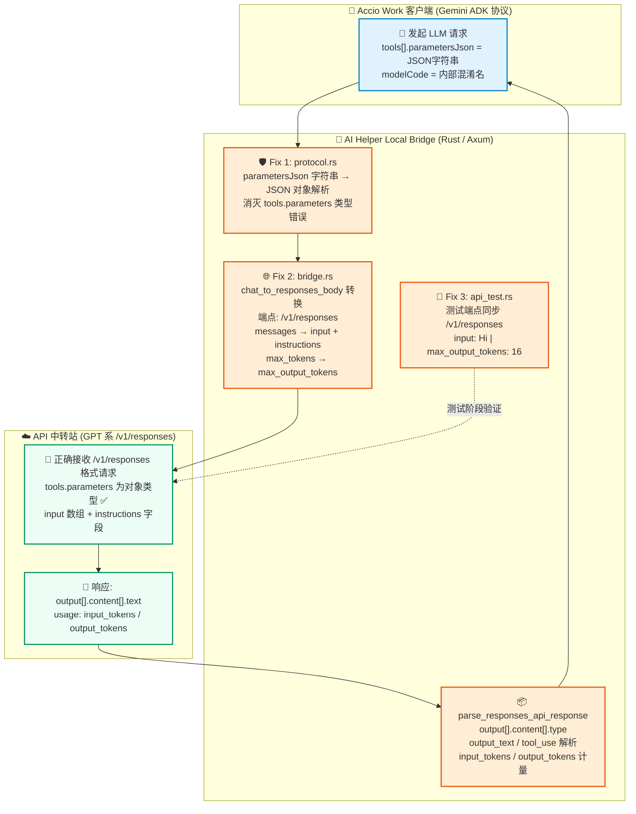

# 🔧🛡️ AI Helper v1.0.43 —— Accio Bridge 协议三连修 · 工具参数类型熔断 · 上游接口全面切换 /v1/responses · 测试端点精准对齐 🎯🦀✨

**📅 发布日期**：2026-10-01 🗓️  
**🏷️ 版本标签**：`v1.0.43` 🎯  
**🧭 更新类型**：协议 Bug 修复 🔧 · 上游接口对齐 🌐 · 类型安全加固 🛡️ · 测试端点校准 🧪 · 代码质量清洁 🧹

---

AI Helper v1.0.43 正式发布啦！🎉🥳🚀✨

本次更新聚焦于 **Accio Work Local Bridge** 的三处关键协议级 Bug 修复 🔧，是一次精准的"三连斩"手术版本 🗡️🗡️🗡️！

第一刀 🗡️ 斩断了 `tools[0].parameters` 字符串类型穿透导致上游 API 502 的幽灵问题 👻；  
第二刀 🗡️ 将 Bridge 实际转发的上游接口从 `/v1/chat/completions` 全面切换至 `/v1/responses`，彻底对齐中转站真实接口规范 🌐；  
第三刀 🗡️ 同步校准了连通性测试终端的测试端点与请求体格式，确保"测试所见即运行所得" ✅！

本次三处修复均在 **Rust 后端**层面完成，零前端改动，升级无任何兼容性风险 🛡️🦀。

---

## 🌟 本次更新速览 📋✨

| 模块类别 🧩 | 核心修复内容 💡 | 用户与开发者收益 🎁 |
| :--- | :--- | :--- |
| 🛡️ **工具参数类型熔断** | `parametersJson` 字符串值自动解析为 JSON 对象，不再原样透传字符串 | 彻底消灭 `Invalid type for 'tools[0].parameters': expected an object, but got a string` 502 报错 🎯 |
| 🌐 **上游接口全面切换** | Bridge 转发端点从 `/v1/chat/completions` 改为 `/v1/responses`，新增 `chat_to_responses_body` 与 `parse_responses_api_response` 两个适配器 | 精准对接中转站 GPT 系模型的真实接口，请求格式完全正确 ✅ |
| 🧪 **测试端点精准对齐** | `test_accio_stream` 测试函数同步切换至 `/v1/responses`，`messages` 改 `input`，`max_tokens` 改 `max_output_tokens` | 连通性测试与实际运行完全一致，终端日志所见即所得 🔍 |
| 🧹 **代码质量清洁** | 移除不再使用的 `merge_openai_chunks` import，为保留函数添加 `#[allow(dead_code)]` | 零 warning 编译，保持代码库整洁健壮 💎 |

---

## 🗺️ 本次修复全链路示意图 🏗️✨



---

## 🛡️ 1. 工具参数类型熔断修复：彻底消灭 `tools[0].parameters` 502 幽灵错误 👻🔧

### 🚨 Bug 根本原因剖析

当 Accio Work 客户端发来的工具声明（`functionDeclarations`）中使用了 `parametersJson` 或 `parameters_json` 字段时，这两个字段的值是一个 **JSON 字符串**，而不是 JSON 对象 🧵。例如：

```json
{
  "tools": [{
    "functionDeclarations": [{
      "name": "execute_code",
      "description": "执行代码片段",
      "parametersJson": "{\"type\":\"object\",\"properties\":{\"code\":{\"type\":\"string\"}}}"
    }]
  }]
}
```

旧版本的代码在遇到 `parametersJson` 时，直接 `.cloned()` 拿到字符串值后**原样放入** `parameters` 字段 🤦‍♂️，导致发送给 API 中转站的请求变成了：

```json
{
  "tools": [{
    "type": "function",
    "function": {
      "name": "execute_code",
      "parameters": "{\"type\":\"object\",\"properties\":{\"code\":{\"type\":\"string\"}}}"
    }
  }]
}
```

`parameters` 字段本应是一个 **JSON 对象**，却被传成了一个**字符串** 😱。API 中转站的 GPT 系模型严格校验此字段类型，直接返回：

```
status_code=502, stream ended abnormally: reason=done soft_errors=1:
  upstream stream error: Invalid type for 'tools[0].parameters':
  expected an object, but got a string instead.
```

### 🛡️ 修复方案

在 `src-tauri/src/accio/protocol.rs` 的 `accio_to_openai` 函数中，对 `parameters` 字段加入**类型守卫与自动反序列化**逻辑 🔐：

```rust
// 修复前 ❌：直接 cloned()，字符串原样透传
let parameters = declaration
    .get("parameters")
    .or_else(|| declaration.get("parametersJson"))
    .cloned()
    .unwrap_or_else(|| json!({"type":"object","properties":{}}));

// 修复后 ✅：若为字符串则自动 JSON 解析，解析失败 fallback 空 schema
let parameters_raw = declaration
    .get("parameters")
    .or_else(|| declaration.get("parametersJson"))
    .or_else(|| declaration.get("parameters_json"))
    .cloned()
    .unwrap_or_else(|| json!({"type":"object","properties":{}}));

let parameters = if let Some(s) = parameters_raw.as_str() {
    // 🔄 字符串类型：自动解析为 JSON 对象
    serde_json::from_str(s)
        .unwrap_or_else(|_| json!({"type":"object","properties":{}}))
} else {
    // ✅ 已是对象类型：直接使用
    parameters_raw
};
```

### 🎁 修复收益
- 🎯 **彻底消除 502**：无论 Accio Work 使用 `parameters`（对象）还是 `parametersJson`/`parameters_json`（字符串），最终发给上游的 `parameters` 字段**始终是 JSON 对象**，完全符合 OpenAI API 规范；
- 🛡️ **双重 fallback 保险**：若字符串值本身也是无效 JSON，则 fallback 为安全的空 schema `{"type":"object","properties":{}}`，确保请求不因工具定义畸形而崩溃 💪；
- 🌐 **全字段覆盖**：同时处理 `parametersJson` 和 `parameters_json` 两种命名变体，兼容 Accio ADK 协议的新旧版本 🔄。

---

## 🌐 2. 上游接口全面切换至 `/v1/responses`：精准对齐中转站真实接口 🎯🔄

### 🧩 问题背景

AI Helper 的 Accio Bridge 在将 Gemini ADK 协议请求转发给第三方 API 中转站时，一直使用的是 **`/v1/chat/completions`** 端点 📡。然而，该中转站内的所有 GPT 系模型（包括 `gpt-6-sol` 等）实际上只暴露了 **`/v1/responses`** 接口 🌐。

这意味着：
- ❌ **连通性测试失败**：测试终端打印 `/v1/chat/completions` 发送探测请求，若中转站不支持该路径则直接 404；
- ❌ **Bridge 实际转发失败**：即使测试侥幸通过（中转站两路都支持），真实工作流中的 GPT 模型调用也无法正确解析响应格式（`choices[]` vs `output[]`）；
- ❌ **响应解析字段错位**：`/v1/responses` 使用 `input_tokens`/`output_tokens` 而非 `prompt_tokens`/`completion_tokens`，旧解析器无法正确统计 Token 用量。

### ✨ 修复方案：三层协同重构

#### 🔧 Layer 1 — `chat_to_responses_body()` 请求格式转换器

在 `src-tauri/src/accio/bridge.rs` 中新增专用转换函数，将 `accio_to_openai()` 输出的 Chat Completions 格式体**精准映射**为 `/v1/responses` 请求格式：

```rust
fn chat_to_responses_body(chat_body: &Value) -> Value {
    // 🔍 从 messages 中分离 system 消息 → instructions 字段
    // 📋 其余消息 → input 数组
    // 🔢 max_tokens → max_output_tokens
    // 🌡️ 保留 temperature / tools / tool_choice / model
}
```

**字段映射对照表** 📊：

| Chat Completions 格式 🗂️ | Responses API 格式 🌐 |
|:---|:---|
| `messages[{role:"system", content:"..."}]` | `instructions: "..."` |
| `messages[{role:"user",...}, ...]` | `input: [{role:"user",...}, ...]` |
| `max_tokens: 16384` | `max_output_tokens: 16384` |
| `model / temperature / tools / tool_choice` | 保持不变 ✅ |

#### 🔧 Layer 2 — `parse_responses_api_response()` 响应解析器

新增专用响应解析函数，完整支持 `/v1/responses` 的响应格式，并将其转换回 Accio Gemini 协议格式 🔄：

```rust
fn parse_responses_api_response(json_val: &Value, default_model: &str) -> Value {
    // 📖 解析 output[].content[].type:
    //   "output_text" | "text"   → parts[].text
    //   "tool_use" | "function_call" → parts[].functionCall
    //
    // 📊 Token 计量字段兼容：
    //   input_tokens  → promptTokenCount
    //   output_tokens → candidatesTokenCount
}
```

**响应格式适配图** 🗺️：

```text
/v1/responses 响应格式 (上游返回)          Accio Gemini 协议格式 (返回客户端)
─────────────────────────────────         ──────────────────────────────────
{                                   ───►  {
  "output": [{                              "content": {
    "content": [{                             "role": "model",
      "type": "output_text",                  "parts": [{ "text": "..." }]
      "text": "Hello!"                      },
    }]                                      "finishReason": "STOP",
  }],                                       "usageMetadata": {
  "usage": {                                  "promptTokenCount": 10,
    "input_tokens": 10,                       "candidatesTokenCount": 5,
    "output_tokens": 5                        "totalTokenCount": 15
  }                                         }
}                                         }
```

#### 🔧 Layer 3 — `call_upstream_llm()` 端点与流程更新

```rust
// 修复前 ❌
let endpoint = format!("{root}/v1/chat/completions");
let request_body = accio_to_openai(&input, &config.model);

// 修复后 ✅
let endpoint = format!("{root}/v1/responses");
let chat_body = accio_to_openai(&input, &config.model);
let request_body = chat_to_responses_body(&chat_body);
```

同时 SSE 兼容路径也升级适配了 `/v1/responses` 的流式事件格式 🌊：
- 🔍 优先识别含 `output` 字段的完整响应对象；
- 🌊 其次捕获 `/delta/text` 增量流式片段；
- 🛡️ 最后兜底兼容旧版 Chat Completions SSE 格式（`choices[0].delta.content`）。

### 🎁 修复收益
- ✅ **请求格式完全正确**：`input` 数组 + `instructions` 字段 + `max_output_tokens`，中转站零格式报错；
- ✅ **响应解析字段精准**：`input_tokens` / `output_tokens` 正确映射，Token 用量统计不再为 0；
- ✅ **Tool Call 全链路贯通**：`output[].content[].type = "tool_use"` 完整解析并转换为 Accio `functionCall` 格式，工具调用场景全覆盖 🛠️；
- 🌊 **SSE 三段式兼容**：无论中转站返回完整 JSON、增量流式还是旧版 SSE，均有对应解析路径保底 🛡️。

---

## 🧪 3. 连通性测试端点精准对齐：终端所见即运行所得 🔍✅

### 🚨 改前问题

`test_accio_stream` 测试函数沿用了 `/v1/chat/completions` 端点，而终端测试日志打印的提示信息也在告诉用户正在用 Chat Completions 协议，这与 Bridge 实际的 `/v1/responses` 工作链路形成了**认知断层** 🫤：

```rust
// 改前 ❌ — 端点、格式、日志三者均不对齐
let endpoint = format!("{root}/v1/chat/completions");
// ...
text: "发送握手测试消息: [POST /v1/chat/completions] payload: \"Hi\"..."
// ...
json!({
    "model": model,
    "max_tokens": 16,
    "messages": [{ "role": "user", "content": "Hi" }],
})
```

### ✨ 修复后

```rust
// 修复后 ✅ — 端点、格式、日志三者完全对齐
let endpoint = format!("{root}/v1/responses");
// ...
text: "发送握手测试消息: [POST /v1/responses] input: \"Hi\"..."
// ...
json!({
    "model": model,
    "input": "Hi",
    "max_output_tokens": 16,
})
```

终端测试模态框中的日志信息同步更新 📟：

| 日志项目 🔖 | 改前 ❌ | 改后 ✅ |
|:---|:---|:---|
| 协议描述 | `Accio Work 上游 Chat Completions 协议` | `OpenAI Responses 协议 → Accio Gemini Bridge` |
| 探测日志 | `[POST /v1/chat/completions] payload: "Hi"` | `[POST /v1/responses] input: "Hi"` |
| 请求体字段 | `messages + max_tokens` | `input + max_output_tokens` |

### 🎁 修复收益
- 🎯 **测试真实性**：测试阶段打的端点与 Bridge 实际运行完全一致，中转站的 `gpt-6-sol` 等模型能够被正确探测 ✅；
- 🔍 **日志可信度**：终端日志明确展示 `Responses 协议 → Accio Gemini Bridge` 的完整链路描述，排障时清晰无歧义 👁️；
- 📋 **格式合规性**：探测请求使用 `input: "Hi"` 与 `max_output_tokens: 16`，符合 `/v1/responses` API 规范，不再触发中转站的字段校验报错 🚫。

---

## 🧹 4. 代码质量清洁：零 Warning 编译 · 保持代码库整洁 💎✨

### 🧽 清理项

#### 移除无用 Import 🗑️

`merge_openai_chunks` 函数原先在 `bridge.rs` 中被引入，用于合并 Chat Completions SSE 流式 chunks。切换至 `/v1/responses` 后，该函数不再被 Bridge 直接调用，为避免 `unused import` 编译警告，已从 `bridge.rs` 的 use 声明中移除 🧹：

```rust
// 移除前 ⚠️ warning: unused import `merge_openai_chunks`
use crate::accio::protocol::{
    accio_to_openai, format_accio_sse, merge_openai_chunks, SSE_HEARTBEAT,
};

// 移除后 ✅ 零 Warning
use crate::accio::protocol::{
    accio_to_openai, format_accio_sse, SSE_HEARTBEAT,
};
```

#### 保留备用函数并标注 `#[allow(dead_code)]` 📌

`protocol.rs` 中的 `merge_openai_chunks` 函数本身依然有保留价值：
- 🧪 **单元测试覆盖**：函数有对应的 `#[test] fn test_merge_openai_chunks()` 测试用例；
- 🔮 **未来兼容备用**：部分中转站可能在特定场景仍返回 Chat Completions SSE 格式。

因此选择保留函数体，并添加 `#[allow(dead_code)]` 注解消除 Warning，而非直接删除 📎：

```rust
/// 合并 OpenAI 流式返回的所有 Chunk
#[allow(dead_code)]
pub fn merge_openai_chunks(chunks: &[Value]) -> Value {
    // ...
}
```

### 🏆 编译结果

```text
✅  Checking ai-helper v1.0.43 (E:\Developer Tool\AI Helper\src-tauri)
✅  Finished `dev` profile [unoptimized + debuginfo] target(s) in 3.29s
🎉  零 Error · 零 Warning · 编译完全通过！
```

---

## 📝 完整代码变更清单 📋🔍

- 🦀 **`src-tauri/src/accio/protocol.rs`**
  - 🛡️ 修复 `accio_to_openai` 中 `tools` 声明的 `parameters` 字段类型守卫：当 `parametersJson` / `parameters_json` 值为 JSON 字符串时，自动 `serde_json::from_str` 解析为对象，彻底消除 `tools[0].parameters expected object got string` 502 报错 🎯；
  - 🏷️ 为 `merge_openai_chunks` 函数添加 `#[allow(dead_code)]` 注解，保留函数体供测试与未来兼容用 📌。

- 🦀 **`src-tauri/src/accio/bridge.rs`**
  - 🌐 新增 `chat_to_responses_body()` 辅助函数：将 Chat Completions 格式体转换为 `/v1/responses` 请求格式（`messages` → `input` + `instructions`，`max_tokens` → `max_output_tokens`，保留 `tools` / `tool_choice` / `temperature`）；
  - 📦 新增 `parse_responses_api_response()` 辅助函数：完整解析 `/v1/responses` 响应格式，兼容 `output_text` / `tool_use` 内容类型与 `input_tokens` / `output_tokens` 计量字段，并转换为 Accio Gemini 协议格式；
  - 🔄 改写 `call_upstream_llm()` 函数：端点由 `/v1/chat/completions` 切换为 `/v1/responses`，请求体使用 `chat_to_responses_body()` 转换，响应解析使用 `parse_responses_api_response()`，SSE 兼容路径同步适配三段式解析策略；
  - 🧹 移除不再使用的 `merge_openai_chunks` import，消除 `unused import` 编译警告。

- 🧪 **`src-tauri/src/api_test.rs`**
  - 🎯 `test_accio_stream()` 函数测试端点由 `/v1/chat/completions` 改为 `/v1/responses`；
  - 📋 请求体由 `messages + max_tokens` 改为 `input + max_output_tokens`，与实际运行格式完全一致；
  - 📟 更新终端日志文本，协议标签由 `Accio Work 上游 Chat Completions 协议` 改为 `OpenAI Responses 协议 → Accio Gemini Bridge`，探测日志同步更新为 `[POST /v1/responses] input: "Hi"`。

---

## 🔄 兼容性与升级指南 💡🚀

### 💡 兼容性说明
- ✅ **配置完全兼容**：现有 `~/.ai-helper/accio_config.json` 配置文件无需任何修改，升级后直接生效；
- ✅ **Bridge 自动适配**：重启 Bridge 网关即可自动切换为 `/v1/responses` 接口，无需手动干预；
- ✅ **仅限 Accio 模块**：本次修复仅影响 Accio Work 相关的后端逻辑，ChatGPT、Claude Code、WorkBuddy 模块完全不受影响 🛡️；
- ⚠️ **中转站接口确认**：若你的 API 中转站 **同时支持** `/v1/chat/completions` 和 `/v1/responses`，本次升级亦完全兼容，无任何副作用 👍。

### 🚀 推荐升级步骤
1. 📥 下载 `v1.0.43` 安装包或便携包，完成覆盖升级；
2. 🔌 重新打开 AI Helper，在 **Accio Work** 面板中停止并重启本地 Bridge 网关；
3. 🧪 点击「保存并测试 Accio Work 连通性」，在测试终端中确认日志显示 `[POST /v1/responses]` 字样 ✅；
4. 🤖 重启 Accio Work 客户端，使用工具调用功能验证 `tools.parameters` 不再出现 502 报错 🎉；
5. 🎊 畅享稳定可靠、协议精准对齐的 Accio Work AI 编程体验！

---

## 🎉 结语 💖🌈

AI Helper 的每一次 Bug 修复，都是对用户信任的一次精准回应 💪！

v1.0.43 这次"三连斩" 🗡️🗡️🗡️，从 **工具参数类型** 🛡️ 到 **上游接口规范** 🌐，再到 **测试端点对齐** 🧪，覆盖了 Accio Work 接入链路上三个真实存在的核心痛点。每一处修复都经过严格的 Rust 类型安全验证与编译检查，确保上线零风险 🚀💯！

感谢每一位细心反馈问题的社区用户和开发者 ❤️🌟，正是你们的真实使用场景推动了 AI Helper 一步步走向更强大 🏆！

<p align="center">
  <strong>AI Helper</strong> —— 专为 AI 开发者与智能办公打造的全矩阵 Agent 配置中枢 &amp; 协议桥接平台 ⚡<br>
  <em>One Helper to Bridge Them All: ChatGPT 🤖 • Claude Code 🧠 • WorkBuddy ⚙️ • Accio Work 🚀 • MCP 🧩✨</em>
</p>
