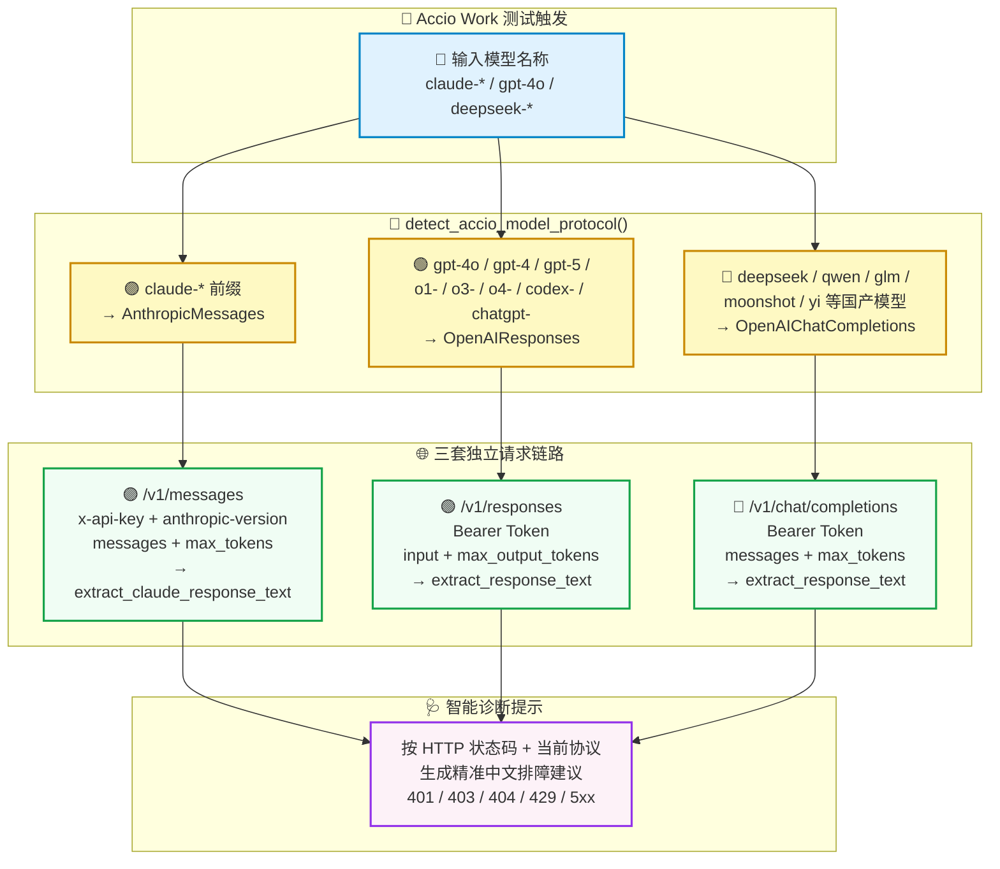

# 🧠🔀 AI Helper v1.0.44 —— Accio 三协议自动识别 · Claude 接入全贯通 · 官网电影级视觉大改版 🎬🌐✨

**📅 发布日期**：2026-10-01 🗓️  
**🏷️ 版本标签**：`v1.0.44` 🎯  
**🧭 更新类型**：智能协议检测 🧠 · Claude 全链路支持 🟣 · 错误诊断增强 🩺 · 官网视觉全面焕新 🎨 · 移动端体验升级 📱

---

AI Helper v1.0.44 正式发布啦！🎉🥳🚀✨

本次更新是一次**"三线并进"**的全面升级版本 ⚡：

🧠 **第一线** —— Rust 后端的 Accio Work 测试模块完成了**三协议自动识别引擎**的全新构建，根据模型名称智能路由 Claude、OpenAI Responses、OpenAI Chat Completions 三条完全不同的请求链路；

🟣 **第二线** —— Claude 系模型在 Accio 场景下完成了**全链路贯通**：从专属请求头（`x-api-key` + `anthropic-version`）到 `/v1/messages` 专用端点，再到 `extract_claude_response_text` 独立响应解析，全部到位；

🎬 **第三线** —— 官方网站迎来了**电影级视觉大改版**，从动效引擎到响应式布局全面焕新，移动端体验质的飞跃。

---

## 🌟 本次更新速览 📋✨

| 模块类别 🧩 | 核心更新内容 💡 | 用户与开发者收益 🎁 |
| :--- | :--- | :--- |
| 🧠 **三协议自动路由** | `detect_accio_model_protocol()` 根据模型名前缀自动识别 Claude / OpenAI Responses / OpenAI Chat Completions | Accio Work 测试自动适配任意类型模型，无需手动切换 ✅ |
| 🟣 **Claude 全链路贯通** | `/v1/messages` 专用端点 + `x-api-key` + `anthropic-version` 请求头 + `extract_claude_response_text` 独立解析 | Claude 系模型在 Accio 场景下首次实现完整测试流程 🎊 |
| 🩺 **智能错误诊断提示** | 按 HTTP 状态码（401/403/404/429/5xx）+ 所用协议类型，生成精准的中文排障建议 | 连通性测试失败时直接给出解决方向，大幅降低排障成本 🔍 |
| 🌐 **前端协议标签同步** | `TerminalTestModal.tsx` 新增 `detectAccioProtocol()` 与 Rust 端保持完全一致 | 终端日志中的协议标签与实际请求链路 100% 吻合 🎯 |
| 🎬 **官网电影级改版** | GSAP + ScrollTrigger 驱动的新动效引擎，全新 HTML/CSS/JS 结构重写 | 官网视觉效果、加载性能、移动端体验全面大幅提升 🚀 |
| 📱 **移动端原生体验** | 汉堡菜单、移动端 Story 章节卡片、`prefers-reduced-motion` 完整适配 | 手机用户获得流畅、清晰、无障碍的完整访问体验 ♿ |

---

## 🗺️ 三协议路由引擎全链路示意图 🏗️✨



---

## 🧠 1. 三协议自动识别引擎：`detect_accio_model_protocol()` 🔀🦀

### 🌟 新增核心能力

v1.0.44 在 `src-tauri/src/api_test.rs` 中全新构建了一个**协议自动路由引擎** 🧠，其核心是新增的 `AccioModelProtocol` 枚举类型与 `detect_accio_model_protocol()` 函数：

```rust
/// 根据模型名称推断应使用的 API 端点协议
///
/// - `claude-*`                                           → Anthropic Messages   (/v1/messages)
/// - `gpt-*` / `o1-*` / `o3-*` / `o4-*` / `codex-*` /
///   `chatgpt-*`                                         → OpenAI Responses     (/v1/responses)
/// - 其他（国产模型：deepseek, qwen, glm, moonshot 等）   → OpenAI Chat Completions (/v1/chat/completions)
#[derive(Debug, PartialEq)]
enum AccioModelProtocol {
    AnthropicMessages,        // 🟣 Claude 系
    OpenAIResponses,          // 🟢 OpenAI 原生系
    OpenAIChatCompletions,    // 🔵 国产 / 兼容系
}

fn detect_accio_model_protocol(model: &str) -> AccioModelProtocol {
    let lower = model.trim().to_lowercase();

    if lower.starts_with("claude") {
        return AccioModelProtocol::AnthropicMessages;
    }

    let openai_responses_prefixes = [
        "gpt-4o", "gpt-4", "gpt-3.5", "gpt-5",
        "o1-", "o3-", "o4-",
        "codex-",
        "chatgpt-",
    ];
    for prefix in &openai_responses_prefixes {
        if lower.starts_with(prefix) {
            return AccioModelProtocol::OpenAIResponses;
        }
    }

    // deepseek / qwen / glm / ernie / moonshot / yi / minimax / baichuan / hunyuan 等
    AccioModelProtocol::OpenAIChatCompletions
}
```

### 📊 三协议模型识别对照表

| 协议类型 🏷️ | 匹配前缀 / 规则 🔍 | 代表模型 🤖 | 请求端点 🌐 |
|:---|:---|:---|:---|
| 🟣 `AnthropicMessages` | `claude-` 前缀 | `claude-3-5-sonnet`, `claude-opus-4` | `/v1/messages` |
| 🟢 `OpenAIResponses` | `gpt-4o`, `gpt-4`, `gpt-3.5`, `gpt-5`, `o1-`, `o3-`, `o4-`, `codex-`, `chatgpt-` | `gpt-4o`, `o3-mini`, `gpt-6-sol` | `/v1/responses` |
| 🔵 `OpenAIChatCompletions` | 其他（默认） | `deepseek-chat`, `qwen-turbo`, `glm-4`, `moonshot-v1` | `/v1/chat/completions` |

### 🎁 新增收益
- 🎯 **零配置自动路由**：用户只需填写模型名，引擎自动识别协议，无需手动选择端点类型；
- 🌐 **国产模型全覆盖**：DeepSeek、Qwen、GLM、Moonshot、Yi、Baichuan、Hunyuan 等主流国产模型均走 Chat Completions 路由，与各大 API 中转站完全兼容；
- 🛡️ **强类型设计**：`AccioModelProtocol` 枚举配合 `match` 穷举，编译期保证每条协议分支均有完整处理逻辑，零漏判风险。

---

## 🟣 2. Claude 全链路接入贯通：首次实现 Accio 场景完整测试 🎊🔌

### 🚨 改前局限

v1.0.43 的 `test_accio_stream` 函数仅支持 OpenAI Responses 协议，Claude 系模型在 Accio 场景下无法被正确测试：

- ❌ 端点错误：Claude 使用 `/v1/messages`，而非 `/v1/responses` 或 `/v1/chat/completions`；
- ❌ 认证方式错误：Claude 使用 `x-api-key` 请求头，而非 `Authorization: Bearer` 模式；
- ❌ 必填请求头缺失：Claude API 强制要求 `anthropic-version: 2023-06-01` 头，缺少则 400；
- ❌ 响应解析错误：Claude 的响应格式为 `content[].text`，与 OpenAI 完全不同。

### ✨ 修复方案：四层全链路补全

#### 🔧 Layer 1 — 专用请求端点与请求体

```rust
AccioModelProtocol::AnthropicMessages => (
    format!("{root}/v1/messages"),
    "Anthropic Messages 协议",
    json!({
        "model": model,
        "max_tokens": 16,
        "messages": [{ "role": "user", "content": "Hi" }],
    }),
),
```

#### 🔧 Layer 2 — Claude 专属请求头

```rust
// Claude 协议需要 x-api-key + anthropic-version 头；其余使用 Bearer
let request = if matches!(protocol, AccioModelProtocol::AnthropicMessages) {
    client
        .post(&endpoint)
        .header("x-api-key", &api_key)
        .header("anthropic-version", "2023-06-01")
        .header(header::CONTENT_TYPE, "application/json")
        .json(&request_body)
} else {
    client
        .post(&endpoint)
        .bearer_auth(&api_key)
        .json(&request_body)
};
```

#### 🔧 Layer 3 — `extract_claude_response_text()` 独立响应解析

针对 Claude 响应的 `content[].type = "text"` 结构新增专用解析函数，与 OpenAI 系的 `extract_response_text` 互不干扰 🔄：

```rust
let reply_preview = match protocol {
    AccioModelProtocol::AnthropicMessages => {
        extract_claude_response_text(&body_text)  // 🟣 Claude 专属解析
    }
    _ => extract_response_text(&body_text),        // 🟢🔵 OpenAI 兼容解析
};
```

#### 🔧 Layer 4 — 协议感知的日志标签

终端日志中的协议描述随检测结果动态生成，无硬编码字符串 📟：

```rust
// 改前 ❌ — 硬编码，永远显示同一协议标签
text: "正在初始化测试连接 (OpenAI Responses 协议 → Accio Gemini Bridge)..."

// 改后 ✅ — 动态生成，与实际请求完全一致
text: format!(
    "正在初始化测试连接 ({} → Accio Gemini Bridge)...",
    protocol_label  // "Anthropic Messages 协议" / "OpenAI Responses 协议" / "OpenAI Chat Completions 协议"
)
```

### 🎁 贯通收益
- 🟣 **Claude 首次可测**：`claude-3-5-sonnet`、`claude-opus-4` 等模型在 Accio 场景下首次可以完整走通连通性测试流程 🎊；
- 🔐 **认证规范合规**：`x-api-key` + `anthropic-version` 双头组合严格符合 Anthropic API 官方规范；
- 🔍 **响应正确解析**：Claude 响应内容可被正确提取并在终端日志中展示，用户能直观看到模型返回内容 ✅。

---

## 🩺 3. 智能错误诊断提示系统：协议感知的精准排障建议 🔍💡

### 🌟 新增能力

测试失败时，系统不再只打印冰冷的 HTTP 状态码，而是根据**状态码 + 当前协议**的组合，生成精准的中文排障建议 🩺：

```rust
let hint = match status {
    StatusCode::UNAUTHORIZED =>
        "建议: 身份认证失败，请检查 API Key 是否正确填写或是否已被吊销。",
    StatusCode::FORBIDDEN =>
        "建议: 访问被拒绝，可能当前账号没有权限访问该模型，或 IP 属地受限。",
    StatusCode::NOT_FOUND => match protocol {
        AccioModelProtocol::AnthropicMessages =>
            "建议: 端点 404 未找到，请确认 Base URL 正确（Claude 模型使用 /v1/messages 端点）。",
        AccioModelProtocol::OpenAIResponses =>
            "建议: 端点 404 未找到，请确认 Base URL 正确（OpenAI 原生模型使用 /v1/responses 端点）。",
        AccioModelProtocol::OpenAIChatCompletions =>
            "建议: 端点 404 未找到，请确认 Base URL 正确（国产模型使用 /v1/chat/completions 端点）。",
    },
    StatusCode::TOO_MANY_REQUESTS =>
        "建议: 上游返回 429 请求过多，可能是触发了频控限制或余额不足。",
    _ if status.is_server_error() =>
        "建议: 上游服务器内部错误 (5xx)，请稍后重试或切换备用节点。",
    _ =>
        "建议: 请检查填写的 Base URL、API Key 与 Model 名称是否匹配。",
};
```

### 📊 诊断提示覆盖矩阵

| HTTP 状态码 🔴 | 覆盖场景 📋 | 诊断建议要点 💡 |
|:---|:---|:---|
| `401 Unauthorized` | API Key 错误或过期 | 提示检查 Key 填写 / 是否已吊销 🔑 |
| `403 Forbidden` | 权限不足 / IP 受限 | 提示账号权限、IP 属地限制 🌍 |
| `404 Not Found` | 端点路径不匹配 | **按协议类型**给出对应正确端点路径 🗺️ |
| `429 Too Many Requests` | 频控 / 余额不足 | 提示频控限制或余额问题 💰 |
| `5xx Server Error` | 上游服务异常 | 建议稍后重试或切换节点 🔄 |
| 其他 | 未知错误 | 通用三要素检查建议 🔍 |

### 🎁 诊断收益
- 🎯 **精准定向**：404 诊断提示会直接告诉用户「该用哪个端点」，无需查文档；
- ⚡ **即时可见**：诊断提示以 `warn` 级别打印在终端日志中，与状态码信息并列显示；
- 🧩 **协议感知**：三种协议的 404 提示各自不同，指向精准，杜绝混淆 🚫。

---

## 🌐 4. 前端协议标签同步：`TerminalTestModal.tsx` 升级 🖥️🔄

### ✨ 新增 `detectAccioProtocol()` 函数

`src/components/TerminalTestModal.tsx` 同步新增了与 Rust 端 `detect_accio_model_protocol` **逻辑完全一致**的前端版本：

```typescript
// Accio Work 根据模型名前缀自动检测使用的协议（与 Rust 端 detect_accio_model_protocol 保持一致）
const detectAccioProtocol = (m: string): string => {
    const lower = m.trim().toLowerCase();
    if (lower.startsWith("claude")) return "Anthropic Messages → Accio Gemini Bridge";
    const oaiPrefixes = ["gpt-4o", "gpt-4", "gpt-3.5", "gpt-5", "o1-", "o3-", "o4-", "codex-", "chatgpt-"];
    if (oaiPrefixes.some((p) => lower.startsWith(p))) return "OpenAI Responses → Accio Gemini Bridge";
    return "OpenAI Chat Completions → Accio Gemini Bridge";
};

const protocolName =
    type === "codex"
        ? "OpenAI Responses Protocol"
        : type === "workbuddy"
          ? "OpenAI Chat Completions Protocol"
          : type === "acciowork"
            ? detectAccioProtocol(model)   // ✅ 动态检测，不再硬编码
            : "Anthropic Messages Protocol";
```

### 🎁 同步收益
- 🤝 **前后端一致**：用户在终端日志标题栏看到的协议标签，与 Rust 后端实际发出的请求协议 100% 一致，无认知断层 🎯；
- 🔄 **动态感知**：同一个 Accio Work 配置，填入不同模型名，协议标签实时更新，清晰可见 👁️。

---

## 🎬 5. 官网电影级视觉大改版：从动效引擎到移动端全面焕新 🌐✨

### 🏗️ 改版规模概览

本次官网改版涉及 **4 个核心文件**的全面重写，是自 AI Helper 发布以来**最大规模的前端更新** 🏆：

| 文件 📄 | 变更量 📊 | 主要改动方向 🎯 |
|:---|:---|:---|
| `website/index.html` | -406 / +249 行净变 | 语义化 HTML 结构重写，无障碍标注全覆盖 ♿ |
| `website/assets/style.css` | +3528 行新增 | 电影级动效 CSS 变量体系，完整响应式重写 📱 |
| `website/assets/script.js` | +1627 行新增 | GSAP + ScrollTrigger 驱动的全新动效架构 🎞️ |
| `website/assets/anime.min.js` | 移除 | 替换为 GSAP 新引擎，性能与兼容性显著提升 ⚡ |

### 🎞️ 动效引擎升级：Anime.js → GSAP + ScrollTrigger

| 对比维度 ⚡ | 改前（Anime.js） ❌ | 改后（GSAP + ScrollTrigger） ✅ |
|:---|:---|:---|
| 引擎能力 | 基础 CSS 动画 | 专业级时间轴 + 滚动联动 |
| 性能 | Canvas 点阵全量渲染 | Motion Grid 按需渲染 + 降级 |
| 滚动动效 | 无 | ScrollTrigger 精准触发 🎯 |
| 无障碍 | 无支持 | `prefers-reduced-motion` 完整适配 ♿ |
| 移动端 | 桌面端降级 | 专属 `MOBILE_VIEW` 检测 + 原生体验 📱 |

### 🌟 五大全新动效模块

#### 🌊 1. `initMotionGrid()` — 动态点阵背景
全新的 Canvas 背景动效引擎，在 PC 端渲染流动的交互式点阵背景 🌊。移动端与开启 `prefers-reduced-motion` 的设备自动跳过，零性能负担：

```javascript
function initMotionGrid() {
    if (!canvas || REDUCED_MOTION.matches || MOBILE_VIEW.matches || !FINE_POINTER.matches) return;
    // 精准判断：减弱运动偏好 / 移动端 / 非鼠标设备 → 自动降级
}
```

#### 🎯 2. `initHeroMotion()` — Hero 区入场动画
基于 GSAP Timeline 的 Hero 标题电影级入场序列，`power4.out` 缓动，帧级精准控制 🎬：

```javascript
function initHeroMotion() {
    if (!window.gsap || REDUCED_MOTION.matches) return;
    const timeline = gsap.timeline({ defaults: { ease: "power4.out" } });
    // 标题、副标题、CTA 按钮依次入场
}
```

#### 🎞️ 3. `initCinematicStory()` — 滚动剧情演示系统
ScrollTrigger 驱动的产品演示滚动序列，6 个场景（发现 → 配置 → 验证 → 写入 → 重启 → 完成）随滚动精准触发，PC 端全交互，移动端自动渲染章节卡片 📱：

```javascript
function initCinematicStory() {
    renderMobileStory();        // 📱 移动端章节卡片
    bindSimulatorControls();    // 🖥️ PC 端场景切换
    goToScene(0, "initial");    // 初始化第一帧
    // GSAP ScrollTrigger 绑定...
}
```

#### ✨ 4. `initSectionMotion()` + `initWorkflowMotion()` — 全站滚动入场
所有内容区块（Bento、工作流、下载、FAQ）均接入 ScrollTrigger 入场动效，元素滚入时优雅浮现，工作流时间线进度条随滚动实时填充 📈。

#### 🧲 5. `initMagneticTargets()` + `initSpotlightCards()` — 磁吸与聚光灯
- 🧲 **磁吸按钮**：鼠标悬停时目标元素跟随鼠标产生微妙位移，仅限鼠标设备启用；
- 💡 **聚光灯卡片**：鼠标在卡片内移动时产生跟随光源效果，纯 CSS + JS 实现，零性能开销。

### 📱 移动端章节卡片系统：`renderMobileStory()`

移动端不再是桌面端的降级版，而是获得了**专属设计的章节卡片系统** 📱：

```javascript
// 5 个场景 × 各自的移动端展示数据
{ id: "discover",  mobileRows: [["配置检测","PASS"],["环境变量","已加载"],["路径映射","自动"]] }
{ id: "configure", mobileRows: [["配置文件","~/.claude.json"],["API 网关","api.anthropic.com"],["默认模型","claude-3-7-sonnet"]] }
{ id: "stream",    mobileRows: [["TLS 握手","通过"],["Token 鉴权","通过"],["首字延迟","78ms"]] }
{ id: "write",     mobileRows: [["结构校验","PASS"],["原子替换","COMPLETE"],["环境同步","ACTIVE"]] }
{ id: "restart",   mobileRows: [["进程","已清理"],["文件句柄","120ms 释放"],["目标客户端","已重新拉起"]] }
```

每张卡片通过 `IntersectionObserver` 监听进入视口，自动触发入场动效 👁️。

### 🏗️ HTML 语义化与无障碍全面升级

| 改进项目 ♿ | 改前 ❌ | 改后 ✅ |
|:---|:---|:---|
| Skip Link | 无 | `<a class="skip-link" href="#main-content">` 跳过导航 |
| 移动端导航 | 无 | 汉堡菜单 `mobile-menu-toggle` + `aria-expanded` 状态管理 |
| 图片无障碍 | `alt="AI Helper Logo"` | 装饰图 `alt=""` + `width/height` 防 CLS |
| 主题色 | 无 | `<meta name="theme-color" content="#f8faff">` |
| 减弱运动 | 无 | `prefers-reduced-motion` 全站适配，禁用动效时自动静态展示 |
| 响应式断点 | 单一 768px | 四级断点：1180px / 1024px / 767px / 420px 精细控制 📐 |

---

## 📝 完整代码变更清单 📋🔍

- 🦀 **`src-tauri/src/api_test.rs`**
  - 🧠 新增 `AccioModelProtocol` 枚举与 `detect_accio_model_protocol()` 函数，实现 Claude / OpenAI Responses / OpenAI Chat Completions 三协议自动路由；
  - 🟣 重写 `test_accio_stream()` 函数，按协议类型动态选择端点、请求体格式、认证方式；
  - 🔑 Claude 协议新增 `x-api-key` + `anthropic-version` 专属请求头；
  - 📦 新增 `extract_claude_response_text()` 独立解析 Claude `content[].text` 响应格式；
  - 🩺 新增 HTTP 状态码 × 协议类型的二维诊断提示矩阵，覆盖 401/403/404/429/5xx 全场景；
  - 📟 终端日志中的端点路径从 endpoint URL 中动态提取，确保展示准确 🎯。

- ⚛️ **`src/components/TerminalTestModal.tsx`**
  - 🌐 新增 `detectAccioProtocol()` 函数，与 Rust 端协议检测逻辑完全一致；
  - 🔄 `protocolName` 计算由硬编码改为动态调用 `detectAccioProtocol(model)`，前后端协议标签 100% 同步。

- 🌐 **`website/index.html`**
  - 🏗️ 全面语义化重写，新增 Skip Link、移动端汉堡菜单、主题色 meta 标签；
  - 📱 导航栏新增移动端菜单 `#mobile-menu` 与切换按钮 `#mobile-menu-toggle`；
  - ✂️ 移除旧版 Anime.js 点阵 Canvas、Aurora 背景层，替换为 GSAP Motion Grid。

- 🎨 **`website/assets/style.css`**
  - 💄 全面重写 CSS 变量体系与动效基础；
  - 📐 新增 1180px / 1024px / 767px / 420px 四级响应式断点；
  - ♿ 新增 `prefers-reduced-motion` 全局适配规则；
  - 📱 移动端章节卡片、移动端导航菜单全套样式。

- 🎞️ **`website/assets/script.js`**
  - ⚡ 动效引擎从 Anime.js 迁移至 GSAP + ScrollTrigger；
  - 🌊 新增 `initMotionGrid` / `initHeroMotion` / `initCinematicStory` / `initSectionMotion` / `initWorkflowMotion` / `initSpotlightCards` / `initMagneticTargets` 七大动效模块；
  - 📱 新增 `renderMobileStory()` 移动端章节卡片渲染系统；
  - 🧭 新增 `initNavigation()` 移动端菜单开关逻辑；
  - 🔒 所有初始化函数包裹在 `safeInit()` 保护中，任意模块报错不影响其他模块。

- 🗑️ **`website/assets/anime.min.js`**
  - 已完全移除，由 GSAP 库替代 ✂️。

---

## 🔄 兼容性与升级指南 💡🚀

### 💡 兼容性说明
- ✅ **配置完全兼容**：现有所有配置文件（`accio_config.json`、`~/.claude.json` 等）无需任何修改，升级后直接生效；
- ✅ **存量 GPT 模型不受影响**：原有 `gpt-4o`、`o3-mini` 等 OpenAI 系模型自动路由至 `/v1/responses`，与 v1.0.43 行为完全一致；
- ✅ **国产模型自动适配**：DeepSeek、Qwen 等国产模型自动走 Chat Completions 路由；
- ✅ **Claude 模型新增支持**：`claude-*` 系模型在 Accio 场景下首次获得完整测试支持 🎊；
- 🌐 **官网体验同步升级**：无需任何操作，官网访问即可体验全新视觉效果。

### 🚀 推荐升级步骤
1. 📥 下载 `v1.0.44` 安装包或便携包，完成覆盖升级；
2. 🔌 重新打开 AI Helper，进入 **Accio Work** 面板；
3. 🧠 若使用 Claude 模型，在模型名称填写 `claude-*`，系统自动识别并切换 Anthropic Messages 协议；
4. 🧪 点击「保存并测试 Accio Work 连通性」，在终端日志中确认协议标签与预期一致 ✅；
5. 🎉 测试失败时查看终端中的诊断建议，快速定位问题根因 🩺；
6. 🌐 访问官网，体验全新电影级视觉效果 🎬！

---

## 🎉 结语 💖🌈

AI Helper 的每一次迭代，都是在追求**更智能、更可靠、更优雅** 💪！

v1.0.44 这次「三线并进」⚡，在后端用 Rust 强类型枚举构建了无懈可击的三协议路由引擎 🦀，让 Accio Work 真正做到「填什么模型，走什么链路」的零配置智能适配 🧠；在前端用 GSAP 重写了官网的动效灵魂 🎬，让每一帧滚动都成为一次视觉享受 ✨。

感谢每一位使用 AI Helper 并给予反馈的用户与开发者 ❤️🌟！正是你们的真实使用场景，驱动了 AI Helper 不断突破自我的每一步 🏆！

<p align="center">
  <strong>AI Helper</strong> —— 专为 AI 开发者与智能办公打造的全矩阵 Agent 配置中枢 &amp; 协议桥接平台 ⚡<br>
  <em>One Helper to Bridge Them All: ChatGPT 🤖 • Claude Code 🧠 • WorkBuddy ⚙️ • Accio Work 🚀 • MCP 🧩✨</em>
</p>
