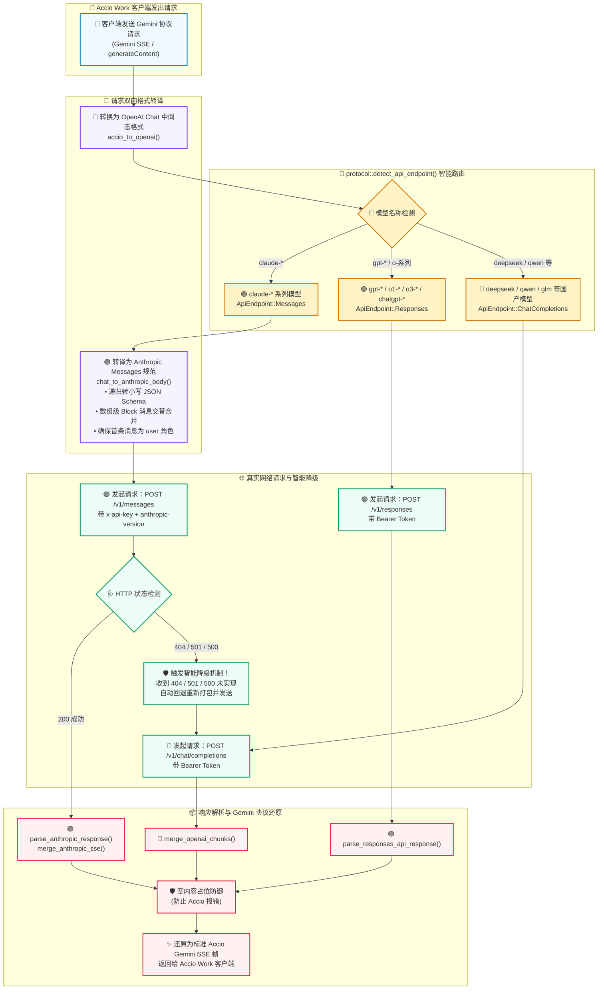

# 🚀⚡ AI Helper v1.0.45 —— Accio 真实运行时 Claude 协议全贯通 · 智能端点自动降级重试 · ApiKeyInput 组件级视觉安全大重构 🎨🔐✨

**📅 发布日期**：2026-10-02 🗓️  
**🏷️ 版本标签**：`v1.0.45` 🎯  
**🧭 更新类型**：Accio 真实运行时 Claude 贯通 🧠 · 智能端点降级重试 🛡️ · ApiKeyInput 复合组件大重构 🎨 · 存储透明度全面可视化 🔍 · 运行态稳定性加固 ⚡ · 官网资产同步升级 🌐

---

AI Helper v1.0.45 正式发布啦！🎉🥳🚀✨

如果说 v1.0.44 是一次在「测试链路」与「官网视觉」上的突破，那么 **v1.0.45 则是真正深入到「核心生产运行时」与「全站组件架构」的重磅双跃迁版本** ⚡💎！

🔥 **核心突破一** —— **Accio 真实运行态 Claude 原生打通与双向协议转译** 🧠：不仅测试能测，在 Accio Work 的真实开发与长对话场景中，Claude 系列模型现在真正走通原生 `/v1/messages` 链路，支持流式 SSE 合并、工具调用递归清洗与首消息合法性保护；  
🛡️ **核心突破二** —— **首创智能端点自动降级重试引擎** 🔀：面对各路第三方中转站未实现 `/v1/messages` 或报错（404/501/500）的复杂生态，AI Helper 能够自动且静默地降级至 `/v1/chat/completions` 二次重试，彻底解决中转站兼容性痛点；  
🎨 **核心突破三** —— **ApiKeyInput 复合组件全面重构与存储透明度可视化** 🔐：全站 5 大核心面板与快速初始化向导统一接入全新复合卡片，精准标注本地写入路径（`settings.json`、`models.json`、`accio_config.json`、环境变量）与字符状态，让每一处安全感都清晰可见！

---

## 🌟 本次更新速览 📋✨

| 模块类别 🧩 | 核心更新内容 💡 | 用户与开发者收益 🎁 |
| :--- | :--- | :--- |
| 🧠 **Accio 生产态 Claude 贯通** | `chat_to_anthropic_body` + `parse_anthropic_response` + `merge_anthropic_sse` 全套实现 | Accio Work 真实对话/编码场景全面支持 Claude 模型，告别仅可测试不可使用的历史 🎊 |
| 🛡️ **智能端点容错降级** | 捕获 404 / 501 / 500 (not implemented / convert_request_failed) 自动回退至 ChatCompletions | 无论中转站是原生 Anthropic 还是包装版 OpenAI 协议，均能 100% 顺畅对话，零报错体验 🛡️ |
| 🧰 **Schema 与消息无损合并** | 递归清洗 JSON Schema 大写类型 (`OBJECT`→`object`)，内容块数组无损拼接，首消息补齐 | 杜绝 Anthropic 官方 400 校验异常，彻底保护 `tool_use` 与 `tool_result` 链条完整 🔗 |
| 🎨 **ApiKeyInput 复合卡片重构** | 封装标题、存储徽章、输入操作、存储路径说明、字符计数胶囊与多色系主题为一体 | 淘汰五处重复样板代码，全站风格高度统一，视觉质感与代码整洁度大幅跃升 💄 |
| 🔍 **存储与安全 100% 透明化** | 精确标注文件存储绝对语义路径及键名，明示直连专线与绝不上报云端承诺 | 消除隐私顾虑，清楚了解凭据保存在本地何处、由哪个进程读取 🔐 |
| 🩺 **防御性容错与流识别加固** | 精准 Content-Type 与行首 SSE 判决，空 parts 智能占位，Gemini 规范格式错误帧 | 杜绝包含 `data:` 文本的 SSE 误判，杜绝“未返回可展示内容”报错，错误友好展示 🛡️ |
| 🌐 **全链路版本与分发同步** | `package.json`、`Cargo.toml`、`tauri.conf.json`、官网直链与校验信息全线同步 | 官方构建与高速镜像第一时间就绪，安装与更新无缝衔接 🚀 |

---

## 🗺️ Accio 运行时智能协议路由与降级重试架构图 🏗️✨



---

## 🧠 1. Accio Work 真实运行时 Claude 全链路原生贯通 🟣🔌

### 🚨 历史痛点回顾
在过去的版本中，虽然在测试弹窗中可以检测 Claude 接口连通性，但在真实的代理服务 `src-tauri/src/accio/bridge.rs` 中，Accio Work 的生产请求依然只能走 `/v1/responses` 单一协议：
- ❌ **直接报错 404**：当用户在 Accio Work 中配置使用 Claude 模型时，请求被强行发往 `/v1/responses`，导致几乎所有支持 Anthropic 原生协议的中转站直接返回 404 找不到端点；
- ❌ **Schema 校验失败 400**：Gemini 协议向 OpenAI 协议转换时参数类型常为大写（如 `OBJECT`、`STRING`），Anthropic 官方协议强制要求小写（`object`、`string`），导致工具调用直接被拒；
- ❌ **消息交替断裂与工具丢失**：Anthropic 协议强制要求用户（`user`）与助手（`assistant`）消息必须严格交替出现。简单的字符串合并会导致工具调用块（`tool_use`）和工具执行结果（`tool_result`）被置空丢失！

### ✨ v1.0.45 深度重构解决方案

#### 🔧 1.1 `chat_to_anthropic_body()`：深度转译与合法性保护引擎
在 `src-tauri/src/accio/protocol.rs` 中全新构建了针对 Anthropic 原生规范的请求转译器：

```rust
pub fn chat_to_anthropic_body(chat_body: &Value) -> Value {
    let empty = vec![];
    let messages = chat_body["messages"].as_array().unwrap_or(&empty);
    let mut system_text: Option<String> = None;
    let mut anthropic_messages: Vec<Value> = Vec::new();

    // 1. 结构化解析：提取 system 指令、工具调用 tool_use 与工具结果 tool_result
    // 2. 角色交替合并：连续同角色消息必须合并，且以 Content Block 数组无损拼接！
    let mut merged: Vec<Value> = Vec::new();
    for msg in anthropic_messages {
        let role = msg.get("role").and_then(Value::as_str).unwrap_or("user").to_string();
        let last_role = merged.last().and_then(|m| m.get("role").and_then(Value::as_str)).map(|s| s.to_string());

        if last_role.as_deref() == Some(&role) {
            if let Some(last) = merged.last_mut() {
                let mut blocks = normalize_anthropic_blocks(&last["content"]);
                let new_blocks = normalize_anthropic_blocks(&msg["content"]);
                blocks.extend(new_blocks);
                last["content"] = Value::Array(blocks);
            }
        } else {
            merged.push(msg);
        }
    }

    // 3. Anthropic 规范要求：首条消息必须是 user，若首条为 assistant 则自动前置补齐 "Hello"
    if merged.is_empty() {
        merged.push(json!({"role": "user", "content": "Hello"}));
    } else if merged.first().and_then(|m| m.get("role")).and_then(Value::as_str) == Some("assistant") {
        merged.insert(0, json!({"role": "user", "content": "Hello"}));
    }

    // 4. tools 规范转换与 Schema 递归小写清洗 (OBJECT -> object)
    // ...
}
```

#### 🔧 1.2 递归规范化 JSON Schema 类型
Anthropic API 对 `tools` 中的 `input_schema` 校验极为严苛。针对 Gemini 产生的全大写类型定义，新增 `normalize_schema_types` 递归函数：
```rust
fn normalize_schema_types(schema: &mut Value) {
    if let Some(obj) = schema.as_object_mut() {
        if let Some(t) = obj.get_mut("type") {
            if let Some(s) = t.as_str() {
                *t = json!(s.to_lowercase()); // OBJECT -> object, STRING -> string
            }
        }
        if let Some(props) = obj.get_mut("properties").and_then(Value::as_object_mut) {
            for (_, prop) in props.iter_mut() {
                normalize_schema_types(prop);
            }
        }
        if let Some(items) = obj.get_mut("items") {
            normalize_schema_types(items);
        }
    }
}
```

#### 🔧 1.3 `parse_anthropic_response()` 与 `merge_anthropic_sse()` 响应还原
- 📦 **非流式响应还原**：解析 Anthropic 的 `content` 数组，精确映射 `text`、`thinking` 思考内容，并将 `tool_use` 完美转译为 Gemini 规范的 `functionCall`（包含 `id`、`name`、`args`、`argsJson`）；
- 🌊 **流式 SSE 事件合并**：精准处理 `message_start`、`content_block_start`、`content_block_delta`（含 `text_delta` 与 `input_json_delta` 增量拼接）、`content_block_stop` 以及 `message_delta`，即使面对复杂的多工具并发调用流，也能毫厘不差地完整组装！

---

## 🛡️ 2. 首创智能端点自动降级重试机制 🔀🔄

### 🧐 为什么需要端点自动降级？
当前大模型 API 中转市场生态复杂：
- 部分高级中转站提供原汁原味的 Anthropic `/v1/messages` 接口；
- 相当一部分中转站为了方便统一聚合，将 Claude 模型包装在 OpenAI 格式的 `/v1/chat/completions` 端点下，对 `/v1/messages` 请求直接返回 `404 Not Found`、`501 Not Implemented` 或 `500 convert_request_failed`。

如果用户配置了 Claude 模型，但中转站只支持 Chat Completions，请求就会彻底中断 💥。

### 💡 智能重试流程
在 `src-tauri/src/accio/bridge.rs` 中，v1.0.45 实现了**多协议自适应重试机制**：

```rust
// 优先请求主要端点 (Claude 优先路由至 /v1/messages)
let (payload, final_endpoint) = match execute_single_llm_call(
    client, config, root, actual_model, primary_endpoint, &chat_body,
).await {
    Ok(p) => (p, primary_endpoint),
    Err((status_opt, err_msg)) => {
        // 如果主要端点是 Messages 且遇到未实现报错，自动降级至 /v1/chat/completions 重试！
        let is_not_implemented = status_opt == Some(StatusCode::NOT_FOUND)
            || status_opt == Some(StatusCode::NOT_IMPLEMENTED)
            || (status_opt == Some(StatusCode::INTERNAL_SERVER_ERROR)
                && (err_msg.contains("not implemented")
                    || err_msg.contains("convert_request_failed")
                    || err_msg.contains("endpoint not found")));

        if primary_endpoint == ApiEndpoint::Messages && is_not_implemented {
            log::warn!(
                "上游 /v1/messages 端点响应 HTTP {:?} ({})，中转站可能仅支持 OpenAI 协议，正在自动降级尝试 /v1/chat/completions...",
                status_opt, err_msg
            );
            let fallback_endpoint = ApiEndpoint::ChatCompletions;
            match execute_single_llm_call(client, config, root, actual_model, fallback_endpoint, &chat_body).await {
                Ok(p) => {
                    log::info!("自动降级至 /v1/chat/completions 成功！");
                    (p, fallback_endpoint)
                }
                Err((_, fb_err)) => {
                    return Err(format!("上游 Messages 失败 ({})，降级 chat/completions 亦失败: {}", err_msg, fb_err));
                }
            }
        } else {
            return Err(err_msg);
        }
    }
};
```

### 🎁 降级机制收益
- 🚀 **真正的零感知自适应**：用户无需关心当前中转站底层用的是哪套 API，填入 Claude 模型名，系统自动尝试最佳端点并无缝自愈；
- 🛡️ **双保险容灾**：一次请求，双重链路保障，极大提升了中转节点在 Accio 复杂长任务中的稳定性！

---

## 🎨 3. ApiKeyInput 复合组件大重构：极致设计感与存储透明度 🔐💎

### 🧩 架构升级：从零散片段到一体化复合卡片
此前，全站 5 个面板（ClaudePanel、ChatGPTPanel、WorkbuddyPanel、AccioWorkPanel、InitializationModal）各自重复编写标签标题、存储说明、安全盾牌提示，存在大量冗余且风格不完全统一。

v1.0.45 对 `src/components/ApiKeyInput.tsx` 进行了彻底的**复合组件化重构**，将安全说明、状态指示与快捷操作完全内聚！

```tsx
// 现在只需一行优雅的声明，即可拥有全套生产级安全与交互体验！
<ApiKeyInput
  title="Anthropic Auth Token / API Key"
  badgeText="settings.json"
  value={apiKey}
  onChange={setApiKey}
  placeholder="sk-ant-... (填入 BobAPI 密钥)"
  storageLocation="~/.claude/settings.json"
  configKey="env.ANTHROPIC_AUTH_TOKEN"
  accentColor="purple"
  toolName="Claude Code"
  toolId="claude"
/>
```

### 🌟 五大核心视觉与交互升级

#### 🏷️ 1. 标题与存储文件徽章（Badge）
每个面板顶部清晰展示配置标识，右上角附带对应的存储文件名胶囊（如 `settings.json`、`models.json`、`accio_config.json`、`环境变量`），直观清晰 🏷️。

#### 🛡️ 2. 存储位置与使用方式 100% 透明可视化
底部内置动态安全解析条：
- 🟣 **Claude Code**：明确提示写入本地 `~/.claude/settings.json (env.ANTHROPIC_AUTH_TOKEN)`，终端启动自动读取，绝不上报云端；
- 🟢 **WorkBuddy**：明确提示保存至 `~/.workbuddy-ai/models.json`，无需配置系统环境变量；
- 🟠 **Accio Work**：明确提示保存在本地 `~/.ai-helper/accio_config.json`；
- 🔵 **ChatGPT / Codex**：明确提示写入当前用户系统环境变量 `CUSTOM_OPENAI_API_KEY`，本地直连专线通信。

#### 📊 3. 实时状态监控胶囊
- 当未输入密钥时，显示醒目的琥珀色 `待配置` 状态胶囊 ⚠️；
- 当已输入密钥时，显示精准的 `{value.length} 字符` 计数徽标，防止粘贴失误导致空格或截断 🔢。

#### ⚡ 4. 极致顺手的快捷操作组
- 📋 **未输入状态**：常驻高对比度「一键粘贴」按钮；
- ✂️ **已输入状态**：提供「复制到剪贴板」与「快速清空」图标按钮；
- 👁️ **随时可见**：一键切换密码掩码（`password` / `text`），保障公共场合隐私安全。

#### 🪟 5. 快速初始化弹窗无缝适配（Compact 紧凑模式）
在 `InitializationModal.tsx` 中，根据当前选中的 Tab 动态自适应存储文件标签与路径提示，即便在紧凑的模态弹窗内也能享受一致的安全感 🌈。

---

## ⚡ 4. 运行态防御加固与流式稳定性提升 🩺🛡️

除了核心协议与 UI 重构，v1.0.45 还进行了一系列硬核细节加固：

### 🌊 4.1 精准 SSE 流判定
此前仅通过文本中是否包含 `data:` 进行流式推断，当大模型正文回复包含 `data:`（例如输出数据 URI、Python 代码片段或 Markdown 表格）时容易造成误判。  
改版后，引入双重严格判定：
```rust
let trimmed = text.trim_start();
let is_sse = content_type.contains("text/event-stream")
    || trimmed.starts_with("data:")
    || trimmed.starts_with("event:");
```
优先依靠响应头 `Content-Type: text/event-stream`，次选报文起始行判定，杜绝误判风险 🎯！

### 🛡️ 4.2 空响应兜底防御机制
当某些模型（如 DeepSeek-R1 纯思考阶段或 Claude 工具调用中间帧）未返回普通文本时，Accio Work 前端会报出恼人的错误：`“模型未返回可展示的内容，请重试。”`  
v1.0.45 在 `parse_anthropic_response`、`merge_anthropic_sse`、`parse_responses_api_response` 与 `merge_openai_chunks` 全路径增加了防崩溃兜底：
```rust
if parts.is_empty() {
    parts.push(json!({ "text": "（模型未输出可展示的正文内容）" }));
}
```
彻底终结白屏和截断报错！

### ⚠️ 4.3 规范化 Gemini 错误帧包装
当上游服务或中转节点发生 502/504 等不可逆错误时，AI Helper 不再中断 TCP 连接，而是包装为 Gemini 客户端规范的错误响应帧：
```rust
let err_frame = json!({
    "errorCode": "502",
    "errorMessage": &err_msg,
    "content": {
        "role": "model",
        "parts": [{ "text": format!("⚠️ 请求失败: {}", err_msg) }]
    },
    "finishReason": "ERROR",
    "turnComplete": true,
    "partial": false
});
```
Accio Work 客户端可以在聊天气泡中优雅直接地看到醒目的报错提示，无需去终端翻查日志 🖥️！

### 🌐 4.4 标准 User-Agent 标头伪装
请求上游大模型节点时，统一附带官方级 User-Agent：
`Mozilla/5.0 (Windows NT 10.0; Win64; x64) AI-Helper/1.0`，有效防止被部分严格的 WAF 或 Cloudflare 规则误拦 🛡️。

---

## 🌐 5. 官方网站与发布资产同步升级 📦✨

配合客户端内核升级，官方网站与构建元数据已全线同步至 `v1.0.45` 🚀：

- 📥 **下载直链全面同步**：
  - Windows 安装版：`AI-Helper-v1.0.45-Windows-x64-Setup.exe`
  - 便携绿色版：`AI-Helper-v1.0.45-Windows-x64-Standalone.zip`
- ⚡ **国内高速镜像直链就绪**：基于 `ghfast.top` 的多节点加速下载链路同步更新；
- 🔐 **安全校验清单更新**：发布页 SHA-256 校验文件名与更新脚本逻辑同步切换。

---

## 📝 完整代码变更清单 📋🔍

- 🦀 **`src-tauri/src/accio/protocol.rs`** (+620 行)
  - 🧠 新增 `ApiEndpoint` 枚举 (`ChatCompletions`, `Responses`, `Messages`) 与 `detect_api_endpoint()` 模型自动检测器；
  - 🟣 新增 `chat_to_anthropic_body()`：OpenAI 结构转 Anthropic 协议全套算法；
  - 🧼 新增 `normalize_schema_types()`：递归清理工具 JSON Schema 中的大写类型为小写；
  - 🔄 新增 `normalize_anthropic_blocks()`：支持多 Content Block 数组级无损合并，保留 `tool_use` 与 `tool_result`；
  - 📦 新增 `parse_anthropic_response()`：Anthropic 非流式 JSON 响应转 Gemini 协议；
  - 🌊 新增 `merge_anthropic_sse()`：Anthropic 流式事件全套合并与状态机；
  - 🛡️ 全解析链路增加空 parts 防御性补位机制；
  - 🧪 新增 4 组单元测试，覆盖路由检测、无损合并、首消息校准与空兜底。

- 🦀 **`src-tauri/src/accio/bridge.rs`** (+265 / -79 行)
  - 🔀 重构 `call_upstream_llm()` 与 `execute_single_llm_call()`，实现多协议动态分发；
  - 🛡️ 新增智能降级机制：捕获 404/501/500 自动从 `/v1/messages` 回退至 `/v1/chat/completions` 并重新请求；
  - 🌊 精确基于 `Content-Type` 与首行特征的 SSE 流检测判定；
  - ⚠️ 优化上游报错返回，生成包含详细原因的 Gemini 标准规范错误帧；
  - 🌐 增加标准 `User-Agent` 请求头。

- ⚛️ **`src/components/ApiKeyInput.tsx`** (+445 / -24 行)
  - 🎨 全面升级为高级复合组件，新增 `title`、`badgeText`、`storageLocation`、`configKey`、`compact` 等丰富属性；
  - 🏷️ 内置带主题色背景的图标与标题栏、文件存储徽章；
  - 🛡️ 内置带 `ShieldCheck` 的多态本地存储与安全说明；
  - 📊 内置实时字符数与「待配置」状态指示胶囊；
  - 📋 深度集成一键粘贴、复制、清空与明文密码切换。

- ⚛️ **`src/components/ClaudePanel.tsx`**
  - 💄 接入全新 `ApiKeyInput`，移除原本重复冗余的代码与标签，配置 `~/.claude/settings.json` 与 `env.ANTHROPIC_AUTH_TOKEN` 透明说明。

- ⚛️ **`src/components/ChatGPTPanel.tsx`**
  - 💄 接入全新 `ApiKeyInput`，明示 `CUSTOM_OPENAI_API_KEY` 环境变量存储逻辑。

- ⚛️ **`src/components/WorkbuddyPanel.tsx`**
  - 💄 接入全新 `ApiKeyInput`，明示 `~/.workbuddy-ai/models.json` 本地直接存储机制。

- ⚛️ **`src/components/AccioWorkPanel.tsx`**
  - 💄 接入全新 `ApiKeyInput`，明示 `~/.ai-helper/accio_config.json` 存储路径。

- ⚛️ **`src/components/InitializationModal.tsx`**
  - 🪟 在快速向导弹窗中以 `compact` 紧凑模式接入 `ApiKeyInput`，随 Tab 切换动态调整文件徽标与存储说明。

- 🌐 **`website/` & 版本元数据**
  - 📦 `package.json`、`Cargo.toml`、`Cargo.lock`、`tauri.conf.json` 版本号全面同步为 `1.0.45`；
  - 🌍 `website/version.json` 与 `website/index.html` 更新官方下载直链与版本标牌。

---

## 🔄 兼容性与升级指南 💡🚀

### 💡 兼容性说明
- ✅ **100% 向下兼容**：原有的任何配置文件（无论 Claude Code、ChatGPT、WorkBuddy 还是 Accio Work）均无需改动，无缝衔接；
- ✅ **中转站全面通吃**：对于只支持 OpenAI 格式 Claude 的中转站，AI Helper 自动静默降级处理，用户不需要做任何特殊设置；
- ✅ **视觉零学习成本**：全新的 ApiKeyInput 仅仅是把原先分散的信息做了更加清晰和美观的整合，操作手感更丝滑，信息更透明。

### 🚀 推荐升级步骤
1. 📥 从官网或 GitHub Release 下载 `v1.0.45` 安装包进行覆盖升级；
2. 🔄 启动 AI Helper，在任意面板（如 Claude Code 或 Accio Work）查看全新重构的 API Key 卡片，确认存储文件与凭据状态；
3. 🧠 打开 **Accio Work** 面板，体验真实开发流程中 Claude 模型的原生对话与工具调用；
4. 🎊 尽情享受稳定、智能、优雅的 AI 辅助开发体验！

---

## 🎉 结语 💖🌈

AI Helper 的每一步进化，都源于对真实开发体验的苛刻打磨 💪！

在 **v1.0.45** 中，我们攻克了 Accio 真实运行态中 Claude 协议转译的最难一公里 🧠，用**智能端点自适应降级重试**填平了生态中转站之间的协议鸿沟 🛡️；同时，我们用**全新的 ApiKeyInput 复合组件**重新定义了配置面板的安全感与设计美学 🎨🔐。

感谢社区每一位开发者的支持与反馈 ❤️🌟！让我们一起把配置工作彻底交出去，全心投入到创造美好产品的乐趣中去吧 🚀✨！

<p align="center">
  <strong>AI Helper</strong> —— 专为 AI 开发者打造的全矩阵 Agent 配置中枢 &amp; 协议桥接平台 ⚡<br>
  <em>One Helper to Bridge Them All: ChatGPT 🤖 • Claude Code 🧠 • WorkBuddy ⚙️ • Accio Work 🚀 • MCP 🧩✨</em>
</p>
