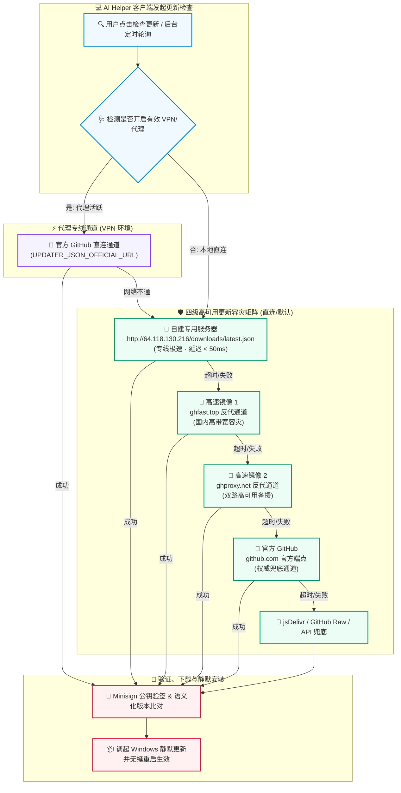

# 🚀⚡ AI Helper v1.0.46 —— 架构级自建更新源接入 · 全球四级容灾分发矩阵 · 毫秒级极速无感热更新 📡🛡️🌐✨

**📅 发布日期**：2026-10-02 🗓️  
**🏷️ 版本标签**：`v1.0.46` 🎯  
**🧭 更新类型**：自建专用更新服务器接入 🖥️ · 全球四级容灾分发网络 🌐 · 智能降级重试链路升级 ⚡ · 客户端分发安全加固 🔐 · 多镜像竞速自愈保障 🚀

---

AI Helper v1.0.46 正式发布啦！🎉🥳🚀✨

为了让已安装客户端的用户在全球任何网络环境下（无论有无开启代理、无论是国内局域网还是海外直连）都能**秒级感知版本更新并以最高速度稳定下载**，AI Helper 迎来了分发架构层面的重磅里程碑升级 —— **正式接入自主部署的高性能更新服务器，构建起「自建服务器主通道 + 三级全球 CDN 镜像」构成的四级高可用容灾更新矩阵** 🛰️💎！

---

## 🌟 核心升级三大亮点 💡✨

### 1. 🖥️ 自建独立更新分发服务全面就绪（最高优先级）
- 🚀 **专线极速直达**：正式将自主运维的高速更新服务器（`http://64.118.130.216/downloads/latest.json`）接入 Tauri 原生更新体系与 Rust 后端多源探测引擎；
- ⚡ **零被墙阻断风险**：完全摆脱对 GitHub Releases 单一源的硬性依赖，不受任何公共网络波动或 DNS 污染影响，更新元数据秒级下发！

### 2. 🛡️ 全球四级分发容灾矩阵（无缝降级 · 零失败率）
- 🧭 **四级智能梯度探测**：
  1. 🥇 **第一顺位**：自建专用更新分发服务器（`http://64.118.130.216`）—— 极速专线，延迟最低！
  2. 🥈 **第二顺位**：国内高速镜像 1（`ghfast.top` 反代）—— 高带宽并发保障！
  3. 🥉 **第三顺位**：国内高速镜像 2（`ghproxy.net` / `gh-proxy.com`）—— 双路防单点故障备援！
  4. 🏅 **第四顺位**：GitHub 官方直链（`github.com`）—— 国际专线与 VPN 环境优先通道！
- 🔄 **毫秒级平滑熔断**：任何通道若发生 HTTP 异常（404/500/超时），引擎即刻自动秒级平滑回退至下一级镜像，用户体验全程无感！

### 3. 🔐 严丝合缝的安全签名与精准日志追踪
- 🔑 **Minisign 非对称高强度验签**：全部更新包元数据均受 `pubkey` 密钥指纹硬核保护，自建源分发同样享受最高级别的防篡改校验；
- 📊 **端到端语义化日志**：Rust 后端更新器全面重塑日志打点标签（`自建更新服务器` / `ghfast` / `ghproxy.net` / `官方 GitHub`），排查与运维了如指掌！

---

## 🌟 本次更新速览 📋✨

| 模块类别 🧩 | 核心更新内容 💡 | 用户与运维收益 🎁 |
| :--- | :--- | :--- |
| 🖥️ **自建更新源** | 接入 `http://64.118.130.216/downloads/latest.json` 作为首选端点 | 国内直连用户更新检查耗时从几秒骤降至几十毫秒，即点即达 ⚡ |
| 🌐 **Tauri 配置升级** | `tauri.conf.json` updater endpoints 增加自建服务器通道 | Tauri 客户端原生后台静默轮询与一键重启安装优先使用自有服务器 🔄 |
| 🦀 **Rust 更新器重构** | `updater.rs` 常量与 `check_for_updates_internal` 探测优先级升级 | 深度覆盖 VPN、透明代理、纯直连等多环境下更新 Manifest 的准确性 🛡️ |
| 📜 **多通道自愈日志** | 全新规范日志标识：自建更新服务器 ➔ ghfast ➔ ghproxy ➔ GitHub | 开发者与高级用户可于日志控制台清晰洞察当前更新来自哪条物理通道 🔍 |
| 🚀 **全自动化发布链路** | GitHub Actions 自动构建 + 本地构建脚本协同，服务器自动化同步就绪 | 自动化管道持续输出安装包、校验文件与 Manifest，版本流转效率拉满 🏎️ |

---

## 🗺️ 全球四级容灾更新分发流程图 🏗️✨



---

## 🛠️ 核心文件变动深度剖析 🔍✨

### 1. 📁 `src-tauri/tauri.conf.json` —— Tauri 插件端点配置
在 `plugins.updater.endpoints` 数组的第一项加入自建服务器地址，确保 Tauri 客户端内置的更新探测服务首先向自建服务器请求：

```json
"plugins": {
  "updater": {
    "pubkey": "dW50cnVzdGVkIGNvbW1lbnQ6IG1pbmlzaWduIHB1YmxpYyBrZXk6IDIyM0Q0OUM2QzJFRDA4NTUKUldSVkNPM0N4a2s5SW5OMUd4MlNIYmJ0SXI1aEx4a0JSSlQvd01UVmNUYkxPZzJJQ2VZb0JYRHoK",
    "endpoints": [
      "http://64.118.130.216/downloads/latest.json",
      "https://ghfast.top/https://github.com/TF49/AI-Helper/releases/latest/download/latest.json",
      "https://gh-proxy.com/https://github.com/TF49/AI-Helper/releases/latest/download/latest.json",
      "https://github.com/TF49/AI-Helper/releases/latest/download/latest.json"
    ],
    "windows": {
      "installMode": "passive"
    }
  }
}
```

### 2. 📁 `src-tauri/src/updater.rs` —— Rust 后端更新模块重构
将 Rust 后端的多通道 Manifest 常量进行了全面重新对齐与梯度排序：

```rust
// 更新源常量定义（自建服务器优先）
const UPDATER_JSON_MIRROR_URL: &str =
    "http://64.118.130.216/downloads/latest.json";
const UPDATER_JSON_MIRROR_BACKUP_URL: &str =
    "https://ghfast.top/https://github.com/TF49/AI-Helper/releases/latest/download/latest.json";
const UPDATER_JSON_MIRROR_BACKUP2_URL: &str =
    "https://ghproxy.net/https://github.com/TF49/AI-Helper/releases/latest/download/latest.json";
const UPDATER_JSON_OFFICIAL_URL: &str =
    "https://github.com/TF49/AI-Helper/releases/latest/download/latest.json";
```

同步优化了探测失败时的回退日志记录逻辑：
```rust
// 1. 优先 自建更新服务器 updater.json (高速专用通道)
match check_updater_json(UPDATER_JSON_MIRROR_URL, "updater.json (自建更新服务器)").await {
    Ok(info) => return Ok(info),
    Err(e) => {
        log::warn!(
            "自建更新服务器 updater.json check failed: {}. Trying ghfast backup...",
            e
        );
    }
}
```

---

## 🚀 升级与发布工作流指南 📖🏁

本次升级采用了**精细化的本地版本递增与一键发布脚本**，推荐操作流程如下：

```powershell
# 1. 执行版本号自动递增（自动同步 package.json, Cargo.toml, tauri.conf.json, README.md）
pnpm run bump

# 2. 执行一键发布打包与推送脚本（完成官网构建同步、Git Tag 打标并自动推送到远端）
pnpm run release
```

### ⏱️ 自动化同步进度
1. ⚙️ **GitHub Actions 构建阶段**（约 5~10 分钟）：编译 Windows x64 安装包、独立免安装版、生成数字签名与 SHA256 校验和并发布 Release；
2. 🔄 **服务器自动化同步阶段**（最长约 30 分钟）：自建服务器定时脚本自动抓取最新 Release 产物并刷新 `http://64.118.130.216/downloads/latest.json`；
3. 🎯 **更新落地验证**：浏览器直接访问 `http://64.118.130.216` 即可看到最新版本号，客户端检测到新版本后将极速完成下载与更新！

---

## 💖 感谢有你 · 伴我们持续进化 🌈✨

从最初的单一代理配置到如今支持全协议转译、多模型多端路由，再到现在的架构级自建分发容灾网络，**AI Helper 的每一次蜕变都离不开大家的陪伴与反馈**！

让每一个开发者拥有最稳定、最敏捷、最优雅的 AI 编程体验，是我们始终不变的追求！🚀🌟💫
