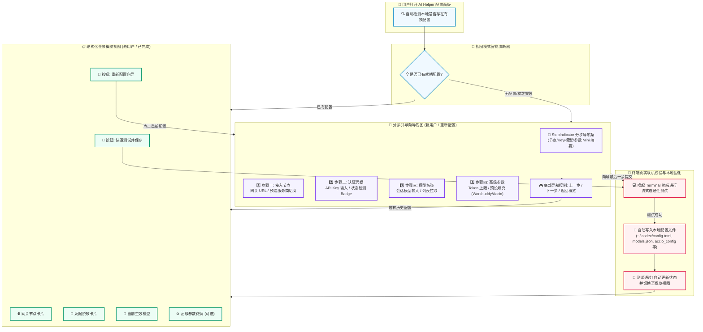

# 🚀🎨 AI Helper v1.0.48 —— 全面板向导式交互体验大跃迁 · 新增 StepIndicator 分步导航器 · 概览与向导双模自由流转 · 丝滑切感动效全面升级 🧭✨🌈💡

**📅 发布日期**：2026-10-09 🗓️  
**🏷️ 版本标签**：`v1.0.48` 🎯  
**🧭 更新类型**：全新向导式 UI 交互范式 🧭 · StepIndicator 分步导航器 🔢 · 概览与向导双态无缝切换 🔀 · 4大面板交互全面重塑 🎨 · Framer Motion 丝滑过渡动效 🌊 · 官网与多端版本协同发布 🌐

---

AI Helper v1.0.48 重磅发布啦！🎉🥳🚀✨

在过去版本中，AI Helper 持续突破协议兼容性、端点降级、自建更新源等底层能力。而在本次 **v1.0.48** 中，我们迎来了**自发布以来最大规模的前端交互与视觉体验进化 —— 全面重构 4 大核心配置面板（ChatGPT / Claude Code / Workbuddy / Accio Work），告别过去单页冗长堆叠的表单，进入现代化「分步引导向导 ⇋ 结构化全景概览」的双模交互新时代** 🌟💎！

无论你是初次尝试配置的萌新，还是需要高频微调参数的极客开发者，AI Helper 都将以最聚焦的步骤、最贴心的微摘要（Mini-summary）以及丝滑平顺的滑入动效，为你带来行云流水般的配置与调试体验 🎈💫！

---

## 🌟 核心升级四大亮点 💡✨

### 1. 🧭 全新通用分步导航组件 —— `StepIndicator`
- 🔢 **步骤状态实时感知**：
  - 🌟 **当前步骤**：外发光环（Ring effect）+ 缩放动效，视觉焦点一目了然！
  - ✅ **已完成步骤**：打勾确认徽标（`Check` 图标），彰显配置就绪状态！
  - ⏳ **待执行步骤**：优雅平滑置灰，清晰展示后续配置路线图！
- 🏷️ **首创「微缩摘要 (Mini-summary)」提示**：
  - 在步骤下方智能提取并显示关键信息片段（如已填网关的主机名 `api.openai.com` 🌐、已脱敏截断的 API Key `sk-7x9...b2` 🔐、当前选定的默认模型 `gpt-4o` 🤖）；
  - 无需返回前置步骤，在顶部导航条即可扫视关键配置值！
- 🔗 **自适应流光进度轨**：动态宽度计算与平滑百分比填充过渡，进度变化灵动丝滑！
- 🖱️ **非线性安全跳转机制**：
  - 允许点击已达成步骤自由回跳修改；
  - 智能拦截越级跳转（未填写 API Key 等必填项时安全阻断后续步骤），保障数据完整性！
- 🎨 **四大面板专属品牌主题配色**：
  - 💙 **OpenAI Codex**：沉稳专业科技蓝 (`blue`)
  - 💜 **Claude Code**：优雅深邃质感紫 (`purple`)
  - 💚 **Workbuddy**：生机盎然翡翠绿 (`emerald`)
  - 🧡 **Accio Work**：活力澎湃创想橙 (`orange`)

---

### 2. 🔀 独创「分步向导 (Wizard) ⇋ 结构化概览 (Summary)」双模自由流转
- 🎯 **彻底解决新老用户痛点**：
  - 过去：所有输入框挤在一屏上下滚动，新手找不到重心，容易漏填；
  - 传统向导通病：每次打开必须反复点击「下一步」才能查看，老用户极其繁琐！
- 💡 **AI Helper 智能双模方案**：
  - 🐣 **无配置/新环境** ➔ **自动开启「分步向导模式」**：一步一步专心填写，逐步消除配置焦虑！
  - 🦅 **已有配置/老用户** ➔ **默认展示「结构化概览卡片」**：3联/4联模块化卡片总览核心参数，一键直接发起连通性测试与保存应用！
  - 🔄 **随时双向切换**：
    - 在概览页点击 **「重新配置向导」** ➔ 瞬时重回第 1 步从容修改；
    - 在向导中只要已有历史配置，右下角提供 **「返回概览」** 快捷通路，无需强制走完向导！
    - 连通性测试成功后，自动锁定并呈现最新配置概览！

---

### 3. 🎨 四大核心 Agent 面板全量交互升级
- 💙 **OpenAI Codex (ChatGPTPanel)**（3步精简流）：
  - 1️⃣ **接入节点**：API 服务端点快速设定，支持中转反代与官方直连 🌐
  - 2️⃣ **认证凭据**：API Key 复合输入、配置文件状态（`~/.codex/config.toml`）即时侦测 🔐
  - 3️⃣ **模型设定**：默认模型输入、在线模型列表一键拉取与快速选取 🤖
- 💜 **Claude Code (ClaudePanel)**（3步精简流）：
  - 1️⃣ **接入节点**：Anthropic 协议网关配置、预设节点秒级切换 🌐
  - 2️⃣ **认证凭据**：Claude API Key 安全录入与本地环境变量配置检测 🔐
  - 3️⃣ **模型设定**：默认测试模型选定（`claude-3-5-sonnet` 等官方与兼容模型）🤖
- 💚 **Workbuddy (WorkbuddyPanel)**（4步进阶流）：
  - 1️⃣ **接入节点**：服务商节点与网关端点 🌐
  - 2️⃣ **API Key**：工作流专属凭据配置 🔐
  - 3️⃣ **模型名称**：多模型选择、历史已有模型列表平滑切换与新模型追加 📋
  - 4️⃣ **高级参数**：输出 Token 上限（`max_output_tokens` 预设快速填入）、上下文窗口、流式传输、多模态视觉等微调选项 ⚙️
- 🧡 **Accio Work (AccioWorkPanel)**（4步进阶流）：
  - 1️⃣ **接入节点**：Gemini / 中转网关地址 🌐
  - 2️⃣ **API Key**：凭据录入与字符合法性校验 🔐
  - 3️⃣ **模型名称**：Accio 智能转译模型设定 🤖
  - 4️⃣ **高级参数**：Token 上限及运行时高级参数精细调控 🎛️

---

### 4. 🌊 Framer Motion 动效赋能 · 沉浸感与微交互拉满
- 🎬 **方向感知横向滑入滑出**：
  - 点击「下一步」向左平滑推入，点击「上一步」向右自然带出；
  - 配合淡入淡出（Opacity Fade），彻底告别生硬的页面突跳！
- ✨ **SpotlightCard 粒子聚光卡片**：
  - 鼠标悬停随动聚光灯粒子高亮，营造细腻科技质感；
- 💫 **StarBorder 璀璨边框保存按钮**：
  - 保持极客辨识度的流光动态边框，测试与保存时带来强烈的仪式感！

---

## 🌟 本次更新速览 📋✨

| 模块分类 🧩 | 核心升级内容 💡 | 收益与体验提升 🎁 |
| :--- | :--- | :--- |
| 🧭 **StepIndicator 组件** | 新增分步导航器，支持节点编号、Check 图标、自适应连接线与 Mini 摘要 | 降低 80% 心智负担，配置进度与关键属性一眼通览 🎯 |
| 🔀 **向导 ⇋ 概览双模态** | 支持无配置时向导引导，有配置时默认概览；支持一键互相切换 | 完美兼顾新手入门与老手高频调试两种截然不同的诉求 ⚡ |
| 🤖 **Codex 面板重构** | 接入 3 步向导：接入节点 ➔ 认证凭据 ➔ 模型设定；新增概览总览页 | 彻底消除长表单滚动，界面清爽聚焦 💙 |
| 🧠 **Claude 面板重构** | 接入 3 步向导，紫色主题定制，集成模型刷新与环境变量检测 | 配置 Claude Code 流程清晰连贯，体验丝滑 💜 |
| 💼 **Workbuddy 面板重构** | 接入 4 步深度向导：节点 ➔ Key ➔ 模型 ➔ Token 高级参数；多模型联动 | 复杂参数层级收敛，多模型管理与新增一目了然 💚 |
| ⚡ **Accio Work 面板重构** | 接入 4 步深度向导，橙色主题定制，参数分步校验 | 运行时协议转译配置条理分明 🧡 |
| 🌊 **Motion 动效体系** | `AnimatePresence` 容器级切页，带方向感滑入与透明度过渡 | 界面切换如丝般顺滑，原生级客户端质感 🏎️ |
| 🌐 **版本与官网生态** | 同步全线工程与官网至 `v1.0.48`，修复官网字符编码并刷新下载源 | 官网落地页、自动化构建包与更新元数据全链路对齐 🚀 |

---

## 🗺️ 全新双模配置流转与向导交互架构图 🏗️✨

---

## 🔍 深度功能细节拆解 🧩✨

### 1. 🧭 `StepIndicator`：有细节、有温度的导航指示器
- **微摘要自动计算**：
  - 节点步骤：自动剥离 `https://` 前缀与后缀斜杠，仅呈现精炼主机名（例如 `https://api.openai.com/v1` ➔ 精简显示为 `api.openai.com`）🎯；
  - Key 步骤：大于 8 位时自动进行前后安全截断（例如 `sk-1234...9876`），既能确认已输入，又绝不泄露敏感明文 🔒；
  - 模型步骤：即时显示当前选定的模型标识（如 `claude-3-5-sonnet` 或 `gpt-4o`）💡；
- **非线性可达性控制 (`maxStepReached`)**：
  - 用户必须在第 2 步输入有效的 API Key 后，才允许点击第 3 步以后的节点；
  - 已完成的步骤随时可点击回跳，无需连续狂按「上一步」按键！

---

### 2. 🤖 针对各个面板的专属定制优化

#### 🔹 OpenAI Codex (ChatGPTPanel) 💙
- 过去需要一屏滑动到底部的网关输入、Key 输入、状态检测卡片、模型列表，现在拆解为清晰的 3 个阶段；
- 概览视图中支持直接查看当前默认接入网关与模型，随时点击「重新配置向导」进行调整；
- 底部 StarBorder 按钮智能识别「保存并应用 Codex 配置」。

#### 🔹 Claude Code (ClaudePanel) 💜
- 采用紫色品牌基调，从节点到凭据、从模型到环境变量说明一脉相承；
- 步骤 2 自动展示 Claude Code 配置文件（`~/.claude/`）以及系统环境变量的挂载状态；
- 步骤 3 深度集成模型快捷拉取，输入框与下拉预设无缝融合。

#### 🔹 Workbuddy (WorkbuddyPanel) 💚
- 采用 4 步深度定制向导，把复杂的 Token 参数（如输出 Token 上限、上下文窗口、流式传输等）统一收敛至第 4 步「高级参数」；
- 提供 `8k`、`16k`、`32k`、`64k` 等预设 Token 胶囊按钮，一键快速填入，免去手动输入的繁琐；
- 概览视图不仅展示当前配置，还能联动多模型列表，随时在新模型新增与旧模型更新之间丝滑切换！

#### 🔹 Accio Work (AccioWorkPanel) 🧡
- 采用 4 步向导设计，将 Gemini 协议网关、API Key、目标模型以及运行时 Token 上限分步收拢；
- 结构化概览清晰展示中转映射详情，保障协议双向转译的稳定性。

---

## 📋 变更文件一览 🛠️

| 变更文件 📄 | 变更性质 📝 | 说明 💡 |
| :--- | :--- | :--- |
| `src/components/StepIndicator.tsx` | 🆕 **新增组件** | 跨面板通用的分步向导导航器，包含状态机、微摘要、流光连接线与多色系主题 🧭 |
| `src/components/ChatGPTPanel.tsx` | 🔄 **重构升级** | 接入 3 步向导流、StepIndicator 与配置概览双模视图 💙 |
| `src/components/ClaudePanel.tsx` | 🔄 **重构升级** | 接入 3 步向导流、紫色主题与模型列表拉取协同 💜 |
| `src/components/WorkbuddyPanel.tsx` | 🔄 **重构升级** | 接入 4 步深度向导流、Token 高级参数分层、概览与多模型联动 💚 |
| `src/components/AccioWorkPanel.tsx` | 🔄 **重构升级** | 接入 4 步向导流、橙色活力主题与运行时参数分层 🧡 |
| `package.json` | ⬆️ **版本升级** | 版本号升级至 `1.0.48` 📦 |
| `src-tauri/Cargo.toml` | ⬆️ **版本升级** | Rust 后端版本号升级至 `1.0.48` 🦀 |
| `src-tauri/Cargo.lock` | ⬆️ **依赖锁定** | 依赖锁文件同步更新 🔒 |
| `src-tauri/tauri.conf.json` | ⬆️ **配置升级** | Tauri 应用元数据版本号升级至 `1.0.48` ⚙️ |
| `website/version.json` | ⬆️ **官网元数据** | 发布时间更新为 `2026-10-09`，安装包与便携包下载链接同步至 `v1.0.48` 🌐 |
| `website/assets/script.js` | ⬆️ **脚本常量** | `CURRENT_VERSION` 常量同步更新至 `v1.0.48` 📜 |
| `website/index.html` | 🐛 **修复与同步** | 修复 Hero 区域按钮文本编码乱码，下载链接全量指向 `v1.0.48` 落地页 🎯 |

---

## 🎁 总结与后续展望 展望未来 🚀🌈

v1.0.48 的发布，标志着 AI Helper 完成了从「功能完备」到「体验精致」的关键蜕变！通过引入分步向导与全景概览的双模流转设计，不仅让首次使用的开发者可以在清晰的指引下 1 分钟完成配置接入，更为日常高频使用的开发者保留了最快捷的全局概览与即时测试入口 ⚡。

感谢所有社区用户的反馈与支持！未来我们将继续在多模型协同、自动化诊断和生态扩展上持续深耕，敬请期待！🥳🎉🚀✨
